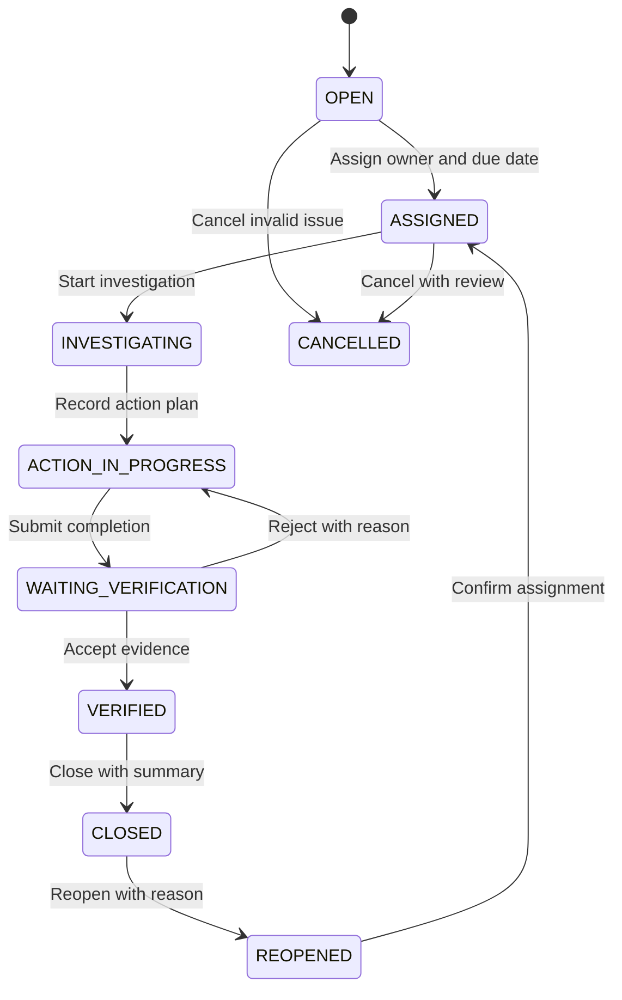
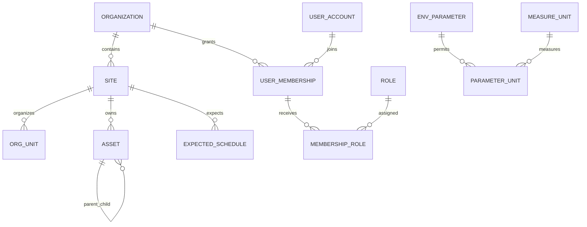
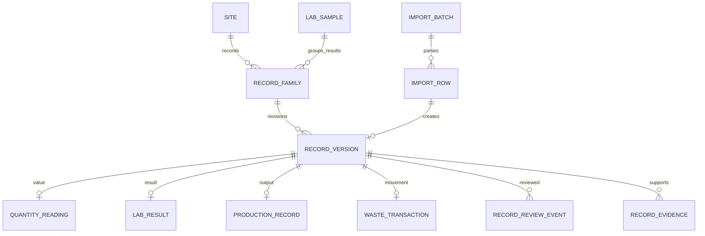
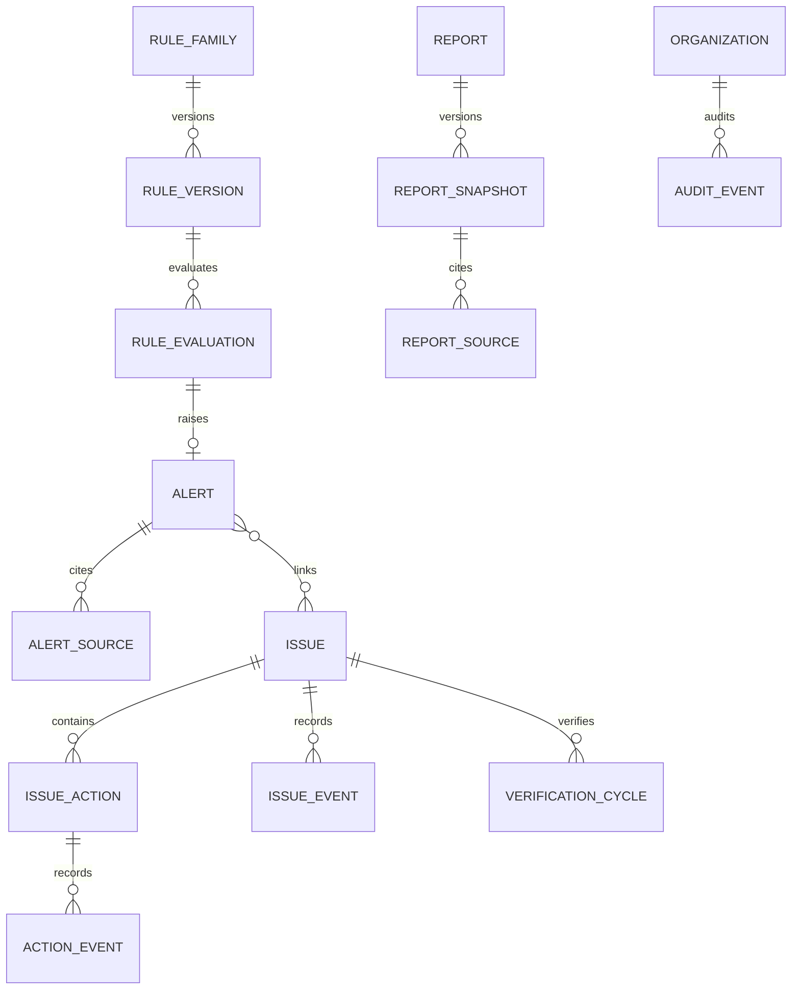
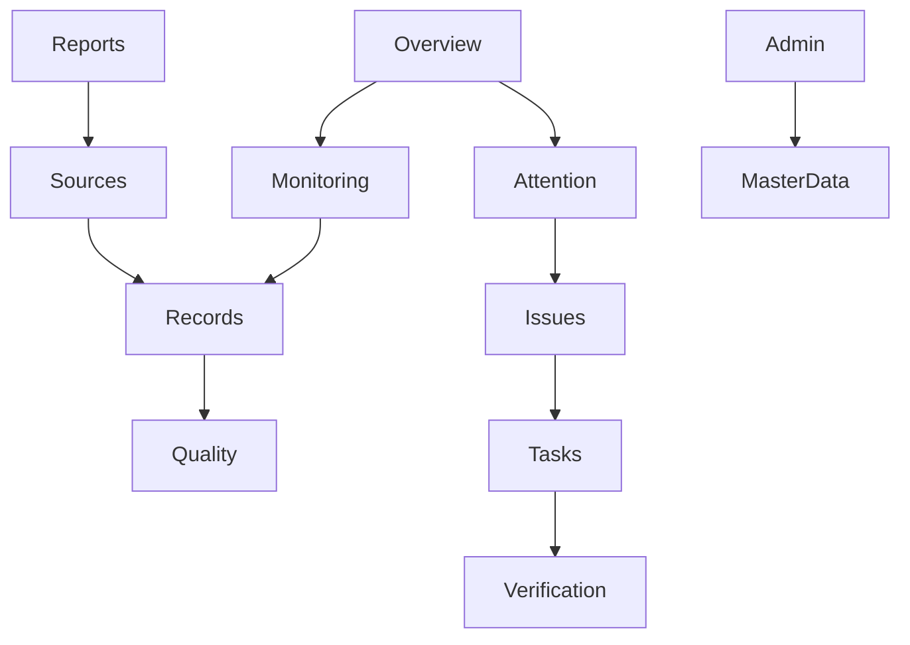

# PROJECT_SPEC.md
## Environmental Intelligence & Action Management Platform

**Codex handoff specification · Version 1.0 · 3 October 2026**  
**Language:** Thai with stable English requirement IDs, entity codes, and workflow statuses.  
**Purpose:** Single implementation reference combining Product Requirements (Step 1), Database & Data Model (Step 2), and UI/UX Wireframes (Step 3).

> Build the Environmental Management product as a phased web application. This document defines product behavior, data integrity, permissions, and page interaction. Organization-specific legal criteria and operational mappings must remain editable and inactive until reviewed by the organization.

## How Codex should use this specification

1. Inspect the target repository, its `AGENTS.md` instructions, existing framework, dependencies, tests, and current behavior before changing code. Preserve repository conventions unless the product requirements require a documented change.
2. Treat the requirements and business rules in this file as the product contract. Treat numeric values marked as examples, starter templates, or proposed targets as non-production defaults.
3. Implement the smallest complete phase at a time. P1 is the operational foundation and must work without AI. Do not start P2/P3 functionality before its prerequisites and acceptance gates are met.
4. Enforce authorization and workflow rules in server-side operations. UI visibility alone is not authorization. Preserve record revisions, audit events, evidence links, and report snapshots.
5. Use the KPI formulas and missing-data behavior in Step 1 together with the source/entity rules in Step 2. Do not infer zero, unit conversion, cause, regulatory compliance, or approval from missing information.
6. Use the page layouts and responsive behavior in Step 3 for implementation and prototype review. Show loading, empty, partial, denied, validation, conflict, and error states as specified.
7. Keep unresolved organization decisions explicit in configuration and in the decision log. Do not silently replace starter defaults with fixed assumptions about a real factory.
8. For each delivered feature, report implemented Requirement IDs, meaningful verification performed, remaining limitations, and the next phase gate. Do not claim unrun tests passed.

## Product direction and implementation boundaries

The product supports **Record → Validate → Monitor → Investigate → Assign → Act → Verify → Close → Report**. Deterministic analytics/rules calculate facts; AI can summarize allowed, sourced context after the data foundation is proven. Authentication, evidence storage, spreadsheets, email/chat and AI are separate integration capabilities with separate status and permission grants.

| Phase | Implementation target | Gate |
|---|---|---|
| P1 — Operational MVP | Authentication/RBAC, editable master data, approved environmental/production records, import, data quality, 4 monitoring areas, rule alerts, Issue/action/verification, evidence, in-app notifications, basic reports and audit | End-to-end entry→review→KPI and alert→issue→close journeys pass; no AI required |
| P2 — AI assistance | Permission-filtered AI gateway, contextual questions, cited summaries and report drafts | P1 accepted; data quality and provider data policy reviewed |
| P3 — External automation | Google Sheets sync, Gmail/Chat, schedules/escalation and opt-in automatic Issue creation | Destinations/permissions approved; retries and idempotency verified |
| P4 — Advanced analytics | Anomaly detection, forecasting and benchmarking | Data sufficiency and evaluation plan approved |

### Agreed starter decisions

| Area | Starter value | Configuration rule |
|---|---|---|
| Organization model | One organization, multiple Sites; expandable to stricter tenant isolation if needed | Every record and action must retain organization/site scope |
| Default timezone/UI | Site timezone; organization default `Asia/Bangkok`; Thai display | Preserve instants in UTC and report with Site-local dates |
| Production basis | Tonne of finished product | Admin can add/rename/effectively version kg, piece, batch, m³ and factory-specific units; no cross-dimension conversion without approved factor |
| Approval chain | Officer submits → Supervisor reviews/assigns → Department Owner performs → separate Supervisor verifies/closes | Workflow templates are editable/versioned; self-approval blocked |
| Measurement/criteria | Generic environmental categories and inactive rule templates | Numeric targets and legal criteria need Site scope, source, dates, and approval before activation |
| Storage/auth | Google sign-in; controlled evidence-storage abstraction | Google sign-in does not automatically grant Drive access; storage provider is still a deployment decision |
| Database reference | PostgreSQL relational design | Confirm against target repository, hosting and actual data before production migration |

### Decisions that remain open

Confirm actual Site/Department/Area hierarchy, sample source workbooks and column mappings, meter interval/cumulative semantics, operational calendars and reporting frequency, product mix/unit equivalence, wastewater sampling points and laboratory qualifiers, waste transaction linkage, thresholds and source references, actual reviewer assignments and backup, evidence provider/retention, user volume/performance envelope, and any Google/Gemini connection policies. Where unavailable, use the editable starter model and flag unconfigured data; do not block unrelated work.

---


## Step 1 — Detailed Product Specification

### Environmental Intelligence & Action Management Platform

**เวอร์ชัน:** 1.0 — Product specification draft  
**วันที่:** 3 ตุลาคม 2026  
**ภาษา:** ไทย โดยใช้ชื่อสถานะและ Requirement ID ภาษาอังกฤษเพื่อส่งต่อทีมพัฒนา  
**ฐานข้อมูลความต้องการ:** แนวคิด Environmental Web App + Gemini, ภาพ Workflow ที่แนบ และ Product Concept ที่สนทนาก่อนหน้า

> เอกสารนี้ระบุพฤติกรรมของผลิตภัณฑ์เพื่อใช้ทบทวนขอบเขต ประเมินงาน และแตก backlog ก่อนพัฒนา ครอบคลุม Page, Function, Button, User Action, Business Rule และ Acceptance Criteria ยังไม่ใช่ Database Schema ของ Step 2 หรือ Wireframe รายหน้าของ Step 3 และไม่ใช่ข้อยืนยันว่าระบบผ่านข้อกำหนดทางกฎหมายสิ่งแวดล้อม

### สารบัญ

1. เป้าหมายและขอบเขตผลิตภัณฑ์
2. สมมติฐาน บทบาท และสิทธิ์
3. Navigation และข้อกำหนดร่วมทุกหน้า
4. วงจรข้อมูล วงจร Alert และวงจร Issue
5. Authentication & Access
6. Overview Dashboard
7. Monitoring — Water
8. Monitoring — Wastewater
9. Monitoring — Energy
10. Monitoring — Waste
11. Data Entry, Import, Production & Data Quality
12. Alerts
13. Issues — List, Create & Detail
14. Tasks / Corrective Actions
15. Evidence & Documents
16. Notifications
17. AI Assistant
18. Reports
19. Administration
20. KPI & Analytics Contract
21. Non-functional Requirements
22. User Journeys & UAT
23. Delivery Backlog, Definition of Done & Decisions

---

### 1. เป้าหมายและขอบเขตผลิตภัณฑ์

#### 1.1 Product statement

ระบบต้องช่วยให้องค์กรรวบรวมข้อมูลน้ำ น้ำเสีย พลังงาน และขยะ เห็นสถานการณ์จากข้อมูลที่ตรวจสอบแล้ว ตรวจพบประเด็นที่ควรติดตาม และติดตามการแก้ไขจนมีหลักฐานและผู้ตรวจสอบรับรอง โดยใช้ AI ช่วยสรุปและอธิบายข้อมูลที่ผู้ใช้มีสิทธิ์เข้าถึง

วงจรใช้งานหลักคือ **Record → Validate → Monitor → Investigate → Assign → Act → Verify → Close**

#### 1.2 Business requirements

| ID | ความต้องการทางธุรกิจ | ผลลัพธ์ที่ตรวจสอบได้ |
|---|---|---|
| BR-001 | รวมข้อมูลและประเด็นไว้ในแหล่งข้อมูลหลักเดียว | KPI, Issue และรายงานเปิดย้อนกลับถึงรายการต้นทางได้ |
| BR-002 | ลดเวลารวบรวมรายงานประจำสัปดาห์ | สร้างรายงานจากข้อมูลที่อนุมัติแล้วพร้อมสถานะความครบถ้วนได้ |
| BR-003 | รู้ว่ามีเรื่องใดต้องจัดการก่อน | แยก Critical, Overdue, Waiting verification และ Missing data ชัดเจน |
| BR-004 | มีผู้รับผิดชอบและกำหนดเสร็จ | Issue ที่เข้าสู่ ASSIGNED ต้องมี Owner และ Due date |
| BR-005 | ตรวจสอบการแก้ไขได้ | การปิด Issue ต้องผ่าน Verification และมีหลักฐานที่เข้าถึงได้ |
| BR-006 | ใช้ข้อมูลอย่างถูกบริบท | ทุก KPI ระบุหน่วย ช่วงเวลา แหล่งข้อมูล ความครบถ้วน และวิธีเปรียบเทียบ |
| BR-007 | จำกัดข้อมูลตามบทบาทและพื้นที่ | สิทธิ์เดียวกันมีผลกับหน้าเว็บ API, Export, Evidence และ AI |
| BR-008 | ใช้ AI ช่วยเตรียมการตัดสินใจ | AI แยกข้อเท็จจริง ข้อสันนิษฐาน และสิ่งที่ควรตรวจสอบ พร้อม Reference |

#### 1.3 Product success metrics

เป้าหมายต่อไปนี้เป็น **ข้อเสนอสำหรับการทดลองใช้** ต้องเก็บ baseline ก่อนและยืนยันกับองค์กร ไม่ใช่ผลลัพธ์ที่รับประกัน

| Metric | วิธีวัด | เป้าหมายเสนอ |
|---|---|---|
| Report preparation time | เวลาตั้งแต่เริ่มรวบรวมจนได้ร่างรายงาน เทียบก่อนและหลังใช้ | ลดลงอย่างน้อย 30% หลังทดลองใช้ 8 สัปดาห์ |
| Assignment coverage | Active Issue ที่มี Owner และ Due date / Active Issue ทั้งหมด | 100% สำหรับ ASSIGNED ขึ้นไป |
| Traceability coverage | KPI และข้อความเชิงตัวเลขในรายงานที่เปิด source ได้ / ทั้งหมด | 100% |
| Data completeness | จำนวนรายการที่ได้รับตามตารางคาดหวัง / จำนวนรายการที่คาดหวัง | เป้าหมายราย Site ที่องค์กรกำหนด |
| On-time closure | Issue ที่ปิดทัน Due date / Issue ที่ปิดในช่วงประเมิน | ตั้งเป้าหลังเห็น baseline ไม่ตั้งเลขโดยเดา |
| Adoption | ผู้มีหน้าที่ซึ่งส่งข้อมูลหรือทำงานตามรอบ / ผู้ที่ควรใช้ | ตั้งตามตารางงานขององค์กร |

#### 1.4 Delivery phases และการตัดขอบเขต

| Phase | สิ่งที่ต้องส่งมอบ | สิ่งที่เป็นเงื่อนไข |
|---|---|---|
| P1 — Operational MVP | Google login, RBAC, Master data, บันทึก/Import ข้อมูล, Production, Dashboard 4 หมวด, ตรวจข้อมูล, Basic rule alerts, Issue/Action/Verification, Evidence, In-app notification, รายงานพื้นฐาน, Audit | ใช้งานวงจรข้อมูลถึงปิดงานได้โดยไม่มี AI |
| P2 — AI assistance | Gemini ผ่าน backend, Contextual AI, Weekly draft summary, Evidence references, Human review | P1 ผ่าน UAT และมีข้อมูลที่เชื่อถือได้ |
| P3 — External automation | Google Sheets sync, Gmail/Google Chat, Scheduled report, Escalation, Auto-create Issue ตามกฎที่อนุมัติ | อนุมัติบัญชีเชื่อมต่อ ช่องทาง และกฎอัตโนมัติ |
| P4 — Advanced analytics | Anomaly models, Forecasting, Benchmarking | ประเมินความเพียงพอของข้อมูลและผลทดลองแยกต่างหาก |

**Google Drive ใน P1:** รองรับหลักฐานผ่านบัญชีเชื่อมต่อที่องค์กรกำหนด หรือใช้ File storage ที่องค์กรเลือก โดยผลิตภัณฑ์ต้องมีพฤติกรรมเดียวกันเรื่องสิทธิ์ ประวัติ และการเปิดหลักฐาน การตัดสินใจผู้ให้บริการเป็น Decision D-05

**Google Sheets:** P1 รองรับ Import/Export แบบไฟล์; การเชื่อมตารางอัตโนมัติอยู่ P3 ไม่มีการถือว่าแก้ Sheet แล้วฐานข้อมูลเปลี่ยนทันทีโดยไม่ตรวจข้อมูล

#### 1.5 ขอบเขตที่ไม่รวมในรุ่นแรก

การควบคุมเครื่องจักร, IoT ingestion แบบ real-time, การยื่นรายงานต่อหน่วยงานรัฐอัตโนมัติ, การรับรองความสอดคล้องทางกฎหมายโดย AI, การสั่งแก้ไขอุปกรณ์โดย AI, Carbon accounting เต็มรูปแบบ และการคำนวณต้นทุนที่ไม่มีข้อมูลอัตราค่าใช้จ่าย

---

### 2. สมมติฐาน บทบาท และสิทธิ์

#### 2.1 สมมติฐานสำหรับจัดทำสเปก

| ID | สมมติฐานในการออกแบบ | ผลหากเปลี่ยน |
|---|---|---|
| AS-01 | หนึ่งองค์กรมีหลาย Site และแต่ละ Site มี Department / Area / Meter | หากเป็นระบบหลายองค์กร ต้องเพิ่ม tenant isolation ใน Step 2 |
| AS-02 | UI ภาษาไทย, timezone เริ่มต้น Asia/Bangkok, ข้อมูลระบบใช้ timestamp ที่เทียบ timezone ได้ | Site ต่างประเทศต้องกำหนดปฏิทินและเวลาราย Site |
| AS-03 | ผู้ใช้ต้องได้รับสิทธิ์ก่อนเข้าใช้งาน แม้ล็อกอิน Google สำเร็จ | หากใช้ self-registration ต้องเพิ่ม approval workflow |
| AS-04 | ข้อมูลหลักเป็น daily readings และผลแล็บตามตาราง ไม่ถือว่ามี hourly data ทุก Meter | ต้องยืนยันความละเอียดจากไฟล์จริงก่อนพัฒนา aggregation |
| AS-05 | Supervisor ตรวจข้อมูลและตรวจปิด Issue; ผู้บันทึก/ผู้แก้ไขงานห้ามอนุมัติงานของตนเอง | องค์กรขนาดเล็กอาจต้องมี exception policy ที่อนุมัติเป็นทางการ |
| AS-06 | Data completeness คำนวณจากตารางคาดหวังที่ตั้งไว้ ไม่ใช้จำนวนวันอย่างเดียว | หากยังไม่มีตาราง ต้องแสดง “ยังคำนวณความครบถ้วนไม่ได้” |
| AS-07 | ค่าเกณฑ์สิ่งแวดล้อมมาจากผู้รับผิดชอบองค์กรพร้อมแหล่งอ้างอิง | ห้ามใช้เลขตัวอย่างในเอกสารเป็นค่า production |
| AS-08 | เริ่มระบบด้วยแม่แบบโรงงานทั่วไปสำหรับเกณฑ์ภายใน หน่วยผลิต และสายอนุมัติ | ผู้ดูแลที่มีสิทธิ์ต้องเพิ่ม/แก้ไข/ยกเลิกการใช้งาน กำหนดวันมีผล และดูประวัติรุ่นได้; ค่าเกี่ยวกับกฎหมายต้องได้รับการยืนยันก่อนเปิดใช้ตัดสินผลจริง |

#### 2.2 Personas และงานหลัก

| Role | งานหลัก | หน้าเริ่มต้น |
|---|---|---|
| Environmental Officer — EO | บันทึก/Import ข้อมูล แก้รายการที่ถูกตีกลับ สร้าง Issue ตรวจ Alert | My work + Overview ของ Site ที่มีสิทธิ์ |
| Department Owner — DO | รับงาน วิเคราะห์สาเหตุ ทำ Corrective action และแนบหลักฐาน | My tasks |
| Environmental Supervisor — ES | ตรวจข้อมูล ตั้ง/ทบทวนกฎ มอบหมายงาน Verify/Close | Attention queue |
| Management — MG | ดู KPI แนวโน้ม ประเด็นค้างและรายงาน | Overview |
| System Admin — SA | ตั้งผู้ใช้ สิทธิ์ Master data และการเชื่อมต่อ | Administration |
| Auditor / Viewer — AV | ดูข้อมูล/ประวัติ/หลักฐานตามขอบเขตที่กำหนด | Reports / Audit view |

#### 2.3 Permission matrix

ทุกช่องยังต้องอยู่ภายใน Site/Department/Record scope ที่ได้รับ Role อย่างเดียวไม่ให้สิทธิ์ทุก Site

| ความสามารถ | EO | DO | ES | MG | SA | AV |
|---|---|---|---|---|---|---|
| ดู Dashboard/ข้อมูลที่อนุมัติ | ✓ | ตาม scope | ✓ | ✓ | ต้องมี business read grant | ✓ |
| บันทึก/Import ข้อมูล | ✓ | เมื่อได้รับ data-entry grant | ✓ | — | — | — |
| อนุมัติ/ปฏิเสธข้อมูล | — | — | ✓ ยกเว้นรายการตนเอง | — | — | — |
| สร้าง Issue | ✓ | ✓ | ✓ | — | — | — |
| มอบหมาย/เปลี่ยน Owner/เปลี่ยน Due date | — | — | ✓ | — | — | — |
| บันทึก Action | งานที่ได้รับหรือเป็น collaborator | งานที่ได้รับ | งานที่ได้รับ | — | — | — |
| Verify / Close / Reopen | — | — | ✓ โดยผ่านกฎแยกผู้ทำและผู้ตรวจ | — | — | — |
| ดู/สร้างรายงาน | ✓ draft | งาน/พื้นที่ตนเองเมื่อมี report grant | ✓ | ✓ read/export | — | ✓ read/export เมื่อได้รับ grant |
| อนุมัติรายงานเผยแพร่ภายใน | — | — | ✓ | — | — | — |
| ตั้ง Threshold และ Alert rule | — | — | ✓ ภายใน Site | — | ช่วยตั้งค่าทางเทคนิค | — |
| จัดการ User/Role/Integration | — | — | — | — | ✓ | — |
| ใช้ AI | ตาม ai-use grant | ตาม ai-use grant | ตาม ai-use grant | ตาม ai-use grant | — เว้นได้รับ business grant | ตาม ai-use grant |
| ดู Audit | รายการของตน | งานของตน | ภายใน scope | เมื่อได้รับ grant | Security/config audit | ภายใน scope |

การมีหลาย Role รวมความสามารถได้ แต่ **ห้าม bypass กฎแยกผู้ปฏิบัติงานกับผู้อนุมัติ** การเปลี่ยนสิทธิ์ต้องมีผลกับ request ถัดไปและไม่ใช้สิทธิ์เก่าจาก session/cache เพื่อดูข้อมูลต่อ

---

### 3. Navigation และข้อกำหนดร่วมทุกหน้า

#### 3.1 Page inventory

| Page ID | Route เสนอ | หน้า | Phase |
|---|---|---|---|
| PG-01 | /login | Sign in / Access denied | P1 |
| PG-02 | /overview | Environmental Overview | P1 |
| PG-03 | /monitoring/water | Water | P1 |
| PG-04 | /monitoring/wastewater | Wastewater quantity & quality | P1 |
| PG-05 | /monitoring/energy | Energy | P1 |
| PG-06 | /monitoring/waste | Waste | P1 |
| PG-07 | /data | Data records & Entry | P1 |
| PG-08 | /data/imports | Import wizard & Import history | P1 |
| PG-09 | /data/quality | Data quality & Approval queue | P1 |
| PG-10 | /data/production | Production records | P1 |
| PG-11 | /alerts | Alerts | P1 |
| PG-12 | /issues | Issue list | P1 |
| PG-13 | /issues/new | Create Issue | P1 |
| PG-14 | /issues/:id | Issue detail | P1 |
| PG-15 | /tasks | My tasks / Team tasks | P1 |
| PG-16 | /documents | Documents & Evidence | P1 |
| PG-17 | /notifications | Notification center | P1 |
| PG-18 | /ai | AI Assistant | P2 |
| PG-19 | /reports | Report list / Builder / Detail | P1; AI sections P2 |
| PG-20 | /admin/users | Users & Access | P1 |
| PG-21 | /admin/master-data | Master data & Expected schedule | P1 |
| PG-22 | /admin/rules | Targets / Thresholds / Rules | P1 |
| PG-23 | /admin/integrations | Integration settings & Health | P1 Drive; P2 Gemini; P3 อื่น ๆ |
| PG-24 | /admin/audit | Audit log | P1 |

ชื่อ Route เป็นแนวทางจัดหน้าผลิตภัณฑ์ ทีมพัฒนาปรับชื่อได้ แต่ต้องรักษา Page ID และความสามารถที่ระบุ

#### 3.2 Shared controls

| องค์ประกอบ | พฤติกรรมที่ต้องมี |
|---|---|
| Site selector | แสดงเฉพาะ Site ที่มีสิทธิ์; “ทั้งหมดที่มีสิทธิ์” ต้องใช้กฎ aggregation ที่ถูกต้อง |
| Period selector | Today, Yesterday, Last 7 days, Last 30 days, This month, Last month, Custom; ระบุวันที่เริ่ม/จบจริงทุกครั้ง |
| Compare selector | ช่วงก่อนหน้าที่จำนวนวันเท่ากันเป็นค่าเริ่มต้น; เปรียบเทียบปีก่อนเป็นตัวเลือกเมื่อมีข้อมูล |
| Data status badge | Freshness, Approved coverage, Missing/Partial data; แยก “ข้อมูลล่าสุด” จาก “เวลาหน้าโหลด” |
| Breadcrumb / Back | ย้อนกลับได้โดยรักษา filter, sort และหน้าของตารางเดิม |
| Export | ใช้ scope/filter เดียวกับหน้าที่เห็น; ตรวจสิทธิ์ใหม่ตอน download |
| Source drawer | แสดง Reading IDs, source, period, revisions และวิธีคำนวณ |
| Chart interactions | Hover แสดงค่า/หน่วย/วันที่; คลิกเปิดรายละเอียด; มีตารางข้อมูลสำหรับผู้ใช้ที่อ่านกราฟไม่ได้ |
| Responsive | Desktop วิเคราะห์หลายส่วน; Mobile เน้นบันทึก รับงาน และหลักฐาน |

#### 3.3 Global requirements

| ID | Requirement / Business rule | Acceptance criteria |
|---|---|---|
| FR-GLOBAL-001 | Dashboard ทุกส่วนใช้ Filter context เดียวกัน | เปลี่ยน Site/Period แล้ว KPI/Chart/Data table เปลี่ยนพร้อมกัน; ไม่มีตัวเลข context เก่าผสมกับใหม่ |
| FR-GLOBAL-002 | สิทธิ์บังคับที่ backend ทุก operation | เรียก URL/API/Export โดยตรงไปยัง Site ที่ไม่มีสิทธิ์แล้วไม่ได้ข้อมูล รวมถึง ID/ชื่อที่อาจรั่วใน error |
| FR-GLOBAL-003 | แยก Loading, Empty, No permission, Error และ Partial data | แต่ละสถานะมีข้อความและทางทำต่อ; Empty ไม่แสดงค่า 0 แทนไม่มีข้อมูล |
| FR-GLOBAL-004 | บันทึกการแก้ไขข้อมูลสำคัญพร้อม version | ผู้ใช้สองคนแก้ record version เดียวกัน คนที่บันทึกทีหลังเห็น conflict และไม่มี silent overwrite |
| FR-GLOBAL-005 | Action ที่เปลี่ยนสถานะมีเหตุผลและ feedback | บันทึกสำเร็จแสดง ID/สถานะ; validation error อยู่ที่ field; timeout แสดงผลไม่แน่นอนและตรวจสถานะได้ |
| FR-GLOBAL-006 | รองรับการ retry โดยไม่สร้างซ้ำ | กด Save/Import/Create Issue ซ้ำหลัง timeout แล้วเกิด business transaction เดียว |
| FR-GLOBAL-007 | ป้องกันการสูญเสีย draft | ออกจากฟอร์มที่มีการแก้ไขแล้วเตือน; Save draft ไม่เปลี่ยนสถานะเป็น submitted |
| FR-GLOBAL-008 | วันเวลาใช้บริบทชัดเจน | Due date รายวันจบ 23:59:59 ตาม Site timezone; report/export แสดง timezone และใช้วันที่ ISO ในไฟล์แลกเปลี่ยน |
| FR-GLOBAL-009 | Snapshot กับ Live data แยกกัน | Issue counter แสดง “สถานะปัจจุบัน ณ …”; KPI ใช้ช่วงเวลาที่เลือก; Historical issue view ต้องระบุ as-of date |

---

### 4. วงจรข้อมูล วงจร Alert และวงจร Issue

#### 4.1 Data lifecycle

| สถานะ | ผู้ดำเนินการ | ความหมาย / การเปลี่ยนสถานะ |
|---|---|---|
| DRAFT | ผู้บันทึก | บันทึกได้แม้ยังไม่ครบ; ไม่เข้า KPI; ส่งได้เมื่อผ่าน validation |
| SUBMITTED | ผู้บันทึกส่ง / Supervisor รับตรวจ | ล็อก field หลัก; Approve หรือ Reject; ผู้ส่งถอนกลับ draft ได้หากยังไม่มี reviewer ตัดสิน |
| APPROVED | Supervisor | เข้า official KPI และ Rule engine; ไม่แก้ค่าทับ |
| REJECTED | Supervisor | ต้องมีเหตุผล; ผู้บันทึกแก้แล้ว submit ใหม่ |
| SUPERSEDED | ระบบหลัง revision ใหม่ได้รับอนุมัติ | เก็บ version เดิม; ไม่รวมซ้ำใน KPI |
| VOIDED | Supervisor ผ่าน controlled void | ตัดออกจาก aggregate พร้อมเหตุผล; คง audit และ references |

การแก้ APPROVED ใช้ **revision ใหม่** ที่ผ่านอนุมัติ เมื่ออนุมัติแล้วแทน version เดิมใน Live analytics รายงาน snapshot เก่ายังเก็บค่าเดิมและระบุว่ามี revision ภายหลัง

#### 4.2 Alert lifecycle

**NEW → ACKNOWLEDGED → LINKED / DISMISSED / RESOLVED**

- ACKNOWLEDGED หมายถึงมีคนรับรู้ ไม่เท่ากับแก้ไขแล้ว
- LINKED หมายถึงเชื่อม Issue เพื่อดำเนินการ โดยแสดงสถานะ Issue ประกอบ
- DISMISSED ต้องมีเหตุผล เช่น meter reset หรือ rule configuration error
- RESOLVED ต้องมี resolution reason หรือ Issue ที่เชื่อมได้รับการปิด
- Reading กลับมาปกติอย่างเดียวไม่ปิด Issue อัตโนมัติ
- Reading ที่ถูก void/revise ทำให้ผลกฎเดิมถูกทำเครื่องหมาย source changed และประเมินใหม่โดยคงประวัติ

#### 4.3 Issue state machine



#### 4.4 Transition contract

| Transition | ผู้ทำได้ | เงื่อนไขบังคับ | ผลข้างเคียง |
|---|---|---|---|
| Create → OPEN | EO / DO / ES | Title, Site, Category, Severity, Description, Detected date, source หรือเหตุผลที่ไม่มี source | ออก Issue ID และ audit |
| OPEN / REOPENED → ASSIGNED | ES | Owner ที่ active และมี Site grant; Due date; Verifier ที่มีสิทธิ์และไม่ใช่ Owner | In-app notification ให้ Owner |
| ASSIGNED → INVESTIGATING | Owner / collaborator ที่ได้รับ grant | บันทึก investigation note | เวลาเริ่มงานและ timeline |
| INVESTIGATING → ACTION_IN_PROGRESS | Owner | สาเหตุยืนยันหรือ “ยังไม่ยืนยัน” พร้อมเหตุผล; อย่างน้อย 1 action มีเจ้าของและ Due date | สร้าง tasks |
| ACTION_IN_PROGRESS → WAITING_VERIFICATION | Owner | Action บังคับทุกงาน DONE; completion summary; evidence ที่เปิดได้; ผลตรวจซ้ำหาก rule กำหนด | แจ้ง Verifier |
| WAITING_VERIFICATION → ACTION_IN_PROGRESS | Verifier / ES ที่ไม่ใช่ผู้ทำงาน | Rejection reason; งานที่ต้องแก้หรือ evidence ที่ขาด | แจ้ง Owner; เก็บครั้งที่ถูก reject |
| WAITING_VERIFICATION → VERIFIED | Verifier | Checklist ครบ, verification note, ผลตรวจซ้ำเมื่อบังคับ, ไม่มี unresolved required action | ล็อกชุดหลักฐานที่ตรวจ; audit |
| VERIFIED → CLOSED | ES ที่มี close grant และไม่ใช่ผู้ทำงาน | Closure summary; ยังไม่มี revision/evidence change หลัง verify | Closed at/by; แจ้งผู้เกี่ยวข้อง; linked alert resolved |
| CLOSED → REOPENED | ES | เหตุผล + source/evidence ใหม่หรือรายการตรวจพบ | ยกเลิก current closure flag โดยคงรอบปิดก่อน; แจ้ง Owner |
| OPEN / ASSIGNED → CANCELLED | ES | เหตุผล invalid/duplicate; duplicate ต้อง link Issue หลัก; ยังไม่มี action เริ่มทำ | ไม่ถือเป็น closure success; audit |

หากแก้ Action/Evidence หลัง VERIFIED ให้ระบบกลับ ACTION_IN_PROGRESS พร้อมเหตุผลและบันทึก history ก่อน Close; ปุ่มเปลี่ยนสถานะทั้งหมดต้องใช้เงื่อนไขเดียวกันทั้ง UI และ API

#### 4.5 Overdue และ Severity

- Overdue เป็น **computed flag** ไม่ใช่สถานะ workflow: ยัง active และเวลาปัจจุบันเกิน Due date; WAITING_VERIFICATION และ VERIFIED ยัง overdue ได้จน CLOSED
- CLOSED, CANCELLED ไม่อยู่ใน backlog; REOPENED อยู่ใน backlog
- ไม่มี Due date ให้แสดง “ยังไม่กำหนดเสร็จ” และจัดเข้าคิว unassigned/unscheduled ไม่แสร้งเป็น on-time
- ใช้ระดับ LOW, MEDIUM, HIGH, CRITICAL; Severity matrix เริ่มต้นเป็นองค์กรกำหนด ส่วนครบ 3×3 อยู่ข้อ 19.3
- เปลี่ยน Due date/Severity ต้องมีเหตุผลและประวัติ; การวัดทันกำหนดต้องแสดงทั้ง original due และ current due ป้องกันเลื่อนกำหนดแล้ว metric ดูดีผิดจริง

---

### 5. Authentication & Access — PG-01

**วัตถุประสงค์:** ให้ผู้มีบัญชีที่องค์กรอนุญาตเข้าถึงเฉพาะความสามารถและข้อมูลของตน

**หน้าและปุ่ม:** Sign in with Google, Retry, Contact admin information, Sign out; เมื่อสิทธิ์ไม่พร้อมให้แสดงสถานะ Access pending/Access denied และไม่โหลดข้อมูลธุรกิจ

**User flow:** Sign in → ยืนยัน identity → ตรวจ organization policy → ตรวจ active membership/role/scope → เปิด landing page ตามบทบาท

| ID | Requirement / Rule | Acceptance criteria |
|---|---|---|
| FR-AUTH-001 | Google sign-in ผ่าน flow ขององค์กร | บัญชีที่ได้รับอนุญาตเข้าได้; ยกเลิก sign-in กลับหน้าปลอดภัยพร้อม Retry |
| FR-AUTH-002 | ตรวจ allowlist/domain policy และ user membership | Domain ถูกต้องแต่ไม่มี membership ไม่ได้สิทธิ์อัตโนมัติ; บัญชีถูก deactivate เข้าไม่ได้ |
| FR-AUTH-003 | ตรวจ scope ทุก request | ผู้ใช้ Site A เปิด deep link Site B แล้วไม่เห็นข้อมูล แม้ URL ถูกต้อง |
| FR-AUTH-004 | Session หมดอายุไม่ทำ draft หายเงียบ ๆ | Save หลังหมดอายุไม่เขียนข้อมูล; แสดงให้ login ใหม่และกู้ draft ได้ภายใต้นโยบายที่อนุมัติ |
| FR-AUTH-005 | Logout / Revoke access | Logout แล้ว token/session ใช้ operation ใหม่ไม่ได้; การ revoke role มีผล request ถัดไป |
| FR-AUTH-006 | Audit การเข้าใช้และการปฏิเสธสิทธิ์ | มี user/time/result/context โดยไม่บันทึก credential หรือ token |

---

### 6. Overview Dashboard — PG-02

**ผู้ใช้หลัก:** EO, ES, MG; ต้องตอบได้เร็วว่า “เกิดอะไรขึ้น ข้อมูลเชื่อถือได้แค่ไหน และควรทำอะไรต่อ”

#### 6.1 องค์ประกอบหน้า

| Section | ข้อมูล | ปุ่ม / การกระทำ |
|---|---|---|
| Header | Site, period, comparison, freshness | เปลี่ยน filter, Refresh, Export |
| Primary KPI | Water consumed, Wastewater treated, Electricity consumed, Waste generated | เปิด dashboard หมวด; Open source |
| Efficiency | Water/Energy/Waste intensity เมื่อ denominator ใช้ได้ | ดู Production context |
| Trends | Water & treated wastewater ในหน่วยเดียวกัน; Energy และ Waste แยก chart | Drill down ตามวัน/Area/Meter |
| Attention queue | Critical issues, overdue issues, threshold alerts, missing data | Open Issue/Alert/Data quality |
| Work snapshot | Active, Overdue, Waiting verification, Closed in selected period | เปิด list พร้อม filter |
| Data quality | Expected/received/approved counts และ missing series | ไป Approval queue |
| Summary | P1 deterministic summary; P2 AI draft ที่ผ่านการระบุ source | View references, Ask AI (P2) |

#### 6.2 Requirements

| ID | Requirement / Rule | Acceptance criteria |
|---|---|---|
| FR-DASH-001 | Primary KPI รวมเฉพาะ APPROVED version ปัจจุบัน | มี draft 100 และ approved 200 แล้ว official KPI เท่ากับ 200; source drawer ระบุรายการที่รวม |
| FR-DASH-002 | KPI ทุกตัวมี unit/period/source/coverage/comparison | ไม่มี numerator หรือข้อมูลขาดแล้วแสดง N/A/Partial พร้อมคำอธิบาย; ไม่แทน missing ด้วย 0 |
| FR-DASH-003 | KPI card และ Chart drill down ได้ | คลิก Water แล้วไป Water โดยรักษา Site/period; คลิกวันแล้วเห็นเฉพาะ records ที่ประกอบค่านั้น |
| FR-DASH-004 | Prior-period compare ใช้ช่วงเท่ากัน | เลือก 1–7 ต.ค. แล้ว default compare เป็น 24–30 ก.ย.; ค่า baseline 0 แสดง % N/A และ absolute delta |
| FR-DASH-005 | Issue count แยก stock และ flow | Active/Overdue แสดงเวลาสถานะปัจจุบัน; Closed in period ใช้ Closed event ในช่วง filter และนับ unique issue พร้อมบอกนิยาม |
| FR-DASH-006 | Attention queue จัดลำดับ | Critical มาก่อน แล้ว High/Overdue ตาม due time; ผู้ใช้เปิด record แล้วเห็นเหตุผลที่ถูกจัดเข้าคิว |
| FR-DASH-007 | เปลี่ยน filter ปลอดภัยต่อ stale response | เปลี่ยน A→B รวดเร็วแล้ว response A ที่มาทีหลังไม่ทับ B; chart title/ค่า/table เป็น context เดียวกัน |
| FR-DASH-008 | แสดง source/freshness ต่างกัน | “ข้อมูลล่าสุด 08:30” ยึด ingestion/approval ที่เกี่ยวข้อง; “รีเฟรชหน้า 10:00” ไม่เปลี่ยนความสดของข้อมูล |

**Empty/error:** หากยังไม่มีข้อมูล แสดง Setup/Enter data ตามสิทธิ์; ถ้ามีเฉพาะ Draft ให้แสดง “ยังไม่มีข้อมูลที่อนุมัติ”; ส่วนใดโหลดล้มเหลวมี Retry ของส่วนนั้นและไม่มีค่าเก่าแสดงเป็นค่าปัจจุบัน

---

### 7. Monitoring — Water — PG-03

**คำถามธุรกิจ:** ใช้น้ำเท่าไร เพิ่มจากจุดไหน เพิ่มตามการผลิตหรือไม่ และควรตรวจจุดใด

**ข้อมูลขั้นต่ำ:** Site/Area/Meter, period, value, unit, reading method (interval consumption หรือ cumulative meter), meter hierarchy, approval, production, target

**Sections:** KPI total/daily average/intensity/change; trend; Actual vs Target; Area contribution; Meter ranking; readings table; linked alerts/issues; data quality banner

**ปุ่ม:** Enter reading, Import, View source, Compare, Create issue from selection, Export, Explain trend (P2)

| ID | Requirement / Rule | Acceptance criteria |
|---|---|---|
| FR-WATER-001 | รองรับปริมาณใช้รายช่วงกับเลขสะสมแยกชนิด | Interval reading ใช้ค่าตรง; cumulative ต้องมี previous approved baseline และคำนวณผลต่าง; ไม่มี baseline แสดงยังคำนวณไม่ได้ |
| FR-WATER-002 | Meter reset/rollover ไม่เกิด negative consumption เงียบ ๆ | ค่าเลขสะสมลดลงถูก flag; ต้องมี reset/rollover event ที่อนุมัติและค่าประกอบก่อนสร้าง consumption |
| FR-WATER-003 | ป้องกันนับ main/submeter ซ้ำ | Site total ใช้ aggregation boundary ที่ตั้งไว้; submeter ใช้ breakdown; sum main+children ไม่เป็น total |
| FR-WATER-004 | ปริมาณและ intensity แสดงคู่กัน | Production เพิ่มแล้ว consumption เพิ่ม ให้เห็น intensity ใน scope/period เดียวกัน; denominator ไม่มี/0 แสดง N/A |
| FR-WATER-005 | Contribution แสดง reconciliation | ผลรวม submeter ไม่เท่ากับ main แสดง Unallocated/difference หรือ data mismatch โดยไม่เรียกว่า leakage ที่ยืนยันแล้ว |
| FR-WATER-006 | Threshold marker เป็นตามวันและ version ของเกณฑ์ | เกณฑ์เปลี่ยนกลางเดือนแล้วจุดในกราฟอ้างเกณฑ์ที่มีผล ณ วันที่ reading ไม่ใช้เกณฑ์ล่าสุดย้อนหลังทั้งหมด |
| FR-WATER-007 | สร้าง Issue จาก Meter/วันได้ | ฟอร์ม prefill Site/category/reading IDs/period และ description ตัวเลข; ผู้ใช้ต้องตรวจ Severity/รายละเอียดก่อนสร้าง |

**ข้อจำกัด:** หากมี daily data อย่างเดียวไม่มี hourly chart; ปริมาณซื้อ ปริมาณดึงจากแหล่งน้ำ และปริมาณใช้จริงต้องแยก parameter หากองค์กรเก็บต่างชนิด

---

### 8. Monitoring — Wastewater — PG-04

**คำถามธุรกิจ:** น้ำเสียเกิด/บำบัด/ระบายเท่าไร ผลตรวจแต่ละจุดเป็นอย่างไร และมีค่าที่ต้องติดตามหรือไม่

**Tabs:** Quantity / Quality / Test records / Related issues

**Quantity:** Generated, Treated, Discharged ใช้ parameter แยก; กราฟตามวัน/จุด; ไม่สรุปว่าผ่านเกณฑ์จากปริมาณบำบัด

**Quality:** Parameter cards, result-vs-threshold chart, sample point table, pending lab results, current applicable criteria metadata

**ฟอร์มผลแล็บ:** Sample ID, Site, sampling point, sampled at, result received at, parameter, raw result, numeric value หรือ censored value, unit, method, laboratory, source document, status

**ปุ่ม:** Add quantity, Add lab result, Import lab results, View certificate, Create Issue, Compare sampling points, Export, Ask AI (P2)

| ID | Requirement / Rule | Acceptance criteria |
|---|---|---|
| FR-WW-001 | แยก quantity กับ quality | Treated volume เป็น KPI ปริมาณ; ไม่มี test result แล้ว Quality แสดง No result ไม่แสดง Pass |
| FR-WW-002 | รองรับ lower/upper/range threshold และ unit ตาม parameter | pH ใช้ range; BOD/COD/TSS ใช้หน่วยที่ตั้ง; เปรียบเทียบ unit ผิดแล้วหยุด validation |
| FR-WW-003 | นิยามคุณภาพตาม sample date | ผลมาถึง 10 ต.ค. ของ sample 3 ต.ค. อยู่ใน Quality period วันที่ 3 และแสดง received date แยก |
| FR-WW-004 | รองรับ lab value เช่น <5 โดยรักษา raw result | Raw <5 ไม่เปลี่ยนเป็น 5 เพื่อ average; แสดงสถานะ indeterminate หากช่วงค่าไม่พอตัดสิน และรอ policy ของ parameter |
| FR-WW-005 | เกณฑ์ต้องตรงจุด/ประเภท/ช่วงมีผล | จุด A และ B ใช้เกณฑ์ต่างกันแล้ว evaluation แยก; ไม่มี applicable threshold แสดง Not evaluated |
| FR-WW-006 | Quality status มี PASS/EXCEED/INDETERMINATE/NOT_EVALUATED/PENDING | ข้อมูลขาดหรือ pending ไม่ถูกนับเป็น pass; status เปิด threshold reference/version ได้ |
| FR-WW-007 | การแสดง pass rate จำกัดตามนิยาม | แสดงจำนวน evaluable approved tests และ missing/indeterminate แยก; label ไม่ใช้ “โรงงานถูกกฎหมาย 100%” |
| FR-WW-008 | Retest ไม่ลบผลเดิม | ผลซ้ำเชื่อม sample/Issue เดิมและเก็บผลเดิม; Issue ต้อง Verify ตาม workflow ก่อนปิด |

**เกณฑ์กฎหมาย:** ต้องตั้งโดยผู้รับผิดชอบองค์กรพร้อมประเภทสถานประกอบการ จุดระบาย หน่วย วิธีตรวจ และเอกสารอ้างอิง ค่า BOD/COD/pH ใน seed/demo ต้องติดป้าย Sample configuration

---

### 9. Monitoring — Energy — PG-05

**คำถามธุรกิจ:** ใช้ไฟฟ้าเท่าไร ประสิทธิภาพต่อการผลิตเปลี่ยนอย่างไร จุดใดมีส่วนเพิ่ม และมีข้อมูลเพียงพอวัด demand/cost หรือไม่

**Sections:** kWh total, energy intensity, renewable share เมื่อมีข้อมูล, peak kW เฉพาะ interval demand, daily trend, Area/Meter breakdown, Energy vs Production, target comparison, readings

**ปุ่ม:** Enter meter, Import, Compare, View source, Create Issue, Export, Explain trend (P2)

| ID | Requirement / Rule | Acceptance criteria |
|---|---|---|
| FR-ENERGY-001 | แยก energy (kWh) กับ demand (kW) | Daily kWh อย่างเดียวไม่สร้าง Peak demand; ค่า Peak แสดง N/A พร้อมข้อมูลที่ต้องใช้ |
| FR-ENERGY-002 | Meter hierarchy และ cumulative rules เหมือน Water | Main/submeter ไม่บวกซ้ำ; reset ต้องมี approved event; meter multiplier ใช้ effective version |
| FR-ENERGY-003 | Energy vs Production ใช้ช่วงและ scope ตรงกัน | Chart ระบุหน่วยของแต่ละ series และมีตาราง; production ขาดแสดง partial และไม่คำนวณ intensity ที่ทำให้ต่ำผิดจริง |
| FR-ENERGY-004 | Cost เป็นข้อมูล bill หรือ estimate แยกกัน | ไม่มี tariff ไม่แสดง cost; estimate ระบุวิธี/อัตรา/version ไม่เรียก actual bill |
| FR-ENERGY-005 | Renewable share ไม่บวกพลังงานซ้ำ | Grid + on-site self-consumption เป็น consumption; energy exported ไม่อยู่ denominator; แสดง source coverage |
| FR-ENERGY-006 | Change/target ไม่สรุปสาเหตุเอง | ใช้เพิ่ม 20% แสดงข้อเท็จจริงและ production context; ไม่สรุปเครื่องจักรเสียจากกราฟเพียงอย่างเดียว |

ค่า Energy saving ต้องมี baseline และวิธีปรับ production/ช่วงเวลาที่องค์กรอนุมัติ มิฉะนั้นแสดง consumption change และไม่เรียก savings

---

### 10. Monitoring — Waste — PG-06

**คำถามธุรกิจ:** เกิดขยะประเภทไหน จากพื้นที่ใด นำไปจัดการอย่างไร และหลักฐานการส่งกำจัดครบหรือไม่

**Sections:** Waste generated, hazardous generated, waste intensity, recycling rate แบบนิยาม disposal basis, waste by type/department, stock vs transferred, disposal documents, related issues

**ฟอร์ม:** Waste type, classification ตามองค์กร, Date/time, Department/Area, quantity/unit, transaction type GENERATED/TRANSFERRED/RECYCLED/DISPOSED/ADJUSTMENT, handler/recipient, related shipment/batch, treatment method, manifest/document, cost ถ้ามี

**ปุ่ม:** Add waste record, Record transfer, Attach manifest, Import, View stock, Create Issue, Export, Ask AI (P2)

| ID | Requirement / Rule | Acceptance criteria |
|---|---|---|
| FR-WASTE-001 | แยก generated กับการเคลื่อนย้าย/จัดการ | ขยะเกิด 100 kg แล้วส่งกำจัด 100 kg ไม่แสดง generated 200 kg |
| FR-WASTE-002 | Convert mass units ที่ยอมรับได้ | 1 ton + 500 kg เป็น 1.5 ton; ถัง/ชิ้นไม่แปลงเป็น kg หากไม่มี approved conversion factor |
| FR-WASTE-003 | Recycling rate ใช้ disposed/handled basis ที่กำหนด | Recycled 60 และ total handled 100 เป็น 60%; generated ต่างช่วงไม่ใช้เป็น denominator โดยอัตโนมัติ |
| FR-WASTE-004 | Classification ห้ามนับ category ทับซ้อน | Waste type มี classification หลักเดียวสำหรับ total; recyclable เป็น attribute ได้โดยไม่สร้าง total ซ้ำ |
| FR-WASTE-005 | Stock balance ตรวจได้ | Opening + generated - transferred ± adjustment เท่ากับ closing ใน scope; ไม่มี opening แสดง insufficient baseline |
| FR-WASTE-006 | Required disposal evidence ตามประเภท | ประเภทที่ตั้ง document-required ไม่มี manifest แล้วเตือน/ไม่ผ่าน submit for verification ตาม rule |
| FR-WASTE-007 | ไม่ตัดสินผู้รับกำจัดจากชื่ออย่างเดียว | เก็บ recipient/document metadata; system status ระบุหลักฐานครบหรือไม่ ไม่อ้างว่าได้รับอนุญาตหากไม่ตรวจเอกสาร |

---

### 11. Data Entry, Import, Production & Data Quality — PG-07 ถึง PG-10

#### 11.1 Data records & Entry — PG-07

**ผู้ใช้:** EO และผู้ที่ได้รับ data-entry grant; ES ใช้ตรวจ/ดู history

**หน้ารายการ:** Filter Site/category/parameter/Meter/date/status/source; search record ID; columns record date, value, unit, source, approval, submitter, version; pagination และ selection ตามสิทธิ์

**ปุ่ม:** Add record, Save draft, Submit, Edit draft, Withdraw submission, View source, View history, Create revision, Request void

**Common fields:** Site*, category*, Area/Meter/Sampling point ตามชนิด*, parameter*, period start/end หรือ sample timestamp*, value/raw result*, unit*, source*, observation note, evidence ตาม rule, entered by/at แบบระบบสร้าง; ดอกจันคือ required ก่อน submit

| ID | Requirement / Rule | Acceptance criteria |
|---|---|---|
| FR-DATA-001 | Form เปลี่ยนตามชนิดข้อมูลและ Master data | เลือก Energy ไม่เห็น parameter น้ำเสีย; Meter ของ Site อื่นเลือกไม่ได้; unit เลือกเฉพาะที่เข้ากัน |
| FR-DATA-002 | Validate required/type/unit/plausibility/date | Submit ที่ value ไม่ใช่ตัวเลขหรือ period end ก่อน start ไม่สำเร็จ; draft incomplete เก็บได้พร้อมสถานะ |
| FR-DATA-003 | Negative values ตามชนิด transaction | Consumption/generated ติดลบถูก block; adjustment ติดลบได้เฉพาะชนิดและผู้มีสิทธิ์พร้อมเหตุผล |
| FR-DATA-004 | Duplicate key ใช้ business grain | Site+Meter/point+parameter+period+sample/source identity ซ้ำถูกแจ้ง; retest ที่ Sample ID ต่างกันเก็บแยกและเชื่อมได้ |
| FR-DATA-005 | Approved correction เป็น revision | เปลี่ยนค่า 200→220 เก็บ 200 เป็นประวัติ; Live KPI ใช้ 220 เมื่อ revision approved และไม่รวมทั้งสอง |
| FR-DATA-006 | Controlled void ไม่ลบประวัติ | Void approved reading ต้องมี reason และ ES ที่ไม่ใช่ผู้สร้าง; Issue/Report เดิมยังเปิด metadata ของ record ได้ |
| FR-DATA-007 | ที่มาและผู้บันทึกแยกกัน | Source=lab/import/meter/manual แยกจาก user; imported file/batch ID เปิดได้โดยมีสิทธิ์ |
| FR-DATA-008 | รายการอนาคตและย้อนหลังตาม policy | Actual reading วันที่อนาคตถูก block ตาม clock tolerance; backdated record แสดง late flag โดยยัง submit ได้เมื่อ policy อนุญาต |

#### 11.2 Import wizard — PG-08

**ขอบเขต P1:** .xlsx และ .csv ตาม template/mapping ที่อนุมัติ; ไฟล์ .xls ต้องแปลงเป็น .xlsx หรือเพิ่ม parser หลังยืนยันตัวอย่างจริง ไม่สัญญาว่ารองรับทุก Excel format

**ขั้นตอน:** Select category/Site → Download template หรือ Upload → Select sheet/encoding/date format → Map fields → Preview & Validate → Confirm import mode → Import → Review batch → Submit for approval

| ขั้น | แสดงอะไร | ปุ่ม |
|---|---|---|
| Upload | ชนิด/ขนาดไฟล์ที่รองรับ, template version | Download template, Choose file, Next |
| Mapping | Source column → target field, unit/date/sample rows | Auto-map suggestion, Save mapping, Back, Validate |
| Preview | Total/valid/warning/error/duplicate rows; แสดงเหตุผลราย row | Filter errors, Download error rows, Back |
| Confirm | Site/category, valid rows ที่จะนำเข้า, duplicate policy, warnings | Import valid rows, Cancel |
| Result | Batch ID, imported/skipped/failed counts, status | Open records, Submit batch, Download results |

| ID | Requirement / Rule | Acceptance criteria |
|---|---|---|
| FR-IMPORT-001 | Validate ก่อนเกิด business record | Upload/Preview ยังไม่เพิ่ม APPROVED reading หรือ KPI; preview แจ้ง missing columns ชัดเจน |
| FR-IMPORT-002 | ไม่เดาวัน/หน่วยที่กำกวม | 03/04/2026 ต้องเลือก DD/MM หรือ MM/DD; พ.ศ. ต้องเลือก source calendar; ไม่มี unit ต้อง mapping ไม่เติมโดยเดา |
| FR-IMPORT-003 | อนุญาต partial import แบบ explicit | มี valid 90/error 10 ต้องยืนยัน import 90; result แสดง 90 imported, 10 not imported พร้อม row reference |
| FR-IMPORT-004 | Duplicate ไม่ overwrite | ค่าเริ่มต้น skip exact duplicates; conflicting duplicates ต้อง resolve/revision; ไม่มีปุ่ม overwrite approved ทั้งชุด |
| FR-IMPORT-005 | Import retry idempotent | Confirm batch เดิมซ้ำหลัง timeout ไม่สร้าง record เพิ่ม; reupload file เดิมแจ้ง prior batch และ key duplicates |
| FR-IMPORT-006 | Imported records เป็น DRAFT จน submit/review | Import 100 rows แล้ว official KPI ไม่เปลี่ยน; batch submit เฉพาะ valid drafts; approval ใช้ separation rule |
| FR-IMPORT-007 | Atomicity ระดับ row และ batch summary | ไฟล์ processing interrupted แล้วแสดงสถานะที่ตรงกับ committed rows; retry ต่อได้โดยไม่เพิ่มซ้ำ |
| FR-IMPORT-008 | Import log ย้อนตรวจได้ | มี filename/checksum/template/mapping version/uploader/time/count/result โดยไม่เผย source file ให้คนไม่มีสิทธิ์ |
| FR-IMPORT-009 | ไม่รัน formula/macro และป้องกัน export injection | Formula cell ต้องเป็น supported cached value หรือแจ้งให้ส่ง values; source workbook ไม่ execute; export cell ที่ขึ้น =,+,-,@ อย่างเป็นข้อความต้องเปิดได้ปลอดภัยโดยไม่เปลี่ยน numeric negatives |
| FR-IMPORT-010 | Limits เป็นค่าที่ปรับได้ | ค่าเริ่มต้นเสนอ 10 MB/50,000 rows ต่อไฟล์; เกิน limit แจ้งก่อน import พร้อมแนวทางแบ่งไฟล์; ต้องทดสอบตาม dataset จริงก่อนยืนยัน |

P3 Google Sheets sync ใช้ staged import process เดียวกัน มี stable external row ID, sync cursor, conflict policy และ job log; การลบ row ใน Sheet ไม่ลบ approved record ในระบบโดยอัตโนมัติ

#### 11.3 Production — PG-10

**วัตถุประสงค์:** ให้ Water/Energy/Waste intensity มี denominator ที่ตรวจสอบได้

**Fields:** Site, production date/period, Department/Line, product group, quantity, unit, source, approval, equivalent-unit factor เมื่อจำเป็น, note

**ปุ่ม:** Add production, Import production, Submit, Review, View source/history

| ID | Requirement / Rule | Acceptance criteria |
|---|---|---|
| FR-PROD-001 | Production ผ่าน validation/approval เหมือน reading | Draft quantity ไม่เป็น denominator ของ official intensity; correction เก็บ revision |
| FR-PROD-002 | Scope/grain ของ denominator ต้องตรง numerator | Water Site A ใช้ Production Site A; ไม่เลือก Line 1 ไปหาร total ทั้ง Site โดยเงียบ ๆ |
| FR-PROD-003 | ห้ามรวมหน่วยผลิตต่างชนิดโดยไม่มี policy | ton กับ pieces ไม่บวกกัน; แสดง intensity รายหน่วย หรือ approved equivalent production พร้อม factor/version |
| FR-PROD-004 | วันที่หยุดผลิตบันทึกเป็น confirmed zero ได้ | Production=0 พร้อมเหตุผลเป็น received valid record; intensity=N/A แต่ไม่ถูกนับ missing |
| FR-PROD-005 | Coverage alignment | Water ครบ 7 วันแต่ Production ครบ 5 วันแล้ว official 7-day intensity เป็น N/A/Incomplete; matched-period calculation แสดงได้เมื่อระบุ 5 วันที่ใช้ชัดเจน |

#### 11.4 Data quality & Approval queue — PG-09

**Tabs:** Pending review / Missing / Duplicates / Unit & range / Late / Revision requests

**ปุ่ม:** Open record, Approve, Reject with reason, Approve selected eligible, Send correction request, Open expected schedule, Export exceptions

| ID | Requirement / Rule | Acceptance criteria |
|---|---|---|
| FR-DQ-001 | Expected schedule กำหนดรายการที่ควรมี | Meter daily กับ lab weekly มี denominator คนละชุด; วันหยุด/out-of-service ที่อนุมัติไม่ถูกนับ expected |
| FR-DQ-002 | แยก received completeness กับ approved coverage | Expected 10, submitted/approved valid 9, approved 7 แสดง received 90% และ approved 70% ไม่ใช้ label เดียวกัน |
| FR-DQ-003 | Review เห็นค่าต้นทางและข้อเตือน | Before approve เปิด source/evidence/previous reading/warnings ได้; warning ที่ override ได้ต้อง reason |
| FR-DQ-004 | Maker-checker บังคับที่ API | ES สร้าง record แล้ว Approve เองไม่สำเร็จ; bulk approve ข้ามรายการที่ self-review และแสดงผลราย item |
| FR-DQ-005 | Reject ต้อง reason และแจ้งผู้ส่ง | Reject แล้ว status=REJECTED, reason อยู่ใน timeline, ผู้ส่งได้รับ notification |
| FR-DQ-006 | อนุมัติแล้วรีเฟรช KPI/Rule evaluation | Approved record ปรากฏใน KPI และประเมิน rule ภายในเป้าหมายเวลาที่กำหนด; failure มีสถานะ retry ไม่ทำเหมือนสำเร็จทั้งหมด |
| FR-DQ-007 | Missing กับ late แยกกัน | เลย submission deadline ยังไม่ส่งเป็น missing/late expectation; ส่งภายหลัง missing หาย แต่ late history คงอยู่ |
| FR-DQ-008 | Exemption มีเหตุผล/ผู้อนุมัติ/ช่วงมีผล | ยกเว้น Meter เสีย 2 วันแล้ว denominator ลดเฉพาะ 2 วัน; ดูประวัติ exception ได้ |

---

### 12. Alerts — PG-11

**ผู้ใช้:** EO รับรู้และตรวจข้อมูล; ES ตัดสิน escalation/dismiss/link Issue

**List:** Alert ID, Category, Rule, Severity, Site/Meter/point, actual vs threshold, detected at, status, acknowledged by, linked Issue

**Filters:** New, Critical, category, rule, source date, detection date, linked/unlinked; filters วันที่ต้องระบุว่ากรองวันที่ใด

**Detail:** Source records, threshold/rule version, evaluation reason, current source validity, history

**ปุ่ม:** Acknowledge, Open source, Create Issue, Link existing Issue, Dismiss with reason, Resolve with reason

| ID | Requirement / Rule | Acceptance criteria |
|---|---|---|
| FR-ALERT-001 | Basic deterministic rules ใน P1 | Approved value > configured limit แล้วสร้าง alert; เท่าขอบเขตใช้ inclusive/exclusive ตาม operator ที่ตั้ง ไม่เดา |
| FR-ALERT-002 | Target, plausibility และ regulatory criteria เป็นคนละชนิด | Threshold detail ระบุ internal target/process alert/organization-supplied regulatory criterion; data-entry out-of-range ไม่ถูกเรียก regulatory exceedance |
| FR-ALERT-003 | Rule ต้องมี scope/unit/window/operator/effective dates | Rule daily total ไม่ evaluate hourly reading เป็น daily value; rule ที่ unit ไม่เข้ากัน activate ไม่ได้ |
| FR-ALERT-004 | Deduplicate ตาม episode/key | ประมวลผล source version/rule version ซ้ำไม่สร้าง alert ใหม่; episode การเกินต่อเนื่องแสดงจำนวนครั้งและ latest value |
| FR-ALERT-005 | Acknowledge ไม่ปิด alert | Acknowledge แล้ว remaining attention แสดง linked/action status ต่อ และ audit who/when |
| FR-ALERT-006 | Link Issue ได้โดย scope ถูกต้อง | Alert Site A link Issue Site B ไม่ได้; หลาย alerts link Issue เดียวได้โดยไม่สร้าง tasks ซ้ำ |
| FR-ALERT-007 | Dismiss/Resolve ต้อง reason และสิทธิ์ | EO acknowledge ได้แต่ dismiss ไม่ได้; ES dismiss แล้วประวัติค่าและกฎยังอยู่ |
| FR-ALERT-008 | Re-evaluate revised/voided source อย่างมีประวัติ | Source เก่าที่ทำ alert ถูก void แล้วแสดง invalidated-source marker; linked Issue ไม่ปิดเอง และ Owner/ES เห็น change notification |
| FR-ALERT-009 | Missing-data และ overdue alerts ใช้ schedule/timezone | Meter ควรส่งภายใน 10:00 แต่ 09:00 ไม่เตือนเกินกำหนด; Issue เลยสิ้น Due date Site จึง overdue |
| FR-ALERT-010 | Auto-create Issue ต้อง opt-in ใน P3 | Rule ปิด auto-create สร้างเพียง alert; เปิดแล้วต้อง default owner/due policy/severity approved และ dedupe key; ทุก Issue ระบุ system actor/rule |

**Default episode proposal:** per Site+subject+parameter+rule มี episode เดียวระหว่างการเกินต่อเนื่อง; อ่านค่าปกติที่ APPROVED แล้วจบ episode; การเกินรอบใหม่สร้างใหม่ ส่วนจำนวน consecutive readings/hysteresis เป็น rule config ที่ต้องยืนยัน

**P1 notifications:** แจ้งในระบบเท่านั้น; Critical ต้องเข้าคิวเด่น การเปิด external channel อยู่ P3 ไม่ถือว่าได้ส่ง Gmail/Chat แล้ว

---

### 13. Issues — PG-12, PG-13, PG-14

#### 13.1 Issue list — PG-12

**Views:** All allowed, My owned, My created, Unassigned, Overdue, Waiting verification, Closed; P1 table view, Kanban เป็น optional ภายหลัง

**Columns:** ID/Title, Category, Site/Area, Severity, Status, Owner, Verifier, Detected date, Original/current Due date, Overdue days, last update, source/evidence indicator

**ปุ่ม:** Create Issue, Open, Filter, Sort, Export; bulk assign เฉพาะ ES; bulk close ไม่รองรับ P1 เพราะแต่ละ Issue ต้องตรวจหลักฐาน

| ID | Requirement / Rule | Acceptance criteria |
|---|---|---|
| FR-ISSUE-001 | List filter คงค่าเมื่อกลับจาก detail | เปิด row แล้ว Back ยังคง Site/status/search/page/sort; share URL ไม่ทำให้ผู้เปิดได้สิทธิ์เพิ่ม |
| FR-ISSUE-002 | Owner/Verifier filter และ attention views | My owned ไม่ปน My created; Waiting verification แสดงเฉพาะงานที่ตนตรวจได้ |
| FR-ISSUE-003 | Overdue computed จาก server time | ข้าม Due date แล้ว active Issue เข้า Overdue โดยไม่ต้องให้ผู้ใช้เปลี่ยน status |
| FR-ISSUE-004 | Bulk assign มี per-item validation | เลือก Issue ต่าง Site ที่ Owner ไม่มี scope แล้วรายการนั้น fail; รายการ valid สำเร็จและแจ้งผลแยก |
| FR-ISSUE-005 | Export เป็นรายการ scope/filter ปัจจุบัน | CSV rows ตรงผลค้นหา ไม่รวม Issue ที่ถูกซ่อนตามสิทธิ์ |

#### 13.2 Create Issue — PG-13

| Field | Required | Rule |
|---|---|---|
| Title | ✓ | 10–200 ตัวอักษร เป็นคำอธิบายที่ค้นหาได้ |
| Site | ✓ | ผู้สร้างมี create grant ใน Site |
| Category | ✓ | Water/Wastewater/Energy/Waste/Data quality/Other ตาม Master |
| Area/Meter/Sampling point | เมื่อเกี่ยวข้อง | ต้องอยู่ Site เดียวกัน |
| Detected at/by | ✓ | Detected by ระบุ user/system actor; actual event ในอดีตได้พร้อม source |
| Description | ✓ | ข้อเท็จจริง ผลกระทบเบื้องต้น และสิ่งที่ต้องตรวจ; ไม่ใส่สาเหตุยืนยันถ้ายังไม่มีหลักฐาน |
| Severity + impact/likelihood | ✓ | default จาก matrix/rule; override มี reason |
| Related reading/Alert/Issue | แนะนำ | ไม่มี source ให้ระบุ manual observation reason |
| Evidence | ตาม category rule | Upload หรือ link ที่ตรวจ access ได้ |
| Owner/Due date/Verifier | ตอน Assign | EO สร้าง OPEN แล้ว ES assign; ES เลือก Create & Assign ได้ |

**ปุ่ม:** Save draft (draft แบบส่วนตัว ยังไม่ออก official Issue ID), Create Issue, Create & Assign (ES), Cancel, Attach evidence, Link source

| ID | Requirement / Rule | Acceptance criteria |
|---|---|---|
| FR-ISSUE-006 | สร้าง manual หรือจาก data/alert | จาก alert prefill source IDs/actual/unit/threshold/period; แก้ description ได้โดยไม่เปลี่ยน source fact |
| FR-ISSUE-007 | Validate ก่อนออก Issue ID | Required ไม่ครบแล้วไม่มี official Issue; success มี immutable ID และ OPEN/ASSIGNED ตาม action |
| FR-ISSUE-008 | ตรวจ possible duplicate | Source/subject/period เดียวกับ active Issue แสดง candidate ให้ link หรือสร้างแยกพร้อมเหตุผล; ไม่รวมเองโดยเงียบ ๆ |
| FR-ISSUE-009 | Severity matrix และ override | เลือก impact/likelihood แล้วได้ severity default; เปลี่ยนลงต่ำกว่ rule severity ต้อง ES reason |
| FR-ISSUE-010 | Issue source links เก็บ version/context | Reading เปลี่ยนภายหลังยังดูค่าที่ใช้ตอนสร้างและ latest revision ได้; แสดง source changed badge |

#### 13.3 Issue detail — PG-14

| Section/Tab | เนื้อหา | User actions |
|---|---|---|
| Summary header | ID, title, severity, status, Owner, Due date, overdue | Assign, Change due date, Start investigation, Reopen ตามสิทธิ์ |
| Facts & Sources | Description, detected at/by, Site/subject, readings/alerts/thresholds | Open source, Add allowed source |
| Investigation | Observation, root-cause hypothesis/confirmed, impact, investigation notes | Save investigation |
| Actions | งาน corrective/preventive, owner, due, completion | Add action, Update action, Submit completion |
| Evidence | Files/documents/measurement retest | Upload, Link, View, Version |
| Verification | Checklist, verifier, acceptance/rejection notes | Request verification, Reject, Verify, Close |
| Discussion | Comments/mentions | Comment; mention เฉพาะคนที่มี scope |
| History | Immutable timeline รวมสถานะ ค่า Owner/Due date เหตุผล | Filter event types, View before/after |

#### 13.4 Detailed requirements

| ID | Requirement / Rule | Acceptance criteria |
|---|---|---|
| FR-ISSUE-011 | Owner หนึ่งคนหลัก และ collaborator หลายคน | Assign active Owner ที่มี scope เท่านั้น; collaborator ไม่ได้สิทธิ์ Close เพิ่ม |
| FR-ISSUE-012 | Due date ต้องมี reason เมื่อเปลี่ยน | เปลี่ยน due เก็บ old/new/reason/actor; original due ไม่ถูก overwrite |
| FR-ISSUE-013 | Owner รับงาน/เริ่ม investigation | Start investigation เปลี่ยน ASSIGNED→INVESTIGATING และมี timestamp; คนที่ไม่มี action grant ทำไม่ได้ |
| FR-ISSUE-014 | Root cause แยก hypothesis กับ confirmed | เลือก “ยังไม่ยืนยัน” ได้พร้อม plan ตรวจ; confirmed ต้องมี basis/evidence; AI ไม่ตั้งเป็น confirmed เอง |
| FR-ISSUE-015 | อย่างน้อยหนึ่ง required action ก่อนดำเนินการ | Start action ไม่มี action ไม่ผ่าน; action ทุกตัวมี owner/due/description และ acceptance evidence requirement |
| FR-ISSUE-016 | Request verification ตรวจ prerequisites | Required action ยังไม่ DONE หรือ required evidence ขาด/เปิดไม่ได้แล้วไม่เข้า WAITING_VERIFICATION พร้อมรายชื่อสิ่งขาด |
| FR-ISSUE-017 | ตรวจแยกผู้ทำและผู้ตรวจ | Owner หรือผู้มีส่วนบันทึก completion ในรอบนี้กด Verify/Close ไม่ได้ แม้มี ES role |
| FR-ISSUE-018 | Reject verification ส่งกลับพร้อมงานแก้ | ต้องมี reason และระบุรายการขาด; status=ACTION_IN_PROGRESS; Owner ได้ notification |
| FR-ISSUE-019 | Verify ล็อกชุดที่ตรวจ | เก็บ verifier/time/checklist/evidence version; evidence version เปลี่ยนหลัง verify ต้องตรวจใหม่ |
| FR-ISSUE-020 | Close ต้อง VERIFIED ที่ยัง valid | ปิดจาก OPEN หรือ WAITING_VERIFICATION ไม่ได้; Closed event มี summary/actor/time/evidence set |
| FR-ISSUE-021 | Reopen คงประวัติรอบก่อน | Closed issue มี source ใหม่แล้ว reopen มี reason; รอบปิดเดิมยังดูได้และ current state active |
| FR-ISSUE-022 | Cancel จำกัดกับ invalid/duplicate ก่อนเริ่ม action | มี started action แล้ว cancel ไม่ได้ใน P1; duplicate ต้อง link canonical Issue; ไม่รวม cancelled ใน on-time closure |
| FR-ISSUE-023 | Comment/mention ไม่ส่งข้อมูลให้ผู้ไม่มีสิทธิ์ | Mention candidate จำกัด scope; notification ให้สิทธิ์ตาม record ปัจจุบันอีกครั้ง |
| FR-ISSUE-024 | Concurrent transition ป้องกัน race | Owner submit completion พร้อม ES เปลี่ยน Owner ใช้ version check; หนึ่ง action สำเร็จ อีก action ได้ conflict ไม่ทำให้ state ผิดกฎ |
| FR-ISSUE-025 | Revision หลัง verify คืนสถานะตรวจใหม่ | แก้ evidence/action ที่เกี่ยวข้องแล้ว status กลับ ACTION_IN_PROGRESS พร้อมเหตุผล; ปุ่ม Close ถูกระงับ |

#### 13.5 Verification checklist เสนอ

1. Corrective actions ที่บังคับทำเสร็จครบและผู้รับผิดชอบระบุผล
2. หลักฐานเปิดได้ ตรง Issue และตรง version ที่ตรวจ
3. มีผลตรวจซ้ำ/การทดสอบหลังแก้ เมื่อ category/rule บังคับ
4. ข้อเท็จจริง สาเหตุที่ยืนยัน และข้อที่ยังต้องติดตามแยกชัดเจน
5. ไม่มี required action ค้าง; residual risk มีคำอธิบายและผู้รับรองตาม policy
6. Verifier มีสิทธิ์และไม่ใช่ผู้ทำ completion ในรอบปัจจุบัน

รายการ 5 อาจกำหนด preventive follow-up เป็น Issue ใหม่ที่ link กันได้ แต่ต้องไม่ใช้เพื่อปิด corrective action ที่ยังทำไม่ครบ

---

### 14. Tasks / Corrective Actions — PG-15

**วัตถุประสงค์:** ให้ผู้รับผิดชอบรู้ว่าต้องทำอะไร ภายในเมื่อไร และต้องส่งหลักฐานใด

**Views:** My tasks, Team tasks (ES), Due soon, Overdue, Waiting verification; Issue owner กับ task owner เป็นคนละ field

**Fields:** Action ID, parent Issue, action type CORRECTIVE/PREVENTIVE/INVESTIGATION, description, Owner, planned due, required/optional, required evidence, status, completed at/by, result note

**Task status:** TODO → IN_PROGRESS → DONE; DONE → IN_PROGRESS เมื่อถูกตีกลับ; CANCELLED เฉพาะ ES พร้อม reason และห้ามยกเลิก required task เพื่อเลี่ยง verification

**ปุ่ม:** Start, Update progress, Add evidence, Mark done, Open Issue, Request due change; ES เพิ่ม/มอบหมาย/ยกเลิกงานได้ภายใต้กฎ

| ID | Requirement / Rule | Acceptance criteria |
|---|---|---|
| FR-TASK-001 | Task ผูก Issue และ scope ที่สืบทอด | Task Site A ให้ผู้มี Site B อย่างเดียวไม่ได้; ไม่มี orphan task ใน P1 |
| FR-TASK-002 | งานมี owner/due/result requirements | Mark done ต้องมี result note และ required evidence; DONE ไม่ปิด parent Issue |
| FR-TASK-003 | Task due ไม่เกิน Issue due โดย default | ตั้งเกินต้อง ES ระบุเหตุผลและปรับ Issue due หรืออนุมัติ exception ที่แสดงชัดเจน |
| FR-TASK-004 | Progress ไม่ใช่ closure status | Task DONE ทุกตัวแล้ว Issue ยัง ACTION_IN_PROGRESS จน Owner request verification |
| FR-TASK-005 | การตีกลับเปิดเฉพาะงานที่ต้องแก้ได้ | Verifier เลือกงานที่ไม่ผ่านแล้วงานนั้นกลับ IN_PROGRESS พร้อม reason; งานอื่นคง DONE |
| FR-TASK-006 | Owner inactive มี reassignment queue | ปิดบัญชี task owner แล้ว task ไม่หาย; ES เห็น unstaffed tasks และ reassign พร้อม audit |
| FR-TASK-007 | Required task cancel มี replacement หรือ policy decision | ยกเลิก required task ไม่ทำให้ gate ผ่านทันที; ต้องบันทึก ES-approved replacement/waiver และแสดงแก่ Verifier |

---

### 15. Evidence & Documents — PG-16

**ประเภทเอกสาร:** Meter photo, Lab certificate, Disposal manifest, Investigation photo, Action completion, Verification document, Reference standard

**Metadata:** Document ID, filename/type/size, Site, linked record/Issue/Action, uploaded by/at, version, storage reference, access/availability status, retention category

**หน้า Documents:** Filter Site/type/linked entity/upload date/uploader; view details/preview; ไม่เป็น file browser ที่เห็นทั้ง Drive ขององค์กร

**ปุ่ม:** Upload, Add authorized link, Preview, Download, Replace with new version, Link to record, Archive ตามสิทธิ์

| ID | Requirement / Rule | Acceptance criteria |
|---|---|---|
| FR-DOC-001 | Evidence ต้องมี scope และ entity link | Upload กับ Issue Site A แล้วหลักฐานสืบทอด Site A; ผู้ไม่มี scope เปิด URL/API/download ไม่ได้ |
| FR-DOC-002 | Allowlist file formats/size และตรวจ content type | เสนอ PDF/JPG/PNG/CSV/XLSX, 20 MB ต่อไฟล์; executable/mismatched extension ถูก reject; files scan pending ใช้ verify ไม่ได้ |
| FR-DOC-003 | Upload failure ไม่สร้างหลักฐานว่าครบ | File transfer fail แสดง Failed/Retry; record ยังไม่ถือมี required evidence |
| FR-DOC-004 | Drive/storage integration ไม่เปิด public link อัตโนมัติ | การเพิ่มหลักฐานไม่เปลี่ยน share เป็น Anyone; backend/app ตรวจสิทธิ์ก่อนส่ง bytes/link ทุกครั้ง |
| FR-DOC-005 | Version ที่ใช้ Verify เก็บคงที่ | Replace เอกสารเป็น version ใหม่แล้ว reference เก่ายังมี history; verified issue ถูกส่งตรวจใหม่ถ้าเปลี่ยนหลักฐานที่ใช้ยืนยัน |
| FR-DOC-006 | ตรวจ broken/revoked link | Evidence inaccessible แสดง badge และ block request verification/close; รายงานเก่าแสดง source unavailable อย่างตรงไปตรงมา |
| FR-DOC-007 | Archive ไม่ทำลาย record history | Evidence ของ closed Issue ลบถาวรจาก UI ไม่ได้ใน P1; archive คง ID/version/metadata ตาม retention policy |
| FR-DOC-008 | เชื่อมเอกสารข้าม entity เฉพาะ scope ที่ compatible | Evidence จาก Site A link record Site B ไม่ได้ เว้นเป็น organization reference ที่ได้รับ grant ชัดเจน |

หลักฐานแบบ external URL ที่ไม่ควบคุม version ต้องติดป้าย “external link”; หาก policy ต้องการหลักฐานคงสภาพให้เก็บ controlled snapshot ก่อน Verify การ sign in ด้วย Google ไม่เท่ากับอนุญาตให้เข้าถึง Drive/Gmail ทุกบริการ

---

### 16. Notifications — PG-17

**P1:** Notification center + unread badge + deep link; ผู้ใช้มี preference ตาม optional events; Critical/Assignment/Verification เป็น mandatory ตามองค์กร

**P3:** Gmail / Google Chat เมื่อเชื่อมและอนุมัติ destination แล้ว; ส่งข้อมูลขั้นต่ำและลิงก์กลับระบบที่ตรวจสิทธิ์ใหม่

| Event | ผู้รับ | In-app P1 | External P3 เสนอ |
|---|---|---|---|
| Assigned / Reassigned | Issue/Task Owner ใหม่ | ทันที | Email ตาม preference |
| Critical rule alert | ES และ EO ของ Site ตาม subscription | ทันที | Email/Chat ตาม channel policy |
| Due soon | Owner | ตามรอบเตือน | Digest |
| Overdue | Owner + ES | ตามรอบและ dedupe | Digest/Escalation |
| Verification requested | Verifier | ทันที | Email |
| Verification rejected | Owner | ทันที | Email |
| Closed/Reopened | Owner/Creator/Verifier | ทันที | ตาม preference |
| Data rejected/source changed | Submitter + ผู้รับผิดชอบ Issue ที่เชื่อม | ทันที | ตาม preference |
| Integration failed | SA; ES ถ้ากระทบข้อมูล | ทันที/รวมเหตุการณ์ซ้ำ | Admin channel |

**ปุ่ม:** Mark read, Mark all read, Open item, Notification preferences; Mark read ไม่เท่ากับ Acknowledge alert หรือ Accept task

| ID | Requirement / Rule | Acceptance criteria |
|---|---|---|
| FR-NOTIF-001 | Event recipients คำนวณจาก current ownership/scope | Reassign แล้ว reminder ถัดไปไป Owner ใหม่; ผู้ไม่มีสิทธิ์ปัจจุบันไม่ได้เนื้อหาข้อมูล |
| FR-NOTIF-002 | Deduplication และ cadence | Retry event เดิมไม่แจ้งซ้ำ; overdue reminder ส่งตามรอบที่ตั้ง ไม่ทุก refresh |
| FR-NOTIF-003 | Notification deep link ตรวจสิทธิ์ | ผู้ถูก revoke กด notification เก่าแล้วไม่ได้ข้อมูล; ไม่มี sensitive summary หลุดในหน้าที่ denied |
| FR-NOTIF-004 | แยก read กับ delivery/action status | อ่านแล้วไม่ปิด alert; external provider accepted ไม่แสดงเป็น user read |
| FR-NOTIF-005 | External send failure retry bounded | P3 มี pending/sent/failed/retrying; failed ไม่แสดง sent; retry ไม่ส่งซ้ำและ SA ดูสาเหตุได้โดยไม่เผย secret |
| FR-NOTIF-006 | Digest และ mandatory preference | Low events เลือก digest/off ได้; mandatory critical category ปิดไม่ได้ถ้า policy กำหนดและ UI บอกเหตุผล |
| FR-NOTIF-007 | Channel destination ต้องยืนยันก่อน activate | Chat space/email group ต้องมี destination identifier และผู้รับผิดชอบอนุมัติ; ไม่มีการส่งถึงทุกคนจากชื่อกลุ่มกำกวม |

**ค่าตั้งต้นเสนอที่ต้องยืนยัน:** Due soon 2 วันก่อนกำหนด, overdue digest วันละหนึ่งครั้ง 09:00 Site timezone; Critical ทันทีในช่องทางที่ active; escalation หลัง overdue 3 วันไป ES ไม่สร้างรายชื่อผู้บริหารขึ้นเอง

---

### 17. AI Assistant — PG-18 และ Contextual AI — P2

#### 17.1 Purpose และขอบเขต

ช่วยสรุปสถานการณ์ เปรียบเทียบช่วงเวลา อธิบายแนวโน้มที่สังเกตได้ สรุป Issue และเตรียมประเด็นประชุม จากข้อมูลที่ระบบอนุญาต AI ไม่มีสิทธิ์สร้าง/มอบหมาย/ปิด Issue หรือเปลี่ยน reading ผ่าน free-text chat ในรุ่นนี้

**AI Assistant page:** Conversation panel, Site/period context, suggested questions, cited record drawer, feedback, saved summary drafts

**Contextual AI:** เปิดจาก Chart/Issue/Report ด้วย context ที่เลือกและขอบเขตผู้ใช้; แสดง chip เช่น “Site A · Water · 1–7 Oct 2026 · Approved data” ให้ตรวจได้ก่อนถาม

**ปุ่ม:** Ask, Stop generation, Retry, Show references, Copy with references, Save draft summary, Insert into report draft, Helpful/Not helpful

#### 17.2 Output contract

| Section | เนื้อหา | กฎ |
|---|---|---|
| Context | Site, period, freshness, included data scope | ใช้ context ที่ส่งจริง; ถ้ามีข้อจำกัดต้องแสดง |
| Facts | ข้อเท็จจริงและตัวเลข | ตัวเลขมาจาก analytics payload พร้อม reference ID |
| Key changes | ความเปลี่ยนแปลงเทียบ baseline | ระบุทั้งช่วงปัจจุบันและช่วงเปรียบเทียบ |
| Issues requiring attention | Critical/Overdue/Waiting verification | ใช้ status จาก snapshot ที่ระบุเวลาชัดเจน |
| Interpretation | ข้อสังเกตที่อนุมาน | ติดป้าย interpretation; ไม่เป็น root cause confirmed |
| Suggested checks | สิ่งที่ควรตรวจต่อ | เป็นข้อเสนอให้คนพิจารณา |
| Missing data & limitations | Coverage/source gaps | ไม่เติมข้อมูลขาดโดยเดา |
| References | Reading, aggregate calculation, Issue, evidence ที่มีสิทธิ์ | คลิกเปิด source ได้; citation ไม่ใช่ ID ที่โมเดลแต่ง |

#### 17.3 Requirements

| ID | Requirement / Rule | Acceptance criteria |
|---|---|---|
| FR-AI-001 | Permission filtering ก่อน retrieval/context ส่ง model | ผู้มี Site A อย่างเดียวถาม Site B แล้วระบบไม่ retrieve/send ข้อมูล B; audit แสดง permitted context |
| FR-AI-002 | Backend ควบคุม credentials/context/model call | Browser ไม่มี API key หรือ unrestricted credential; frontend ไม่เรียก provider โดยตรง |
| FR-AI-003 | KPI deterministic ก่อน AI | Water 850 จาก analytics ถูกส่งเป็น fact; model output 900 ต้องถูกตรวจพบและไม่แสดงเป็น verified fact |
| FR-AI-004 | References ใช้ allowlisted source IDs | Model ให้ reference ที่ไม่มีใน payload แล้ว renderer ไม่สร้าง link และคำตอบถูก flag/ตอบกลับแบบข้อมูลไม่เพียงพอ |
| FR-AI-005 | แยก fact/interpretation/checks | คำตอบที่พูดถึงสาเหตุท่อรั่วต้องอยู่ suggested investigation หากไม่มี evidence ยืนยัน; ไม่บันทึก root cause อัตโนมัติ |
| FR-AI-006 | Missing/zero baseline handled | ข้อมูลขาดแสดง coverage/limitations; baseline 0 ไม่แสดง % เป็น infinity; ไม่มีข้อมูลตอบว่าไม่พอสรุป |
| FR-AI-007 | Contextual questions รักษา selected scope | กด Explain trend ที่ Meter A 1–7 ต.ค. แล้ว request/response header แสดง context เดียวกัน; เปลี่ยน context ถัดไปไม่ย้อนเปลี่ยนคำตอบเก่า |
| FR-AI-008 | Guard ต่อคำสั่งจาก source content | เอกสารแนบที่สั่ง “ignore permissions” ถูกถือเป็นข้อมูล; ไม่เพิ่ม scope/ไม่เรียก arbitrary action; มี UAT injection case |
| FR-AI-009 | Timeout/rate limit/provider outage ไม่หยุดงานหลัก | AI ล้มเหลวแสดง Retry/ใช้ตัวเลขระบบต่อ; Data/Issue/Dashboard/Reports พื้นฐานใช้งานได้ |
| FR-AI-010 | Human review ก่อนใช้สรุปเผยแพร่ | Insert AI output เข้า Report เป็น draft section มี AI label; ES ต้อง review/approve report ก่อน published |
| FR-AI-011 | Audit การใช้ AI โดยลดข้อมูลส่วนบุคคล | เก็บ user/context/source IDs/provider config version/time/result/usage; ไม่เก็บ API key และไม่ส่งชื่อบุคคลหากไม่จำเป็น |
| FR-AI-012 | Quota ต่อผู้ใช้/องค์กรและ data policy | เกิน quota แสดงเหตุผลและ reset policy; attachment full text ไม่ส่งถ้าองค์กรยังไม่อนุมัติ |
| FR-AI-013 | Conversation history ใช้สิทธิ์ปัจจุบัน | ผู้ถูก revoke Site A เปิด history แล้วเนื้อหาที่มีข้อมูล A ถูกซ่อน/ปฏิเสธ; citation download ตรวจสิทธิ์ใหม่ |
| FR-AI-014 | Stop/Retry ไม่ทำ business mutation | Stop ยุติการแสดง generation; Retry ไม่เพิ่ม Issue/Task/notification ภายนอก และป้องกันบันทึก summary ซ้ำ |

**Assistant intents ที่ต้องรองรับใน P2:** Weekly overview, Category trend, Overdue issue summary, Missing data summary, Meeting follow-up draft; คำถามนอกขอบเขตหรือขอ diagnosis ที่ไม่มีข้อมูลให้ตอบข้อจำกัดและเสนอข้อมูลที่ต้องตรวจเพิ่ม

**Acceptance example:** ผู้ใช้ถาม “ทำไมใช้น้ำเพิ่ม?” ระบบตอบ fact ว่าเพิ่มเท่าไร พร้อม production context จาก source; ระบุว่าข้อมูลยังยืนยันสาเหตุไม่ได้; เสนอให้ตรวจ cleaning/meter/maintenance ตามบริบทที่มี ไม่สร้างข้อเท็จจริงใหม่

---

### 18. Reports — PG-19

#### 18.1 Report types และรูปแบบ

| Report | ข้อมูลหลัก | Output |
|---|---|---|
| Daily environmental | KPI 4 หมวด + quality + attention | PDF, CSV data |
| Weekly management | Executive draft, KPI/change, trends, issues, actions, missing data, next steps | PDF, XLSX data |
| Monthly environmental | Totals/intensity/target/quality/issue outcomes | PDF, XLSX data |
| Issue status | Active/overdue/closed/reopened/owner/due/history summary | PDF, CSV/XLSX |
| Category report | Water/Energy/Waste quantity; Wastewater quantity/quality แยก | PDF, CSV/XLSX |

CSV ใช้ส่งข้อมูลตาราง; PDF สำหรับอ่าน/ประชุม; XLSX สำหรับวิเคราะห์ต่อ ไม่จำเป็นต้องสร้าง chart ทุกตัวใน XLSX ของ P1

#### 18.2 Page behavior

**Report list:** Report ID/type/Site/period/status/version/prepared by/reviewed by/generated at/source snapshot freshness

**Builder:** Select type/scope/period → Preview KPI/coverage → Add narrative → Generate draft → Review → Approve/publish internally → Export

**Status:** DRAFT → IN_REVIEW → APPROVED → PUBLISHED; IN_REVIEW → DRAFT เมื่อ reject; รุ่นเผยแพร่แล้วแก้ไม่ได้ ต้องสร้าง new version/superseding report

**ปุ่ม:** New report, Preview, Generate, Save draft, Submit review, Reject, Approve, Publish internally, Download PDF/XLSX/CSV, View sources, Create new version; Schedule report อยู่ P3

| ID | Requirement / Rule | Acceptance criteria |
|---|---|---|
| FR-REPORT-001 | Report ใช้ approved data snapshot | ตัวเลขรายงาน ณ generation ตรง analytics snapshot; reading revision ภายหลังไม่แก้ PDF/version เก่า |
| FR-REPORT-002 | Snapshot เก็บสูตร/source/criteria version | เปิด report เก่าเห็น source IDs, calculation version และ threshold ที่ใช้ แม้ config เปลี่ยน |
| FR-REPORT-003 | Missing data ใน report เห็นชัด | Coverage ต่ำแสดง badge/table วันหรือ parameter ที่ขาด; incomplete total ไม่แสดงเป็น full-period confirmed total |
| FR-REPORT-004 | Narrative และ AI เป็น draft แยกจาก facts | ผู้ใช้แก้ paragraph ได้ แต่ KPI ไม่แก้ใน report; AI label และ references คงอยู่จน human review |
| FR-REPORT-005 | Review/publish ตามสิทธิ์และ maker-checker | ผู้จัดทำ approve report ของตนไม่ได้; PUBLISHED ต้องผ่าน APPROVED และบันทึกผู้เผยแพร่/เวลา |
| FR-REPORT-006 | Published หมายถึงในระบบภายใน | Publish ไม่ส่ง email/chat อัตโนมัติใน P1; ส่งภายนอกเป็น action แยกใน P3 พร้อม recipients ที่ตรวจแล้ว |
| FR-REPORT-007 | Export consistent และ download authorization | PDF/XLSX/CSV version เดียวกันมี totals/period/unit ตรงกัน; URL download ไม่ให้ user ที่หมดสิทธิ์เปิด |
| FR-REPORT-008 | Long job มี progress/status และ retry | Generate async มี queued/running/succeeded/failed; retry ไม่สร้าง duplicate published version |
| FR-REPORT-009 | Report source correction notice | Reading ถูก supersede แล้ว report เก่าแสดง “มีข้อมูลแก้ไขหลังจัดทำ”; ES สร้าง corrected version ได้โดยคงรุ่นเก่า |
| FR-REPORT-010 | P3 scheduled report สร้าง draft ก่อน | Job ตามรอบใช้ timezone; source ไม่ครบแล้วใส่ warning/หยุดตาม policy; ไม่มี AI auto-approve |

**ข้อเสนอ review policy:** P1 official report ทุกแบบต้อง ES approval; ผู้ใช้ export draft ได้เมื่อมี grant โดยมี watermark “DRAFT / ยังไม่อนุมัติ”; องค์กรอาจแยก supervisor สำหรับข้อมูลกับรายงานเมื่อ scope ใหญ่ขึ้น

---

### 19. Administration — PG-20 ถึง PG-24

#### 19.1 Users & Access — PG-20

**ผู้ใช้:** SA; การกำหนด business scope ต้องมีผู้รับผิดชอบองค์กรอนุมัติตาม policy

**Fields:** User identity/email, membership status INVITED/ACTIVE/INACTIVE, roles, Site/Department grants, capabilities, effective dates, notification policy

**ปุ่ม:** Add allowed user, Assign role/scope, Deactivate, Revoke session, Review open responsibilities, View access history

| ID | Requirement / Rule | Acceptance criteria |
|---|---|---|
| FR-ADMIN-001 | จัดการ roles กับ data scope แยกกัน | ให้ ES role แต่ไม่ให้ Site A แล้วไม่เข้าถึง A; UI แสดง effective permissions ที่ได้จริง |
| FR-ADMIN-002 | Deactivate พร้อมตรวจ open ownership | มีงานค้างแล้ว SA เห็นรายการ reassignment; deactivate เพิกถอน access ทันทีและไม่ลบ user audit |
| FR-ADMIN-003 | ป้องกันลบ admin คนสุดท้าย | Deactivate/revoke admin คนสุดท้ายในองค์กรถูก block พร้อมแนวทางเพิ่มผู้ดูแลแทน |
| FR-ADMIN-004 | Permission change audit | เพิ่ม/ลด grant มี before/after/actor/time/reason; business data grant ไม่แถมตาม admin role |
| FR-ADMIN-005 | Invitations เป็น action แยกจากเพิ่ม record | Add user ไม่ส่ง email จนกด invite ตาม notification policy ที่อนุมัติ; email identity match กับบัญชี sign-in |

#### 19.2 Master data & Expected schedule — PG-21

**Entities:** Site, Department, Area, Meter, Meter hierarchy, Sampling point, Parameter, Unit/conversion, Production unit/product group, Waste type, Handler, Calendar, Expected schedule, Verification checklist

**Common fields:** Code/Name, Site scope, status, effective from/to, responsible owner, created/modified history

**ปุ่ม:** Create, Edit draft configuration, Activate, Deactivate, View dependency, New effective version, Preview expected counts

| ID | Requirement / Rule | Acceptance criteria |
|---|---|---|
| FR-ADMIN-006 | Master code ไม่ซ้ำใน scope ที่กำหนด | สร้าง Meter code ซ้ำ Site เดียวกันไม่ได้; ชื่อแสดงเปลี่ยนได้โดย references ID ไม่แตก |
| FR-ADMIN-007 | Deactivate ไม่ลบประวัติ | Meter inactive ไม่เลือกสำหรับ reading ใหม่ที่อยู่นอกช่วง active แต่ historical chart ยังแสดงได้ |
| FR-ADMIN-008 | Meter hierarchy ไม่มี cycle และ double-count boundary | Parent ของตัวเอง/ลูกหลานถูก block; preview แสดง Meter ใดรวมใน Site total |
| FR-ADMIN-009 | Parameter มี quantity kind/unit/aggregation | pH ไม่ถูก SUM; kW ไม่รวมเป็น kWh; conversion ต้อง dimension compatible |
| FR-ADMIN-010 | Conversion factor เป็น effective version | ton→kg factor มาตรฐานตั้งได้; piece→kg ต้อง approved context factor; report เก่าอ้าง factor ที่ใช้ |
| FR-ADMIN-011 | Expected schedule มี frequency/deadline/calendar | daily meter กับ weekly sample ทำ preview expected counts ได้; effective-date change ไม่แก้ denominator เก่าทันทีโดยไม่มี version |
| FR-ADMIN-012 | Dependency validation ก่อนเปลี่ยน scope | ย้าย Meter ข้าม Site ที่มี readings ต้อง migration/effective association plan ไม่แก้ record เดิมย้อนหลังเงียบ ๆ |

**Starter configuration สำหรับโรงงานทั่วไป:** ระบบเตรียมหมวด Water, Wastewater, Energy และ Waste; หน่วยมาตรฐาน m³, kWh, kW, kg และ ton; หน่วยผลิตเริ่มต้นเป็น **ton of finished product** และมีตัวเลือก kg, piece, batch และ m³ ผู้ดูแลเพิ่มหน่วยใหม่และ conversion factor ได้ หน่วยต่างมิติไม่รวมกันจนกว่าจะมี approved equivalent-unit factor ระบบต้องเปิดให้เปลี่ยนชื่อหน่วยผลิตตามสินค้าของโรงงาน เช่น ton product, 1,000 pieces หรือ batch โดยเก็บ effective version ของการเปลี่ยนแปลง

#### 19.3 Targets, Thresholds & Rules — PG-22

**Target** คือเป้าหมายประสิทธิภาพ, **Threshold** คือเงื่อนไขค่าที่ต้องสนใจ, **Alert rule** คือการกระทำเมื่อเงื่อนไขเกิด ทั้งสามต้องแยก entity/behavior ใน Step 2

**Fields:** Rule/threshold ID/name/type, Site/subject/parameter, unit, aggregation/window, operator, lower/upper/value, bound inclusion, severity, effective dates, source/reference, approver, event frequency/episode policy

**ปุ่ม:** New draft, Edit, Simulate on sample/history, Submit rule review, Approve/Activate, Pause, New version, View evaluation history

**ตัวอย่าง Severity matrix ที่เสนอ:** Impact/likelihood ต้องนิยามคำว่า Low/Medium/High กับผู้รับผิดชอบองค์กรก่อนใช้งาน; regulatory alert อาจใช้ fixed severity override ตาม policy

| Impact \ Likelihood | Low | Medium | High |
|---|---|---|---|
| Low | LOW | LOW | MEDIUM |
| Medium | LOW | MEDIUM | HIGH |
| High | MEDIUM | HIGH | CRITICAL |

| ID | Requirement / Rule | Acceptance criteria |
|---|---|---|
| FR-ADMIN-013 | Rule/threshold มี scope/effective version | วันที่ reading 3 ต.ค. ใช้ version ที่ effective วันที่ 3; detail แสดง version/reference |
| FR-ADMIN-014 | Guard against conflicting criteria | Active rules scope/type/priority ที่ทับซ้อนโดยไม่มี resolution ถูก block หรือให้ ES resolve; ไม่เลือก threshold แบบสุ่ม |
| FR-ADMIN-015 | Regulatory criterion ต้อง source metadata | ไม่มี reference/jurisdiction/applicability owner/effective dates แล้ว activate เป็น regulatory ไม่ได้ |
| FR-ADMIN-016 | Rule simulation ไม่มี live side effects | ทดลองข้อมูลย้อนหลังแสดง expected alerts/counts; ไม่ส่ง notification หรือสร้าง Issue จริง |
| FR-ADMIN-017 | Activate ต้อง approved config | ผู้ร่างกับผู้อนุมัติ rule แยกกัน; API activate draft/unapproved ไม่ผ่าน; หลาย ES หรือ reviewer สำรองต้องจัดไว้ |
| FR-ADMIN-018 | Rule pause ไม่ปิด alert/Issue เดิม | Pause หยุด evaluation ใหม่ตาม policy แต่ประวัติและงานค้างยังอยู่ |
| FR-ADMIN-019 | Recompute explicit เมื่อเปลี่ยนย้อนหลัง | Activate เกณฑ์ใหม่ไม่ rewrite report/closed Issue เก่า; historical re-evaluation เป็นงานที่มี reason และแสดงผลต่าง |

**Starter criteria สำหรับโรงงานทั่วไป:** ระบบสร้างโครงเกณฑ์ภายใน เช่น Actual vs Target, warning เมื่อสูงกว่าเป้าหมาย, critical rule, ช่วงค่าที่ยอมรับได้ และ missing/late submission โดยยังไม่ใส่ค่ากฎหมายเฉพาะโรงงานเป็นค่าจริง ผู้มีสิทธิ์เพิ่มหรือแก้ค่า ขอบเขต Site/Area/Meter/Parameter หน่วย operator ระดับความรุนแรง แหล่งอ้างอิง ผู้อนุมัติ และวันเริ่ม/สิ้นสุดได้ การแก้เกณฑ์ที่เปิดใช้แล้วต้องสร้างรุ่นใหม่และผ่านผู้อนุมัติ ห้ามแก้ค่าทับรุ่นเดิม

**Starter approval chain สำหรับโรงงานทั่วไป:** Environmental Officer เป็นผู้บันทึก, Environmental Supervisor คนที่ 1 เป็นผู้ตรวจข้อมูลและมอบหมายงาน, Department Owner เป็นผู้แก้ไข, Environmental Supervisor คนที่ 2 หรือผู้ตรวจสำรองเป็นผู้ Verify/Close และอนุมัติรายงาน, System Admin จัดการสิทธิ์โดยไม่ได้สิทธิ์อ่านข้อมูลธุรกิจอัตโนมัติ ผู้ดูแลสามารถเพิ่มขั้น เปลี่ยนบทบาทผู้อนุมัติ กำหนดผู้แทน และตั้งขอบเขตตาม Site/ประเภทเอกสารได้ แต่ผู้สร้างหรือผู้ปฏิบัติงานห้ามอนุมัติรายการของตนเอง

#### 19.4 Integrations & Health — PG-23

แยก Google Sign-In ออกจาก Drive, Sheets, Gmail, Chat และ Gemini แต่ละบริการมี connection, approved scopes, organization owner และ health status ของตน

| Integration | Phase | พฤติกรรมผลิตภัณฑ์ |
|---|---|---|
| Google identity | P1 | Sign-in/access health |
| Drive / controlled storage | P1 | Evidence availability / upload health |
| Gemini | P2 | AI enabled/model configuration/quota/health |
| Sheets | P3 | Source mapping/sync state/row conflicts |
| Gmail | P3 | Sender/delivery status/retry policy |
| Chat | P3 | Approved space destination/delivery health |

**ปุ่ม:** Connect/Authorize (ตามผู้ให้บริการ), Test connection แบบไม่ส่ง business messages, View scopes, Disconnect, Retry job, Rotate credential ตาม workflow ของระบบ; secret fields ไม่แสดงค่าจริงกลับ UI

| ID | Requirement / Rule | Acceptance criteria |
|---|---|---|
| FR-INT-001 | Connection status แยก per integration | Sign-in OK แต่ Drive expired แสดงเฉพาะ Drive degraded; ไม่บอกทุกบริการพร้อมเพราะ login สำเร็จ |
| FR-INT-002 | Disconnect มี impact preview | ตัด Drive แล้วเห็น affected evidence upload; record history ยังอยู่; missing connection ไม่ทำ Issue หาย |
| FR-INT-003 | Credentials ไม่อยู่ frontend/log/export | Test connection/health response แสดง status/scopes/time ไม่คืน secret/token |
| FR-INT-004 | Sync job มี retries/conflicts/last successful watermark | P3 failed sync ไม่เลื่อน success watermark; retry ไม่สร้าง duplicates; มี row-level error queue |
| FR-INT-005 | External side effect ต้อง destination/policy ถูกต้อง | Test connection ไม่ส่งไปผู้ใช้จริง; send action ของระบบหลัง activate ใช้ destination ที่องค์กรอนุมัติเท่านั้น |

#### 19.5 Audit log — PG-24

**Filters:** Entity type/ID, actor, Site, time, action, outcome; เปิด before/after ด้วยสิทธิ์ของ entity และ audit grant

**Events:** Data submit/approve/reject/revise/void; Import; Rule activation; Issue/action/verification transitions; evidence version; report approval/export; permission change; AI request metadata; notification delivery; login failures

| ID | Requirement / Rule | Acceptance criteria |
|---|---|---|
| FR-AUDIT-001 | Critical events append-only | ผู้ใช้ทั่วไป/SA เปลี่ยนหรือลบ audit จาก UI/API ไม่ได้; event มี actor/time/entity/version/outcome/reason |
| FR-AUDIT-002 | Audit scope ไม่รั่ว business payload | SA ที่ไม่มี read grant เห็น config/security audit ได้ แต่ไม่เห็นผลแล็บ Site A ใน before/after |
| FR-AUDIT-003 | Audit และ business transaction สอดคล้อง | ถ้า mutation สำเร็จต้องมี durable event; retry ไม่เกิด transition ซ้ำ; failure มี failure log แยกจาก success history |
| FR-AUDIT-004 | Retention/export เป็นองค์กรอนุมัติ | Export audit ตรวจสิทธิ์และบันทึก export event; retention date ไม่ตั้งโดยเดาตามข้อกำหนดกฎหมาย |

---

### 20. KPI & Analytics Contract

ส่วนนี้เป็นนิยามพฤติกรรมการวิเคราะห์สำหรับ Step 1 ส่วน SQL/schema และ physical model จะอยู่ Step 2

#### 20.1 Shared calculation rules

1. Official analytics ใช้ current APPROVED record versions ใน period/scope ที่เลือก; superseded/voided/draft/rejected ไม่รวม
2. รายวันอิง Site operational calendar/timezone; กรณีทั้งหมดหลาย Site ต้องบอก aggregation เป็น “ผลรวม local reporting dates” หรือใช้ normalized reporting window ที่องค์กรยืนยัน ห้ามสลับนิยามโดยเงียบ ๆ
3. Sum เฉพาะหน่วยและ quantity kind ที่เข้ากัน และ aggregation boundaries ที่อนุมัติ
4. Cumulative meter ต้องแปลงเป็น interval consumption ก่อน sum; ไม่ sum เลขมิเตอร์สะสม
5. Missing เป็น null/unknown; zero คือวัดและยืนยันว่า 0; interpolation ไม่เข้า official total เว้นมี approved estimation policy และ label
6. แสดง rounding เฉพาะ presentation; สูตรใช้ค่าที่ละเอียดเต็ม; export ระบุ precision และ display units
7. Chart ข้ามช่อง missing ด้วย gap ไม่เชื่อมเป็นแนวต่อเนื่องที่ดูเหมือนมีค่า; legend บอก partial series
8. Intensity หลาย Site ใช้ sum numerator / sum compatible production denominator ห้าม average ของ site ratios แบบไม่ถ่วงน้ำหนัก
9. ข้อมูล quality เช่น pH ไม่ sum และไม่ใช้ monthly mean เพื่อตัดสิน pass ของผลทุก sample
10. ไม่ถือว่าลด resource เป็นผลดีเสมอ: ต้องแสดง production/coverage context; สีเขียว/แดงใช้ target direction ที่ตั้ง ไม่ยึดลูกศรขึ้นลงอย่างเดียว

#### 20.2 KPI dictionary

| KPI ID | KPI | Formula / Definition | Unit / Grain | Missing/edge behavior |
|---|---|---|---|---|
| KPI-W01 | Water consumed | Σ approved interval consumption ใน boundary | m³ / Site-period | Partial total พร้อม coverage; main/submeter ไม่ซ้ำ |
| KPI-W02 | Water daily average | Water total / expected operating days ที่ข้อมูลครบ | m³/day | ไม่หารด้วยจำนวนวันครบทั้ง period เมื่อ missing; ระบุ observed-day average |
| KPI-W03 | Water intensity | Water consumed / approved aligned production | m³/production unit | Production 0/missing/misaligned → N/A |
| KPI-WW01 | Wastewater treated | Σ treated volume | m³ / Site-period | แยก generated/discharged |
| KPI-WW02 | Quality exceedance count | จำนวน approved evaluable results ที่เกิน applicable criteria | tests / point-parameter-sample | Pending/indeterminate/not evaluated แยก |
| KPI-WW03 | Evaluated test pass rate | Pass evaluable results / all evaluable results ×100 | % / selected test scope | Denominator 0 → N/A; ไม่เรียก compliance rate ทั้งองค์กร |
| KPI-E01 | Electricity consumed | Σ approved interval electricity consumed | kWh / Site-period | ไม่รวม exported energy; ไม่ sum meter hierarchy ซ้ำ |
| KPI-E02 | Energy intensity | Electricity consumed / aligned production | kWh/production unit | Rules เหมือน water intensity |
| KPI-E03 | Peak demand | Max approved interval demand ใน window ที่กำหนด | kW / Site-period | ไม่มี demand measurements → N/A |
| KPI-E04 | Renewable share | Renewable energy consumed / total energy consumed ×100 | % / same energy accounting boundary | Source coverage ต้องครบ; denominator 0 → N/A |
| KPI-WS01 | Waste generated | Σ GENERATED quantity แปลง mass unit ที่ยอมรับ | kg หรือ ton / Site-period | ไม่รวม transfer/disposal ซ้ำ |
| KPI-WS02 | Waste intensity | Waste generated / aligned production | kg/production unit | ห้ามรวม count/volume กับ mass โดยไม่มี factor |
| KPI-WS03 | Recycling rate — handled basis | Recycled quantity / all handled quantity ×100 | % / handling date-period | ต้องมี transaction linkage ป้องกัน recycling record และ transfer นับซ้ำ |
| KPI-I01 | Active Issue count | Unique issues ใน active states ณ snapshot time | issues / as of now | CLOSED/CANCELLED ไม่รวม; REOPENED รวม |
| KPI-I02 | Overdue Issue count | Active issue และ now > current Due date | issues / as of now | ไม่มี due อยู่ unscheduled queue |
| KPI-I03 | Closed in period | Unique issues ที่มี CLOSED event ในช่วงเลือก | issues / event period | Reopened แสดงประกอบ; current state ไม่ใช้แทน historical closed events |
| KPI-I04 | Closure cycle time | Final closure at - initial opened at ของ current CLOSED issues ที่ปิดในช่วงเลือก | median days / closed cohort | Reopened current active ไม่อยู่ cohort; แสดงขนาด cohort |
| KPI-I05 | On-time final closure | Current CLOSED issues ที่ final close ≤ original due / eligible current CLOSED issues | % / final-closure cohort | ไม่มี original due แยก exception; current-due metric เป็น secondary |
| KPI-DQ01 | Received completeness | Expected slots ที่มี valid received current record / expected slots ×100 | % / schedule-period | ใช้ DRAFT ที่ครบและ valid หรือ SUBMITTED/APPROVED; REJECTED ไม่เป็น valid; duplicate slot นับ 1 |
| KPI-DQ02 | Approved coverage | Expected slots ที่มี current APPROVED record / expected slots ×100 | % / schedule-period | Expected 0 → N/A/No expected records |
| KPI-C01 | Change % | (Current - baseline) / baseline ×100 | % / equal-length periods | Baseline 0 → N/A พร้อม absolute delta; partial coverage แจ้ง comparability |

**ความแตกต่าง KPI-I03 กับ KPI-I05:** I03 เป็น event activity ในช่วงเวลา ส่วน I05 เป็น outcome ของ cohort ที่ปัจจุบันยังปิดแล้ว การ reopen ไม่ลบ historical activity แต่ไม่ควรถือว่างานยังเสร็จในการวัด outcome

#### 20.3 KPI card contract

ทุก card/tooltip/source drawer ต้องมี KPI ID/name, display value/unit, actual date range, Site/scope, aggregation method, baseline range/value, percent/absolute delta, target/threshold version เมื่อใช้, source counts/IDs, approved coverage, last approved/ingested time และ computed at

#### 20.4 Analytical views และการตัดสินใจ

| View | ใช้ตอบ | สิ่งที่ทำต่อได้ |
|---|---|---|
| Trend + target | เพิ่ม/ลดเมื่อไร เกินเงื่อนไขวันไหน | เปิด readings/Create Issue |
| Area/Meter contribution | ส่วนใดมีส่วนต่อ total/การเพิ่ม | Drill down/Assign investigation |
| Resource vs Production | เพิ่มตามการผลิตหรือ intensity เปลี่ยน | ตรวจ denominator/production mix |
| Quality result vs criterion | ผลตรวจใดเกินเกณฑ์ที่ตั้ง | เปิด lab evidence/Create Issue |
| Issue aging | งานค้างนาน/คอขวด verification ที่ใด | Reassign/review queue |
| Missing-data heatmap/table | Source ใดขาด วันไหน | ติดตามผู้บันทึก/แก้ expected schedule |

Resource vs Production เป็น descriptive comparison ไม่ใช้ยืนยัน causality; correlation/model prediction อยู่ P4 หลังมีการประเมินความเหมาะสม

---

### 21. Non-functional Requirements

#### 21.1 Proposed acceptance envelope

ตัวเลข performance/availability ต่อไปนี้เป็น **เป้าหมายเสนอเพื่อวางแผน** ต้องยืนยัน hosting, budget, network และ dataset จริงก่อนผูกเป็น commitment

**ชุดทดสอบเสนอ:** 10 Sites, 200 Meters, 1,000,000 readings, 10,000 Issues, 50 concurrent users; Dashboard เลือกช่วงไม่เกิน 12 เดือน; desktop browser ที่องค์กรรองรับและ mobile สองขนาด; ทดสอบด้วยข้อมูลสังเคราะห์ที่เป็นตัวแทนการใช้งาน

| ID | Requirement | Acceptance criteria / วิธีตรวจ |
|---|---|---|
| NFR-PERF-001 | Dashboard responsiveness | p95 initial meaningful KPI ≤3 วินาที และ filter refresh ≤2 วินาที ใน envelope ที่ตกลง; ระบุ cold/warm cache และ network conditions ในผลทดสอบ |
| NFR-PERF-002 | List/form responsiveness | p95 paginated Issue/readings list ≤2 วินาที; save transaction ≤2 วินาทีโดยไม่รวม large upload/provider latency |
| NFR-PERF-003 | Analytics freshness | Approved reading ถึง Live KPI และ rule result ≤60 วินาทีในภาวะปกติ; เกินมี processing/degraded status |
| NFR-PERF-004 | Heavy jobs | Import/export/report ไม่ block interactive app; มี queued/running/progress/error; 50,000-row import เป้าหมาย ≤5 นาทีหลัง upload ใน envelope |
| NFR-SEC-001 | End-to-end authorization | Automated/API UAT ปฏิเสธ unauthorized read/write/export/AI/evidence/audit และ cross-Site ID enumeration |
| NFR-SEC-002 | Secret/session protection | Credentials ฝั่ง server; sensitive logs redacted; session transport/storage ตาม security design ขององค์กร; login/AI/export มี abuse controls |
| NFR-SEC-003 | Input/file safety | Validate server-side; file allowlist/content checks/scan policy; output escaping; export injection cases ผ่าน |
| NFR-DATA-001 | Transaction/version integrity | Approval+revision+audit สอดคล้องกัน; race tests ไม่เกิด double-count/illegal transition; source IDs คงที่ |
| NFR-AVAIL-001 | Service availability | เป้าหมายเสนอ 99.5% ต่อเดือน ไม่รวม maintenance ที่ประกาศ; ตกลง measurement/operating hours ก่อนใช้เป็น SLA |
| NFR-REC-001 | Backup & restore | เป้าหมายเสนอ RPO ≤24 ชั่วโมง, RTO ≤8 ชั่วโมง; ทดสอบ restore DB+metadata+controlled evidence และ source references ใน staging |
| NFR-OBS-001 | Health and job observability | เห็น failed imports/evaluations/notifications/report jobs; alert ผู้ดูแลตาม policy; ไม่มี silent failure ที่โชว์งานสำเร็จ |
| NFR-UX-001 | Responsive & accessibility | Operate ด้วย keyboard; labels/focus/validation อ่านได้; ไม่ใช้สีอย่างเดียวบอกสถานะ; test desktop/tablet/mobile และ screen reader บน flow หลัก |
| NFR-UX-002 | Language/date clarity | UI ไทย; field names สม่ำเสมอ; display พ.ศ./ค.ศ. ตาม setting; data exchange ใช้ ISO ค.ศ. โดยระบุให้ชัด |
| NFR-AI-001 | AI graceful degradation | Provider outage ไม่กระทบ login/data/issues/non-AI reports; no invented references; P2 evaluation scenarios ผ่านก่อนเปิดให้ทุกคน |
| NFR-RET-001 | Retention/privacy | องค์กรอนุมัติ data/evidence/audit/AI retention และ provider data handling; ไม่ตั้งระยะเวลาจากข้อกฎหมายที่ยังไม่ตรวจ |
| NFR-MAINT-001 | Business config versioning | เปลี่ยนเกณฑ์/unit/matrix/schedule ได้ตาม workflow โดยไม่แก้ code สำหรับแต่ละ Site; configuration มี version/approver |

#### 21.2 Operational exception handling

| เหตุการณ์ | พฤติกรรมที่ต้องเห็น | ผู้จัดการต่อ |
|---|---|---|
| ไม่มี Verifier ที่ eligible | Request verification ค้างพร้อมเหตุผล ไม่ auto-approve; มี queue ขอแต่งตั้งผู้ตรวจสำรอง | ES/SA ตามบทบาท |
| Owner ถูก deactivate | งานคงอยู่และมี badge owner inactive; reminder ไป ES ตาม policy | ES reassign |
| Drive/storage unavailable | Upload/preview แสดง degraded; required evidence gate ยังไม่ผ่าน | SA restore connection; Owner retry |
| Rule evaluation failed | Reading ยัง approved แต่มี pending/failed evaluation; queue retry | SA/ES |
| Production data ขาด | Resource total อาจ partial/complete ตามของตน; intensity เป็น incomplete/N/A | EO/Production data owner |
| Import บาง row ผิด | Import เฉพาะ valid เมื่อยืนยัน; มี error download; ไม่ทิ้ง row โดยไม่แจ้ง | EO |
| Concurrent edits | บันทึกทีหลังได้ conflict พร้อม reload/compare; ไม่ merge status โดยเดา | ผู้แก้ไข |
| AI timeout | ข้อความ Retry และ dashboard facts ใช้ได้ | ผู้ใช้/SA |
| Evidence ถูกเปลี่ยนหลัง Verify | Invalidate verification และกลับ action stage; แจ้ง Owner/Verifier | ES ตรวจใหม่ |
| รายงานเผยแพร่มี reading corrected | แจ้ง superseding data; รุ่นเก่าคงไว้; สร้าง corrected report | ES |

#### 21.3 Logical service boundaries สำหรับส่งต่อ Step 2

| Boundary | ความรับผิดชอบ | Contract ที่ต้องรักษา |
|---|---|---|
| Identity & Access | Identity, membership, roles, scopes | Context ของผู้ใช้ต้องบังคับทุก service |
| Data ingestion & Review | Manual/import/validation/revisions | Approved canonical records พร้อม provenance |
| Analytics | KPI/formula/coverage/source lineage | ตัวเลข deterministic และ calculation version |
| Rule evaluation | Threshold/episode/alert | Rule/source version และ dedupe; retry ได้ |
| Work management | Issue/action/verification/history | Valid transitions, maker-checker, concurrency |
| Evidence service | Storage/access/version/availability | ไม่เปิด public เพื่อแก้ปัญหา permission |
| Reporting | Snapshots/review/exports | Published version คงสภาพและ traceable |
| AI gateway | Context filtering/fact references/quotas | ไม่มี direct frontend credential หรือ unrestricted data retrieval |
| Notifications & Jobs | Event routing/retry/digest/schedules | At-least-once delivery ต้อง dedupe business effect |
| Audit | Durable event history | Authorized, immutable, linked to transaction |

ไม่จำเป็นต้องทำทุก boundary เป็น microservice ใน P1 สามารถอยู่ application เดียวกันได้ โดยต้องมีความรับผิดชอบและกฎที่ชัดเจน

---

### 22. User Journeys & UAT

#### 22.1 Journey A — บันทึกข้อมูลประจำวันจนแสดง Dashboard

1. EO เข้า Site A และเลือกวันรายงาน
2. บันทึก Water/Energy/Waste/Wastewater หรือ Import batch เป็น DRAFT
3. ตรวจ preview/unit/source แล้ว Submit
4. ES อีกคนตรวจ source/warnings และ Approve
5. Dashboard แสดงยอดที่อนุมัติพร้อม coverage และ source links
6. Rule engine สร้าง Alert เมื่อเข้าเงื่อนไขที่ตั้ง

**สำเร็จเมื่อ:** Dashboard/Export/Report ใช้ค่าเดียวกัน ไม่รวม draft ไม่ซ้ำ และ EO เปิด source ได้ตามสิทธิ์

#### 22.2 Journey B — เกิน threshold ไปจนปิด Issue

1. EO/ES เปิด New Alert และตรวจ source/criterion version
2. Acknowledge แล้ว Create Issue หรือ Link existing
3. ES กำหนด Owner/Due date/Verifier
4. Owner เริ่ม investigation และแยก hypothesis/confirmed root cause
5. สร้าง corrective actions; Task Owner ทำงานและแนบหลักฐาน
6. Issue Owner ส่ง Request verification เมื่อ prerequisites ครบ
7. Verifier ตรวจและ Reject หรือ Verify
8. ES ที่ไม่ใช่ผู้ทำงาน Close พร้อม closure summary

**สำเร็จเมื่อ:** มี complete history, evidence versions, owner และ due; alert resolved หลัง verified closure; user ที่ไม่มีสิทธิ์ข้ามขั้นไม่ได้

#### 22.3 Journey C — รายงานประชุมประจำสัปดาห์

1. MG ดู Overview; ES เลือก Site/period/weekly report
2. Builder แสดง KPI/coverage/active snapshot/closed-in-period แยกนิยาม
3. P1 ใช้ narrative manual; P2 ขอ AI สรุปจาก snapshot เดียวกัน
4. ผู้จัดทำตรวจ references และ Submit review
5. ES reviewer อีกคน Approve; ผู้มี publish grant Publish internally
6. Export PDF/XLSX จาก version เดียวกัน; ไม่มี automatic external sending ใน P1

**สำเร็จเมื่อ:** ตรวจย้อน source ได้ ตัวเลขตรง และ report version เก่าไม่เปลี่ยนเมื่อ reading มี revision

#### 22.4 Journey D — ตรวจพบข้อมูลผิดภายหลัง

1. EO พบ approved Water reading ผิดและ Create revision พร้อม reason
2. ES อนุมัติ revision; version เดิมเป็น SUPERSEDED
3. Live KPI และ rules ประเมินใหม่; linked Issue แสดง source changed
4. Published report เก่าแสดง correction notice; ES สร้างรายงานรุ่นแก้ไข

**สำเร็จเมื่อ:** ไม่มีการลบประวัติหรือรวม version เก่า/ใหม่ซ้ำ และ Issue ไม่ถูกปิดเพราะค่าต้นทางเปลี่ยนเพียงอย่างเดียว

#### 22.5 UAT fixture ที่ต้องจัดเตรียม

ใช้ข้อมูลทดสอบเท่านั้น ไม่ใช้เป็น regulatory configuration จริง

- Site A และ Site B; ผู้ใช้ EO-A, DO-A, ES-A1, ES-A2, MG-A, SA-no-business, AV-A และผู้ใช้ Site B
- Water MAIN-A=100 m³, CHILD-A1=60, CHILD-A2=40 ในวันเดียวกัน; aggregation boundary ใช้ MAIN-A
- Production Site A=20 ton → Water intensity=5 m³/ton
- วันถัดไป Water=120 แต่ไม่มี production → intensity=N/A ไม่เป็น 6
- Approved MAIN-A revision 100→110; current total=110 ไม่เป็น 210
- Waste generated=100 kg, transferred/handled=100 kg, recycled subset=60 kg → generated=100, recycling rate=60%
- Lab parameter DEMO-X มี upper threshold ตัวอย่าง 10 mg/L; result 12 เป็น EXCEED; result pending ไม่เป็น PASS
- Cumulative Meter 1,000→1,100 → consumption 100; 1,100→50 ต้อง flag reset ไม่สร้าง -1,050 consumption
- Expected slots=10, valid received=9, approved=7 → received 90%, approved 70%
- Approved baseline Water=0, current=10 → delta +10, Change %=N/A
- Published report version เก่า + revised source; Critical Issue, overdue Issue, Issue waiting verification; evidence unavailable
- เอกสาร AI test ที่มีคำสั่งให้เปิดข้อมูล Site B เพื่อทดสอบว่าเป็น untrusted content

#### 22.6 UAT scenarios และ traceability

| UAT ID | Scenario / Given–When | Expected result | Requirements |
|---|---|---|---|
| UAT-01 | Allowed Google user sign-in; disallowed/inactive user sign-in | Allowed เข้าหน้าตามบทบาท; อื่น ๆ ไม่เห็น business data | AUTH-001–005 |
| UAT-02 | EO-A เปิด Site B ผ่าน URL/API/export/evidence/AI | ปฏิเสธทุกช่องทางและไม่รั่ว metadata | GLOBAL-002, NFR-SEC-001, AI-001 |
| UAT-03 | Draft 100 และ approved 200 | Official KPI=200; drawer อ้าง approved record | DASH-001, DATA-005 |
| UAT-04 | Main=100, children=60+40 | Site total=100, breakdown=60+40 ไม่เป็น 200 | WATER-003, ADMIN-008 |
| UAT-05 | Cumulative decrease ไม่มี reset event | แสดง error/needs review; ไม่สร้าง negative consumption | WATER-002, ENERGY-002 |
| UAT-06 | Production=0 หรือ missing | Intensity=N/A พร้อมเหตุผล; zero ที่ยืนยันไม่เป็น missing | PROD-004–005, KPI-W03 |
| UAT-07 | Current=10 baseline=0 | Absolute delta=10; Change %=N/A | DASH-004, KPI-C01 |
| UAT-08 | Sample 3 ต.ค. result มา 10 ต.ค. | Chart quality อยู่ 3 ต.ค.; received date แยก | WW-003 |
| UAT-09 | Pending/no threshold/censored lab value | ไม่แสดง Pass โดยเดา; status ตาม evaluation policy | WW-004–007 |
| UAT-10 | Waste generate+transfer+recycle | Generated ไม่ซ้ำ; handled rate ใช้ denominator ที่นิยาม | WASTE-001–005 |
| UAT-11 | Import วันที่กำกวม หน่วยผิด duplicates และ row errors | Preview ระบุข้อผิด; import valid ต้อง explicit; approved ไม่ overwrite | IMPORT-001–004 |
| UAT-12 | Retry Import/Create Issue หลัง timeout | Business records ไม่เพิ่มซ้ำ | GLOBAL-006, IMPORT-005 |
| UAT-13 | ES-A1 approve record/rule/report ที่ตนสร้าง | Block; ES-A2 ที่มี scope อนุมัติได้ | DQ-004, ADMIN-017, REPORT-005 |
| UAT-14 | Approved reading revise/void | Current totals ถูกต้อง; history/report references คงอยู่ | DATA-005–006, REPORT-009 |
| UAT-15 | Re-evaluate rule source เดิมหลายครั้ง | Alert เดียวตาม episode/dedupe key | ALERT-004 |
| UAT-16 | Acknowledge Alert และ value กลับปกติ | ไม่ปิด linked Issue อัตโนมัติ | ALERT-005–008 |
| UAT-17 | Assign inactive/out-of-scope Owner | Block พร้อม field error; valid Owner+Verifier เข้า ASSIGNED | ISSUE-011, transition contract |
| UAT-18 | ยังมี required task ค้าง/evidence ขาดแล้วส่งตรวจ | ไม่เข้า WAITING_VERIFICATION และเห็นสิ่งที่ขาด | ISSUE-016, TASK-002 |
| UAT-19 | Owner มี ES role กด Verify/Close งานตน | Block ทั้ง UI/API | ISSUE-017–020 |
| UAT-20 | Verifier reject แล้ว Owner แก้ ส่งตรวจใหม่ | State/timeline/notifications ครบ; งานที่เลือกเปิดใหม่ | ISSUE-018, TASK-005 |
| UAT-21 | VERIFIED แล้วแก้ evidence/action | Verification invalid; กลับ ACTION_IN_PROGRESS; Close ไม่ได้ | ISSUE-025, DOC-005 |
| UAT-22 | Close และ Reopen | คง closed event เดิม; Active count เพิ่ม; outcome metrics ใช้นิยามที่กำหนด | ISSUE-021, KPI-I01/I03/I05 |
| UAT-23 | Due date เลื่อนภายหลังเกินกำหนด | Audit เก็บ original/current; on-time original metric ไม่ถูกแต่งให้ดีขึ้น | ISSUE-012, KPI-I05 |
| UAT-24 | สองคนเปลี่ยน status/version พร้อมกัน | หนึ่งสำเร็จ อีก conflict; ไม่มี illegal state | GLOBAL-004, ISSUE-024 |
| UAT-25 | Evidence ถูก revoke/Drive outage | Access warning; verification gate ไม่ผ่าน; retry ได้ | DOC-003–006, INT-001 |
| UAT-26 | Scheduled reminders retries/reassign | ไม่แจ้งซ้ำ; notification ไป current Owner | NOTIF-001–005 |
| UAT-27 | Generate report แล้ว revise reading | Old snapshot ไม่เปลี่ยน; corrected notice/new version | REPORT-001–002/009 |
| UAT-28 | AI สรุป KPI และอ้าง reference ปลอม | ตรวจ mismatch; fake link ไม่ render; response fail safely | AI-003–006 |
| UAT-29 | AI source มี injection/ถามข้าม Site/provider outage | Scope ไม่เปลี่ยน; ไม่มี mutation; core app ทำงาน | AI-001/008–009 |
| UAT-30 | SA-no-business เปิด Audit/source/AI | เห็นเฉพาะ admin/security grants ไม่เห็น business payload | ADMIN-001, AUDIT-002 |
| UAT-31 | Expected=10 received=9 approved=7; exemption 2 slots | Coverage ตามสูตร/version; exemption มี history | DQ-001–008, KPI-DQ01/02 |
| UAT-32 | กด filter สลับเร็ว Loading/Empty/Error | Context ไม่ปน; ไม่แทน missing/error เป็น 0 | GLOBAL-001/003, DASH-007 |
| UAT-33 | Export data ที่มี formula-like text และไฟล์ไม่ปลอดภัย | ไม่มี executable formula จากข้อความ/ไม่มีรัน macro; actual numeric negatives ถูกต้อง | IMPORT-009, DOC-002 |
| UAT-34 | Keyboard/mobile ทำ Entry→Task→Evidence | Control/label/focus/error ใช้งานได้; critical content ไม่หลุดจอ | NFR-UX-001–002 |
| UAT-35 | Backup restore ใน staging | Records, evidence metadata, audit และ report references ใช้ได้ตาม RPO/RTO | NFR-REC-001 |

ชื่ออ้างอิงสั้น เช่น AUTH-001 หมายถึง FR-AUTH-001; KPI ใช้ ID เต็มตาม dictionary ทีม QA ต้องแนบผลจริง/ภาพ/ข้อมูลทดสอบ และบันทึก defect ไม่ถือว่าตารางนี้คือการทดสอบที่รันแล้ว

---

### 23. Delivery Backlog, Definition of Done & Decisions

#### 23.1 Epic backlog และลำดับพัฒนา

| Epic | Phase / Priority | Scope | Dependencies | Exit gate |
|---|---|---|---|---|
| E01 Access foundation | P1 / Must | Login, role/scope, shared UI states, audit foundation | D-01/02 | UAT-01/02/30 ผ่าน |
| E02 Master & ingestion | P1 / Must | Master, schedules, Entry, Import, Production | E01; source sample files | UAT-11/12/13/31 ผ่าน |
| E03 Approved analytics | P1 / Must | Approval/revision, KPI, Overview, 4 Monitoring | E02; KPI grain/boundaries | UAT-03–10/14/32 ผ่าน |
| E04 Rules & alerts | P1 / Must | Versioned criteria/rules/basic alerts/episodes | E03; D-04 | UAT-15/16 ผ่าน |
| E05 Action workflow | P1 / Must | Issue/task/verification/evidence/in-app notifications | E01/E04; storage decision | UAT-17–26 ผ่าน |
| E06 Reports & hardening | P1 / Must | Snapshot reports, exports, NFR, recovery | E03/E05 | UAT-27/33–35 และ P1 end-to-end ผ่าน |
| E07 AI assistant | P2 / Should after P1 | Contextual AI, cited summaries, gateway/quotas | E03/E05/E06; data policy | UAT-28/29 + AI review cases ผ่าน |
| E08 External automation | P3 / Later | Sheets, email/chat, escalation, scheduler/auto Issue | E04–E06; recipient/channel approval | P3 retry/dedupe/permission UAT ผ่าน |
| E09 Advanced analytics | P4 / Discovery | Forecast/anomaly/benchmarks | Historical coverage + evaluation plan | ผลทดลอง/model evaluation ที่อนุมัติ |

ไม่มีการประเมินจำนวนสัปดาห์หรือราคาจากการเดา ต้องใช้ทีมจริง ไฟล์จริง integration credentials และ workload เพื่อ estimate

#### 23.2 Example user stories พร้อม acceptance

**US-01 — Daily entry**  
As an EO, I want to submit daily meter readings with evidence so that the Supervisor can approve traceable environmental data.  
Given a permitted Site and active Meter, when I enter valid interval data and submit, then status is SUBMITTED, official KPI remains unchanged until another eligible reviewer approves, and history records submitter/time/source.

**US-02 — Supervisor verification**  
As an ES, I want to inspect completed actions and evidence before closing an Issue so that closure has an accountable basis.  
Given an Issue in WAITING_VERIFICATION with complete accessible evidence, when a non-participant Verifier verifies and an eligible ES closes, then the system records evidence versions, verifier, closure summary and closure time; incomplete/self-review attempts are rejected.

**US-03 — Management drill down**  
As Management, I want to trace a KPI to records so that I can assess the number and its limitations.  
Given a Water KPI for Site A and a selected period, when I open sources, then I see the approved records and aggregation boundary that produce the total, coverage and threshold context, with no records outside my grants.

**US-04 — AI meeting draft (P2)**  
As an ES, I want a sourced weekly summary draft so that I can prepare a meeting faster.  
Given a report snapshot I can access, when I request a summary, then numeric claims match the payload, references are valid, interpretations are separated and the result remains draft until human report approval.

#### 23.3 Definition of Done ต่อ feature

1. เชื่อม Page ID, Requirement IDs และ User story กับ implementation/backlog item
2. มี positive/negative acceptance evidence ตามความเสี่ยงของ feature ไม่ทดสอบแต่ happy path
3. Backend ตรวจ permission/scope และ business rule เหมือน UI
4. มี Loading/Empty/Partial/Validation/Error/No permission states ที่เกี่ยวข้อง
5. Mutation มี audit, version conflict handling และ retry/deduplication ตามข้อกำหนด
6. KPI/report มีสูตรและ source lineage; missing/zero/unit/timezone ทำงานตรง contract
7. ผ่าน desktop/mobile/accessibility checks ของ flow ที่เกี่ยวข้อง
8. ไม่มี production secrets/demo regulatory criteria ใน client หรือ seed ที่เปิดจริง
9. ผู้รับผิดชอบธุรกิจตรวจผล และมี rollback/operational notes ตาม feature

#### 23.4 P1 go-live acceptance

- Journey A–D ทำได้ครบด้วยบัญชีบทบาทจริงใน staging
- Permission tests, maker-checker, revision และ illegal transition tests ผ่าน
- UAT ใน P1 ผ่านและไม่มี unresolved defect ระดับ critical/high ตามเกณฑ์องค์กร
- Master data, aggregation boundary, expected schedule, applicable thresholds และ reviewer สำรองได้รับการยืนยัน
- Evidence storage และสิทธิ์พร้อม; ไม่มี public links ที่เกิดจาก workaround
- Restore drill ผ่านและมีผู้ดูแลความล้มเหลวของ job/integration
- Import จากไฟล์ตัวอย่างจริงผ่านพร้อม reconciliation totals
- ผู้ใช้ได้รับคำแนะนำการบันทึก/แก้ไข/Verify/Report และมีช่องทางแจ้งปัญหา
- AI/external automation ที่ยังไม่ผ่าน gate ปิดไว้โดยแสดง feature availability อย่างตรงไปตรงมา

#### 23.5 Decisions ที่ต้องยืนยันก่อนเริ่มพัฒนาในส่วนที่เกี่ยวข้อง

| Decision | คำถามที่ยังขาดข้อมูล | Default ในสเปก / ผลต่อการพัฒนา | ต้องยืนยันเมื่อไร |
|---|---|---|---|
| D-01 | กี่องค์กร กี่ Site และ structure Department/Area อย่างไร | หนึ่งองค์กรหลาย Site; multi-tenant ต้องออกแบบเพิ่ม | ก่อน Step 2 |
| D-02 | Google Workspace domain/allowlist และรายชื่อ Roles/Scopes | ไม่ใช้ self-registration; admin ไม่เห็น business data อัตโนมัติ | ก่อน Auth implementation |
| D-03 | ตัวอย่างไฟล์จริง แหล่งข้อมูล หน่วย ความถี่ และ meter hierarchy | Daily เป็นฐาน; .xlsx/.csv P1; no assumed hourly/demand | ก่อน ingestion/schema |
| D-04 | เกณฑ์ Targets/Regulatory/Internal และ Severity policy | **ยืนยันแนวทางแล้ว:** ใช้แม่แบบโรงงานทั่วไปที่เพิ่ม/แก้ไขได้ เก็บ version/ผู้อนุมัติ/วันมีผล; ค่ากฎหมายเฉพาะโรงงานยังต้อง reference ก่อน activate | ก่อนเปิด rules |
| D-05 | Drive หรือ controlled storage, owner account, permissions/version policy | Abstract evidence behavior; no public sharing | ก่อน evidence implementation |
| D-06 | ใครตรวจข้อมูล/rules/report/Issue; มี reviewer สำรองหรือไม่ | **ยืนยันค่าเริ่มต้นแล้ว:** Officer → Supervisor 1 → Department Owner → Supervisor 2/ผู้ตรวจสำรอง; ผู้ดูแลแก้ workflow ได้และห้าม self-approval | ก่อน UAT ให้ระบุชื่อจริง |
| D-07 | Production source/unit/product mix และ operational day | **ยืนยันค่าเริ่มต้นแล้ว:** ton of finished product; เพิ่ม kg/piece/batch/m³ หรือหน่วยเฉพาะโรงงานได้; mixed units ต้องมี approved equivalent factor | ก่อน KPI intensity ให้เลือกหน่วยจริง |
| D-08 | Expected schedule/holidays/submission deadline | ไม่มี schedule → completeness unavailable | ก่อน Dashboard coverage |
| D-09 | Due date/severity/escalation และ notification cadence | Due date สิ้นวัน Site; digest proposal ตามข้อ 16 | ก่อน notifications |
| D-10 | Waste classification/transaction linkage/handling denominator | Generated กับ handled แยก; recycling handled basis | ก่อน waste schema |
| D-11 | Lab censored-result policy/sample grain/criteria applicability | Preserve raw; ambiguity → indeterminate | ก่อน quality evaluation |
| D-12 | Report templates/approvers/retention/export permissions | Snapshot; review ก่อน publish ภายใน | ก่อน report builder |
| D-13 | AI provider data handling, payload policy, quota และ allowed documents | P2 หลัง P1; no full attachments without approval | ก่อน AI integration |
| D-14 | Hosting/budget/data volumes/browser support/SLA/RPO/RTO | Proposed NFR envelope เท่านั้น | ก่อน technical sizing/go-live |
| D-15 | Sheets/Gmail/Chat destinations และ source-of-truth policy | P3; staged sync; canonical DB; no external send in P1 | ก่อน automation |
| D-16 | Controlled exception กรณีทีมเล็กและผู้ตรวจไม่พอ | Default block self-review; exception ต้อง policy ใหม่พร้อม audit | ก่อนใช้งานจริงถ้าเกี่ยวข้อง |

รายการเหล่านี้ **ไม่ขัดขวางการทบทวน Product Specification** แต่ต้องยืนยันก่อนพัฒนา/เปิดใช้ความสามารถที่พึ่งพาข้อมูลนั้น ทีมพัฒนาห้ามเปลี่ยน assumption ให้เป็นข้อเท็จจริงขององค์กรโดยเงียบ ๆ

#### 23.6 Handoff ไป Step 2 — Database & Data Model

สิ่งที่ต้องนำไปออกแบบ:

- Canonical record grain ของ readings, samples, production และ waste transactions
- ตาราง organization/site/department/area/meter พร้อม effective associations และ meter boundary
- Record versions, approvals, revisions, voiding และ source lineage
- Expected schedules/exemptions และ period/calendar calculation
- Threshold/rule versions, episode keys และ evaluation histories
- Issue/actions/verification cycles/closure events/due history
- Evidence IDs/versions/access metadata และ controlled snapshots
- Report snapshots/calculation versions และ correction references
- Membership/capabilities/data scopes/audit/outbox/job idempotency
- Query examples/reconciliation tests ของ KPI dictionary

#### 23.7 Handoff ไป Step 3 — UI/UX Wireframe Specification

ออกแบบจาก Page inventory โดยใส่ตำแหน่ง header/filter/KPI/attention/source drawer, หน้ารายการและ detail, wizard steps, mobile entry/tasks/evidence, role-specific actions และทุก state ที่ระบุในสเปก ไม่มีการเปิดปุ่ม AI/automation ที่ Phase ยังไม่พร้อม

#### 23.8 Instructions สำหรับ Codex เมื่อนำไปพัฒนา

> ใช้เอกสารนี้เป็น Step 1 product contract อย่าเริ่มสร้างครบทุก Phase ในครั้งเดียว ให้รวม Step 2 schema/data contracts และ Step 3 wireframes ก่อน จากนั้นทำ P1 ตาม Epic dependencies ทุก business rule ต้องบังคับที่ backend และมี traceability ไปยัง Requirement ID หาก decision ที่มีผลต่อ schema/security/calculation ยังไม่ได้รับคำตอบ ให้เสนอทางเลือกพร้อมผลกระทบและเก็บ assumption ชัดเจน ไม่ใช้ sample threshold หรือสิทธิ์แบบเปิดกว้างเป็น production default

**จุดสิ้นสุด Step 1:** ได้ขอบเขตผลิตภัณฑ์ รายหน้าที่ต้องมี พฤติกรรมผู้ใช้ กฎธุรกิจ ตัวชี้วัด นิยามสถานะ เกณฑ์ตรวจรับ และรายการตัดสินใจที่สามารถใช้ทบทวนและแตกงานพัฒนาได้


## Step 2 — Database & Data Model Design

### Environmental Intelligence & Action Management Platform

**เอกสาร:** Step 2 — Logical/Physical Data Model Draft  
**อ้างอิง:** [Step 1 — Detailed Product Specification](Step 1 — Detailed Product Specification) และแนวคิด Environmental Web App + Gemini  
**วันที่:** 3 ตุลาคม 2026  
**แนวทางเริ่มต้น:** Relational database โดยกำหนด PostgreSQL เป็นแบบอ้างอิง, UUID เป็น key, transaction เป็น UTC, วันที่รายงานใช้ timezone ของ Site  
**ระดับเอกสาร:** พร้อมส่งให้ทีมทำ Technical Specification และ Wireframe ต่อ; ยังต้องตรวจไฟล์ข้อมูลจริงก่อนยืนยัน mapping

> แบบจำลองนี้รองรับหลายองค์กร หลายโรงงาน ข้อมูลที่อนุมัติและแก้เป็นรุ่น ประวัติผู้อนุมัติ หลักฐานที่เปิดย้อนหลังได้ และสายอนุมัติ/เกณฑ์/หน่วยที่ผู้ดูแลปรับได้ ตัวอย่างหน่วยและกฎทั่วไปเป็น starter configuration สำหรับปรับใช้ ไม่ใช่ค่ากฎหมายหรือค่าปฏิบัติการที่ผ่านการยืนยันของโรงงานใดโรงงานหนึ่ง

### 1. เป้าหมายและหลักการออกแบบ

แบบข้อมูลต้องสนับสนุนวงจร **Record → Validate → Approve → Measure → Alert → Issue → Action → Verify → Report** และรักษาความเชื่อมโยงจาก KPI/AI/Report ไปยังข้อมูลต้นทางได้

| หลักการ | วิธีนำไปใช้ |
|---|---|
| Tenant separation | ทุกข้อมูลธุรกิจผูก `organization_id`; ข้อมูลภายในองค์กรผูก `site_id` เมื่อเกี่ยวข้อง; ทุก Query ตรวจ scope |
| Master data is versionable | เปลี่ยนหน่วย เกณฑ์ Workflow Schedule หรือสูตรต้องสร้างรุ่น/ช่วงมีผล ไม่ rewrite ประวัติ |
| Immutable submitted facts | Draft แก้ได้; Submitted/Approved แก้ค่าทับไม่ได้; แก้ด้วย revision; Void เก็บประวัติ |
| Canonical units | เก็บค่าต้นฉบับและหน่วยที่บันทึก พร้อมค่ามาตรฐานหลังแปลงและ conversion version |
| Time semantics | แยก `occurred_at/period_start/period_end`, `received_at`, `submitted_at`, `approved_at`; UTC instant และ Site local date แยกกัน |
| No silent zero | Missing, confirmed zero, not-applicable และ invalid เป็นคนละกรณี |
| Work history preserved | Issue/Task/Evidence/Approval/Audit เป็น event history; ไม่ลบหลักฐานที่ถูกใช้ปิดงาน |
| Deterministic analytics | KPI/rule คำนวณด้วย logic ที่ version แล้ว; AI รับผลที่คำนวณเสร็จและ reference ID |
| Least privilege | Role grants + Site/Department scope; บังคับทั้ง API, query, report export, evidence และ AI |
| Configurable defaults | Seed starter values เพื่อเริ่มต้น; admin เปลี่ยนค่าใน UI ด้วย review/effective date/audit |

### 2. Scope ของ data model

#### 2.1 ขอบเขต P1

Organization, Site, Organization Units, Membership/Access, Measurement Parameters/Units, Meter/Sampling Point, Expected Schedules, Environmental Reading revisions, Lab Sample/Result revisions, Production revisions, Waste transactions, Import batches/rows, Approval workflow configuration/instances, Data Quality exceptions, Threshold/rules, Alert/evaluation/source links, Issue/Actions/verification cycles, Evidence metadata/version, In-app notification/outbox, Report snapshot/source references, Audit log

#### 2.2 P2/P3 models ที่เตรียม relationship ไว้

AI conversations/messages/references and provider-call metadata; Google Sheets connectors/sync cursors; outbound channel/integration jobs; scheduled reports; AI quota records. ไม่ต้องเปิดหรือส่งข้อมูลเหล่านี้ใน P1 หากยังไม่ activate feature

#### 2.3 นอกขอบเขต canonical database

- Binary file contents: จัดเก็บใน controlled storage; database เก็บ metadata, object key, version และ hash
- Provider OAuth credentials/API keys: secret manager เท่านั้น; DB เก็บ `secret_reference` ห้ามเก็บ token plaintext
- Realtime telemetry/IoT event bus: P1 รับ daily/periodic readings ผ่าน UI/import; เตรียม external source reference
- AI model internals/training data: ไม่เป็น source of truth ของ environmental fact

### 3. ER Diagram

ERD นี้แสดงความสัมพันธ์สำคัญ แบ่งเป็น 3 แผนภาพให้อ่านง่าย

#### 3.1 Organization, access และ master data



#### 3.2 Environmental records, revisions และ analytics sources



#### 3.3 Rules, issue workflow, report และ audit



ความสัมพันธ์เชิง polymorphic ที่จำเป็น เช่น audit subject, approval subject, notification target, report source ที่อาจเป็นคนละชนิด ระบุไว้ใน data dictionary พร้อมข้อกำหนดให้ API ตรวจ existence/scope ภายใน transaction และมี reference type/ID ที่ตรวจย้อนกลับได้ ไม่ถือ polymorphic ID เป็น foreign key ที่ฐานข้อมูลรับประกันเอง

### 4. Domain model และมาตรฐาน field

#### 4.1 Naming & data types

| เรื่อง | มาตรฐาน |
|---|---|
| Primary key | UUID `id`; สร้างใน application หรือ DB; ห้ามใช้ serial ID เป็นเลขที่เปิดเผยภายนอก |
| External business number | `issue_key`, `record_number`, `report_number` เป็น human-readable; unique ต่อองค์กร; ไม่ใช้แทน PK |
| Foreign keys | รูปแบบ `<entity>_id`; ใช้ composite foreign keys ที่สำคัญเพื่อบังคับ `organization_id`/`site_id` ให้ตรงกัน |
| Exact measurement | `NUMERIC(20,6)` หรือ precision ที่เหมาะกับ parameter; ห้ามใช้ float/double สำหรับยอดที่ต้อง reconciliation |
| Time | `TIMESTAMPTZ` เก็บ UTC; Site เก็บ IANA TZ เช่น `Asia/Bangkok`; UI render local |
| Business date | `DATE` เก็บ local operating/sample/report date; ไม่อนุมานจาก UTC midnight |
| Currency | ถ้าเปิด cost ใช้ `NUMERIC(20,4)` + ISO currency; เก็บ transaction date และ tariff/invoice source |
| Codes | Stable machine code uppercase + human label ไทย/อังกฤษ; code ไม่เปลี่ยนตามการ rename |
| Text | UTF-8; description text; constrained status/type ใช้ code enum หรือ reference table |
| Soft deletion | Master มี `inactive_at`/effective end; business history ห้าม hard-delete ผ่าน UI |
| JSON | ใช้เฉพาะ extensible metadata / config payload ที่ validate ตาม schema version; ใช้ columns ปกติสำหรับค่าที่ query/join/aggregate |
| Decimal conversion | เก็บ raw number/unit, canonical number/unit, factor/version และ rounding policy |

#### 4.2 ตารางชนิดข้อมูลหลัก

**Record** มี 2 ชั้น: `record_families` เป็นตัวตนของรายการเดิมและคีย์ deduplication; `record_versions` เป็น snapshot ของแต่ละ revision รวม status/provenance/workflow. Subtype table เก็บ field เฉพาะชนิดข้อมูลโดย 1 version มี subtype ได้ตรงหนึ่งชนิดที่สอดคล้อง `record_type_code`.

ผลที่ต้องได้เมื่อแก้ค่าที่ approved: สร้าง revision N+1 เป็น DRAFT/SUBMITTED; version N ยังคง APPROVED และเป็นค่าปัจจุบัน; เมื่อ reviewer อนุมัติ N+1 ใน transaction เดียวกันให้ N เป็น SUPERSEDED และ N+1 เป็น APPROVED; ถ้า revision ถูกปฏิเสธ N ยังคงเป็น official fact.

### 5. Data Dictionary — organization, identity และ authorization

#### 5.1 `organizations`

| Column | Type | Req. | Key / Rule |
|---|---|---:|---|
| `id` | uuid | ✓ | PK |
| `code` | varchar(50) | ✓ | Unique; stable organization code |
| `name` | varchar(200) | ✓ | Display name |
| `default_timezone` | varchar(64) | ✓ | IANA TZ; seed `Asia/Bangkok` เป็นค่าเสนอ |
| `default_locale` | varchar(16) | ✓ | เช่น `th-TH` |
| `status` | varchar(20) | ✓ | ACTIVE / SUSPENDED |
| `settings_version` | integer | ✓ | Optimistic configuration version |
| `created_at`, `updated_at` | timestamptz | ✓ | System timestamps |

#### 5.2 `sites`

| Column | Type | Req. | Key / Rule |
|---|---|---:|---|
| `id` | uuid | ✓ | PK |
| `organization_id` | uuid | ✓ | FK → organizations; tenant key |
| `code` | varchar(50) | ✓ | Unique `(organization_id, code)` |
| `name` | varchar(200) | ✓ | Display name |
| `timezone` | varchar(64) | ✓ | IANA timezone; separate from org default |
| `currency_code` | char(3) |  | ISO code; needed only when cost used |
| `operational_calendar_id` | uuid |  | FK to site calendar, must same org |
| `effective_from`, `effective_to` | date | ✓/ | Effective period; no overlap for active site code policy |
| `status` | varchar(20) | ✓ | ACTIVE / INACTIVE |
| `created_at`, `updated_at` | timestamptz | ✓ | System timestamps |

**Constraints/indexes:** unique `(organization_id, code)`; unique `(organization_id, id)` for composite child FKs; indexes `(organization_id, status)`.

#### 5.3 `org_units`

แทน Department, Area, Line และกลุ่มงานได้ในตารางต้นไม้ ลดการล็อกโครงสร้างกับจำนวนชั้น แต่ต้องกำหนด `unit_type` จาก master ที่อนุมัติ

| Column | Type | Req. | Key / Rule |
|---|---|---:|---|
| `id` | uuid | ✓ | PK |
| `organization_id`, `site_id` | uuid | ✓ | Composite FK → sites; tenant consistency |
| `parent_unit_id` | uuid |  | FK → org_units same Site; ห้าม cycle |
| `code`, `name` | varchar | ✓ | Unique `(site_id, code)` |
| `unit_type_code` | varchar(40) | ✓ | DEPARTMENT / AREA / PRODUCTION_LINE / OTHER |
| `effective_from`, `effective_to` | date | ✓/ | เวลาเริ่ม/เลิกใช้ |
| `status` | varchar(20) | ✓ | ACTIVE / INACTIVE |

**กฎ:** ย้ายหน่วยที่มี records แล้วห้าม reparent ย้อนประวัติแบบเงียบ ๆ; ใช้ effective-dated unit assignment หรือสร้างหน่วยใหม่ตาม migration policy.

#### 5.4 `user_accounts`, `user_memberships`

`user_accounts` เก็บ identity จากระบบ login ไม่เก็บ credential:

| `user_accounts` column | Type | Rule |
|---|---|---|
| `id` | uuid PK | Internal subject id |
| `identity_provider` | varchar(40) | เช่น GOOGLE |
| `provider_subject` | varchar(255) | Unique `(identity_provider, provider_subject)`; immutable ID |
| `email_normalized` | varchar(320) | Unique ตาม policy; ใช้แสดง/resolve invitation |
| `display_name` | varchar(200) | จาก identity provider หรือผู้ดูแลปรับตาม policy |
| `status` | varchar(20) | ACTIVE / DISABLED |
| `last_login_at` | timestamptz nullable | Audit/operational aid |
| `created_at`, `updated_at` | timestamptz | System timestamps |

`user_memberships` ผูก user กับ organization; หนึ่ง user อยู่หลาย org ได้

| `user_memberships` column | Type | Rule |
|---|---|---|
| `id` | uuid PK | Membership ID |
| `organization_id` | uuid FK | Tenant |
| `user_id` | uuid FK | User account |
| `status` | varchar(20) | INVITED / ACTIVE / INACTIVE |
| `invited_by`, `invited_at`, `activated_at` | uuid/timestamptz | Invitation lifecycle; nullable ตาม status |
| `effective_from`, `effective_to` | timestamptz | Membership validity |
| `UNIQUE` | `(organization_id, user_id)` | One membership per organization |

#### 5.5 RBAC: `roles`, `permissions`, `role_permissions`, `membership_role_grants`, `data_scope_grants`

| Table | Columns สำคัญ | Constraint |
|---|---|---|
| `roles` | id, organization_id nullable (global templates), code, name, is_system, status | Unique global/system role code หรือ `(organization_id, code)` |
| `permissions` | id, code, description, resource, action | Unique permission code เช่น `reading.approve`, `issue.verify` |
| `role_permissions` | role_id, permission_id | Composite PK; role-to-capability mapping |
| `membership_role_grants` | id, membership_id, role_id, granted_by, valid_from/to, reason | Effective-dated; role grant history ไม่เขียนทับ |
| `data_scope_grants` | id, membership_id, scope_type, site_id, org_unit_id, category_code, valid_from/to, granted_by | Exact dimension หรือ global organization grant ที่ explicit; no accidental null-as-all |

**ขอบเขต:** `scope_type` = ORGANIZATION / SITE / ORG_UNIT / CATEGORY; CHECK บังคับว่ามี FK เป้าหมายตรงกับ `scope_type`; unique active grant ใน scope เดียวกัน; grant ต้องอยู่ organization เดียวกัน; permission และ data scope เช็กพร้อมกันทุก request. Org-wide access ต้องเป็น record grant แบบ ORGANIZATION ไม่ใช้ null แปลว่า all.

**System role starter seed:** ENVIRONMENTAL_OFFICER, DEPARTMENT_OWNER, ENVIRONMENTAL_SUPERVISOR, MANAGEMENT, SYSTEM_ADMIN, AUDITOR_VIEWER. Role เป็น preset ที่ผู้ดูแลปรับ permission mapping ได้ผ่าน version/effective date; SA ไม่มี business read grant เป็นค่าเริ่มต้น.

### 6. Data Dictionary — master data, units, meters, schedules

#### 6.1 `unit_dimensions`, `measure_units`, `unit_conversion_versions`

| Table | Fields สำคัญ | ข้อกำหนด |
|---|---|---|
| `unit_dimensions` | id, code, dimension_kind | MASS, VOLUME, ENERGY, POWER, COUNT, PRODUCTION_EQUIVALENT, CONCENTRATION, PH, CURRENCY; PH เป็น scale/ไม่มี linear conversion |
| `measure_units` | id, code, name, symbol, dimension_id, is_si_preferred, status | Seed m³, L, kWh, MWh, kW, W, kg, ton(metric), piece, batch; code unique |
| `unit_conversion_versions` | id, organization_id nullable, from_unit_id, to_unit_id, factor NUMERIC(20,12), offset, effective_from/to, version_no, status, source_note, approved_by | Global conversion เฉพาะ exact dimension; custom/equivalent production conversion ต้อง scope org/product และมีผู้อนุมัติ; offset ใช้เฉพาะ parameter ที่อนุญาต |

สูตร linear conversion: `canonical_value = raw_value × factor + offset`. ต้องแปลงหน่วยมิติเดียวกันเท่านั้น เว้นแต่เป็น product-specific equivalent unit ที่มี target product group + yield/basis + approval; factor ไม่มีข้อมูลไม่ให้อนุมาน conversion จากชื่อหน่วย

#### 6.2 `environmental_categories`, `parameters`, `parameter_unit_rules`

| Table | Fields สำคัญ | ความหมาย |
|---|---|---|
| `environmental_categories` | id, code, name, status, sort_order | Seed WATER, WASTEWATER, ENERGY, WASTE, PRODUCTION, DATA_QUALITY |
| `parameters` | id, category_id, code, name, value_kind, dimension_id, aggregation_method, precision, allow_negative, status | `value_kind` NUMERIC / RANGE / CATEGORICAL; aggregation SUM/AVG/MIN/MAX/LAST/NONE; `PH` aggregation NONE by default |
| `parameter_unit_rules` | id, parameter_id, unit_id, is_default, valid_from/to, conversion_policy | หน่วยที่ใช้กับ parameter ได้; unique active default ต่อ parameter |

Starter parameter codes (ชื่อ label แก้ได้, codes คงที่): `WATER_CONSUMED`, `WATER_WITHDRAWN`, `WW_GENERATED`, `WW_TREATED`, `WW_DISCHARGED`, `WW_PH`, `WW_COD`, `WW_BOD`, `WW_TSS`, `ENERGY_CONSUMED`, `ENERGY_DEMAND`, `RENEWABLE_GENERATED`, `WASTE_GENERATED`. รายชื่อ parameter และ applicability เป็นค่าตั้งต้น; admin เพิ่ม/edit/deactivate ได้โดยไม่เปลี่ยน historical IDs.

#### 6.3 `assets` — meter, sample point และ equipment

| Column | Type | Rule |
|---|---|---|
| `id` | uuid PK | Asset identity |
| `organization_id`, `site_id` | uuid | Composite FK site |
| `parent_asset_id` | uuid nullable | Parent asset, same Site; prohibit cycle |
| `asset_type_code` | varchar(40) | METER / SAMPLING_POINT / EQUIPMENT / AREA_BOUNDARY |
| `code`, `name` | varchar | Unique `(site_id, code)` |
| `measurement_role` | varchar(40) | MAIN / SUBMETER / CHECK_METER / SAMPLE_LOCATION / OTHER |
| `unit_id`, `parameter_id` | uuid nullable | Defaults/applicability; validate against parameter unit |
| `counter_type` | varchar(20) | INTERVAL / CUMULATIVE / NONE |
| `multiplier` | numeric | Positive; revisioned config for meter scale |
| `aggregation_boundary` | varchar(30) | INCLUDED / BREAKDOWN_ONLY / EXCLUDED; prevents parent-child double count |
| `valid_from/to`, `status` | date/date/status | Effective-dated master; historical fact retains asset ID |
| `external_reference` | varchar(255) nullable | Meter serial/source system; never secret |

`asset_config_versions` เก็บ multiplier, counter rollover/modulus, unit, parent/aggregation boundary และ effective period พร้อม actor/approval. ไม่แก้ `assets` field ที่มีผลย้อนหลังโดยตรง. Parent/child uniqueness/cycle ตรวจด้วย transaction/recursive query.

#### 6.4 `production_units`, `product_groups`, `production_equivalence_versions`

| Table | Fields สำคัญ | Rule |
|---|---|---|
| `product_groups` | id, organization_id, site_id nullable, code, name, status | สินค้าหรือกลุ่มสินค้าที่เลือกใช้กับ denominator |
| `production_units` | id, organization_id nullable, code, name, unit_id, product_group_id nullable, is_default, status | seed ton finished product; kg/piece/batch/m³; organization-specific name; global templates copy-on-use |
| `production_equivalence_versions` | id, org_id, site_id nullable, product_group_id, source_unit, target_production_unit, factor, basis_description, valid dates, version, approved_by | แปลงเฉพาะ production basis ที่อนุมัติ; ไม่มี factor ไม่รวมหน่วย |

ค่าตั้งต้นที่เสนอคือหน่วยผลิตหลัก `TON_FINISHED_PRODUCT` และเลือก `KG_PRODUCT`, `PIECE`, `BATCH`, `M3_PRODUCT` ได้ ผู้ดูแลเปลี่ยนชื่อ label และสร้าง production unit เฉพาะโรงงานได้โดยเก็บ stable code/ID; การแก้ default มี effective date และไม่เปลี่ยน record เก่า.

#### 6.5 `calendars`, `calendar_exceptions`, `expected_schedules`, `schedule_exemptions`

| Table | Fields สำคัญ | Rule |
|---|---|---|
| `operational_calendars` | id, org_id, site_id, timezone, reporting_day_start, week_start, effective dates | Operational day definition แยกจาก server timezone |
| `calendar_days` | calendar_id, local_date, is_operating_day, reason | Holidays/shutdown override มีเหตุผลและ version |
| `expected_schedules` | id, org_id, site_id, source_type, asset/parameter/org_unit, frequency, due local time, due timezone, valid from/to, owner role/user, version, status | ตัวกำหนด denominator completeness; uniqueness per scope/frequency/effective interval |
| `schedule_exemptions` | id, schedule_id, subject_id, local_date/range, reason_code, note, requested_by, approved_by, status | Out-of-service/maintenance exemption; approved only; never delete denominator silently |

`frequency_code` starter: DAILY, WEEKLY, MONTHLY, PER_SAMPLE, PER_SHIFT; `source_type` = METER_READING, LAB_RESULT, PRODUCTION, WASTE_LOG. กรณี schedule เปลี่ยน ต้องเก็บรุ่นเดิมและคำนวณ historical completeness ด้วย version ที่ active ในวันนั้น.

### 7. Data Dictionary — record family, approvals, provenance

#### 7.1 `record_families`

| Column | Type | Req. | Rule |
|---|---|---:|---|
| `id` | uuid | ✓ | PK stable logical record identity |
| `organization_id`, `site_id` | uuid | ✓ | Tenant/site scope |
| `record_type_code` | varchar(30) | ✓ | QUANTITY_READING / LAB_RESULT / PRODUCTION / WASTE_TRANSACTION |
| `business_key_hash` | bytea/varchar(64) | ✓ | Hash of canonical natural key; useful for dedupe |
| `source_system_id` | uuid nullable |  | Internal/import/external source |
| `external_record_key` | varchar(255) nullable |  | Idempotent external key; unique per source/org |
| `created_at`, `created_by` | timestamptz/uuid | ✓ | First ingestion/creator |
| `current_approved_version_id` | uuid nullable |  | Optional denormalized pointer; must match an APPROVED child in same family; maintain transactionally |

**Uniqueness:** `(organization_id, site_id, record_type_code, business_key_hash)` for manual/import key; external key unique where nonnull. Define natural key by record type in section 7.5.

#### 7.2 `record_versions`

| Column | Type | Req. | Rule |
|---|---|---:|---|
| `id` | uuid | ✓ | PK referenced by subtype, report, alert and evidence |
| `record_family_id` | uuid | ✓ | FK to family |
| `version_no` | integer | ✓ | Starts 1, increment within family; unique family/version |
| `status` | varchar(20) | ✓ | DRAFT / SUBMITTED / APPROVED / REJECTED / SUPERSEDED / VOIDED |
| `entered_by`, `entered_at` | uuid/timestamptz | ✓ | Actor + server timestamp |
| `submitted_by`, `submitted_at` | uuid/timestamptz nullable |  | Required when status SUBMITTED and later |
| `source_kind` | varchar(30) | ✓ | MANUAL / FILE_IMPORT / SHEETS_SYNC / API / DEVICE |
| `source_batch_id` | uuid nullable |  | Import/sync provenance |
| `source_row_number` | integer nullable |  | Original row reference |
| `source_file_name` | varchar(255) nullable |  | Display provenance; do not store file contents here |
| `source_hash` | varchar(128) nullable |  | SHA-256 of imported source object if available |
| `correction_reason` | text nullable |  | Required for revision of approved/rejected record |
| `reviewed_at`, `reviewed_by` | timestamptz/uuid nullable |  | Denormalized latest action only; event table canonical |
| `created_at` | timestamptz | ✓ | Immutable creation timestamp |

Partial unique indexes: one `APPROVED` version per family; at most one active SUBMITTED revision per family; no version_no duplicate. Approval transaction demotes prior version to SUPERSEDED only after new version passed checks. `REJECTED` can be superseded by a new submitted version. `VOIDED` requires approved controlled review; family then has no current official approved version unless a different approved revision exists.

#### 7.3 `record_review_events`

| Column | Type | Rule |
|---|---|---|
| `id` | uuid PK | Review event identity |
| `organization_id`, `site_id`, `record_version_id` | uuid | Composite FK scope |
| `action` | varchar(30) | SUBMIT / APPROVE / REJECT / REQUEST_CORRECTION / WITHDRAW / VOID / SUPERSEDE |
| `actor_membership_id` | uuid | Organization member; system actor via explicit service principal |
| `reason`, `comment` | text | Reject/void/override reason required |
| `from_status`, `to_status` | varchar(20) | Before/after for state history |
| `workflow_instance_id`, `workflow_step_id` | uuid nullable | Approval step provenance |
| `occurred_at` | timestamptz | Server-generated; append-only |

Review event rows are append-only; an application can update the version's current `status`, but must insert the matching review event in the same DB transaction.

#### 7.4 `data_quality_findings`

| Column | Type | Rule |
|---|---|---|
| `id` | uuid PK | |
| `organization_id`, `site_id` | uuid | Tenant/scope |
| `record_version_id` | uuid nullable | Related record when applicable |
| `schedule_id`, `expected_local_date` | uuid/date nullable | Missing/late slot reference |
| `finding_code` | varchar(40) | MISSING / DUPLICATE / INVALID_UNIT / OUT_OF_RANGE / LATE / SOURCE_GAP / BROKEN_EVIDENCE |
| `severity`, `status` | varchar(20) | INFO/WARNING/ERROR; OPEN/ACKNOWLEDGED/RESOLVED/EXEMPTED |
| `details` | jsonb | Validated structured diagnostic, not free-form value-of-record |
| `detected_at`, `resolved_at` | timestamptz | Detection lifecycle |
| `resolution_reason`, `resolved_by` | text/uuid nullable | Exemption/resolution history |

Missing schedule slots can be computed on read or materialized as findings by a scheduled job; job is idempotent by `(schedule_id, expected_local_date, finding_code)`. Exemptions do not erase prior alerts/findings.

#### 7.5 Provenance and deduplication natural keys

| Record kind | Proposed natural key | Required checks |
|---|---|---|
| Interval quantity reading | Site + parameter + asset + start/end instant + source identity | Source unit normalization, no overlapping interval unless explicitly permitted |
| Cumulative counter snapshot | Site + meter + observed_at instant + source identity | Strict sort order; reset event if value drops |
| Lab result | Site + Sample ID + sampling point + parameter + result sequence/lab report | Preserve raw reported result and received date; retest is separate result sequence |
| Production record | Site + local production date/shift + line + product group + unit/source | No mixed unit addition without equivalency |
| Waste transaction | Site + transaction reference + waste type + transaction kind + line number | Link shipment/manifest and generated lot; prevent transfer from being recounted as generation |

An import's same filename is not a sufficient dedupe key; use stable record key/source ID plus row-level normalized business key and file checksum as a warning aid.

### 8. Data Dictionary — typed environmental facts

#### 8.1 `quantity_readings`

One row per `record_version_id`; suitable for interval consumption/withdrawal/discharge, energy, demand and other quantitative readings.

| Column | Type | Rule |
|---|---|---|
| `record_version_id` | uuid PK/FK | Exactly one subtype for QUANTITY_READING |
| `parameter_id` | uuid | FK parameter |
| `asset_id` | uuid nullable | Meter/measurement source; same Site |
| `org_unit_id` | uuid nullable | Department/Area; same Site |
| `period_start_at`, `period_end_at` | timestamptz | Interval; if point observation use `observed_at` |
| `observed_at` | timestamptz nullable | Cumulative meter snapshot instant |
| `local_operating_date` | date | Site-local date assigned on ingestion and retained |
| `raw_value` | numeric(20,6) | Original numeric entry |
| `raw_unit_id` | uuid | Unit user/source supplied |
| `canonical_value` | numeric(24,9) nullable | Converted using approved conversion; nullable until convertible |
| `canonical_unit_id` | uuid nullable | Canonical unit in parameter's dimension |
| `conversion_version_id` | uuid nullable | Exact factor used |
| `reading_mode` | varchar(20) | INTERVAL / CUMULATIVE / POINT |
| `source_note` | text nullable | Operator note/source reading reference |
| `counter_reset_event_id` | uuid nullable | Approved reset linkage for decreasing counter |

Validation: `period_end_at > period_start_at`; values negative only for parameters/transaction types explicitly allowing it; INTERVAL requires period; CUMULATIVE requires observed_at. `canonical_value` cannot be filled with guessed or current factor when no effective conversion exists.

#### 8.2 `lab_samples`, `lab_sample_versions`, `lab_results`

Sample header and per-parameter results are separate so a lab report with many results has one sample and many individually revisionable values.

| Table | Fields สำคัญ | Rule |
|---|---|---|
| `lab_samples` | id, org/site, sample_code, sample_point_id, sampled_at, local_sample_date, sample_kind, collection_method, collected_by | Stable sample identity; sample code unique in Site/source scope |
| `lab_sample_versions` | record_version_id PK/FK, lab_sample_id, laboratory_id/name snapshot, lab_report_no, received_at, method, raw document evidence | Versioned submission/approval/provenance |
| `lab_results` | record_version_id PK/FK, lab_sample_id, parameter_id, result_kind, raw_result_text, numeric_value, lower_value, upper_value, unit_id, canonical values, qualifier | one parameter result per version; raw `<5` preserved as text/qualifier not cast to 5 |

`result_kind`: NUMERIC / RANGE / BELOW_LIMIT / ABOVE_LIMIT / QUALITATIVE / PENDING. Numeric result may be null for textual/censored result; CHECK rules enforce required bound/value by kind. Threshold evaluator returns INDETERMINATE if it cannot compare exactly under configured policy. The applicable threshold is determined by Site, parameter, sample point/type and sampled date.

#### 8.3 `production_records`

| Column | Type | Rule |
|---|---|---|
| `record_version_id` | uuid PK/FK | Typed fact revision |
| `org_unit_id` | uuid nullable | Line/department scope |
| `product_group_id` | uuid nullable | Product/mix group |
| `production_date` | date | Site local operating date |
| `shift_code` | varchar nullable | Optional configured shift |
| `quantity` | numeric(20,6) | ≥0; 0 requires confirmed zero semantics, distinct from no record |
| `production_unit_id` | uuid | Unit definition active on date |
| `raw_unit_id` | uuid | Original entry unit |
| `equivalence_version_id` | uuid nullable | Product-specific factor if applied |
| `equivalent_quantity` | numeric(24,9) nullable | Only calculated with applicable approved factor |
| `zero_reason` | text nullable | Required when quantity = 0 per policy |

Unique logical record family key: Site + date + unit/line + product group + shift + source. If several production lines or products roll up, analytics sums compatible canonical equivalents; no factor means separate series/N/A intensity.

#### 8.4 `waste_types`, `waste_transactions`, `waste_lot_links`

| Table | Fields สำคัญ | Rule |
|---|---|---|
| `waste_types` | id, org_id nullable, code, label, classification, hazardous flag, recyclable attribute, required_evidence_policy, effective dates, status | Classification GENERAL/RECYCLABLE/HAZARDOUS/INDUSTRIAL/OTHER; attributes do not double count total |
| `waste_transactions` | record_version_id PK/FK, waste_type_id, org_unit_id, event_date, transaction_kind, quantity, unit_id, canonical_mass_kg, recipient_id nullable, treatment_method, shipment_reference, cost, currency, source_document_id | Kind GENERATED/TRANSFERRED/RECYCLED/DISPOSED/ADJUSTMENT; mass conversion only if valid |
| `waste_lot_links` | from_transaction_version_id, to_transaction_version_id, linked_quantity, unit_id, link_kind | Joins generated lot to transfer/treatment; composite PK, quantities reconcile |

For recycling rate, select handled transactions by approved denominator policy; where recycled is subset of transferred, each quantity has an allocation link so it is not counted twice. Stock formula: `opening stock + generated + adjustments in - transferred/disposed - adjustments out = closing stock`; opening stock may be explicit measured transaction. If basis/linkage incomplete, rate/stock is N/A or partial with reason.

#### 8.5 `counter_reset_events`

| Column | Type | Rule |
|---|---|---|
| `id` | uuid PK | |
| `organization_id`, `site_id`, `asset_id` | uuid | Same Site scope |
| `effective_at` | timestamptz | Reset/rollover moment |
| `previous_value`, `new_value` | numeric | Evidence of counter change |
| `event_type` | varchar(20) | RESET / ROLLOVER / METER_REPLACEMENT |
| `approved_by`, `reason`, `evidence_id` | FK/text | Requires reviewer and evidence under policy |
| `config_version_id` | uuid | Meter config used |

Counter consumption = delta between approved snapshots × multiplier; if delta < 0 and no approved reset/rollover linkage, no negative derived value is inserted; raise DQ finding. For rollover, modulus is versioned meter config and calculation records both snapshots and formula version.

### 9. Data Dictionary — Import and integration provenance

#### 9.1 `source_systems`, `integration_connections`

| Table | Fields สำคัญ | Rule |
|---|---|---|
| `source_systems` | id, organization_id, code, source_type, name, status | POS/METER/LAB/MANUAL/GOOGLE_SHEETS/API; stable source identity |
| `integration_connections` | id, org_id, provider_code, status, secret_reference, approved_scopes, destination_ref, last_health_at, last_success_at, config_version | Do not store OAuth token/password; secrets live outside relational DB |
| `sync_cursors` | connection_id, source_resource_id, cursor_value, successful_watermark, updated_at | Advance watermark only for committed/handled rows |
| `integration_jobs` | id, connection_id, job_kind, idempotency_key, status, started_at, finished_at, attempts, safe_error_code | Retryable, no sensitive secrets in error detail |

#### 9.2 `import_batches`, `import_rows`, `field_mappings`

| Table | Fields สำคัญ | Rule |
|---|---|---|
| `import_batches` | id, org_id, site_id, category_code, source_system_id, original_filename, content_hash, template_version, uploaded_by/at, status, row counters, mapping_version_id | Idempotency + batch lifecycle; draft import records not official |
| `import_rows` | id, batch_id, source_row_number, raw_row_json, normalized_row_json, status, error_codes, warning_codes, record_version_id nullable | Unique batch/row; JSON encrypted/redacted by policy; only validated structure |
| `field_mapping_versions` | id, org_id, site_id, source_system_id, category, version, status, created_by/approved_by | Effective version for template/header mapping |
| `field_mapping_items` | mapping_version_id, source_column, target_field_code, transform_code, default_unit_id nullable | Approved transforms from allowlisted registry; no arbitrary code execution |

Batch states: UPLOADED → PREVIEWED → IMPORTING → IMPORTED_WITH_ERRORS/IMPORTED → SUBMITTED/ABORTED. Each imported business row is a DRAFT record_version until submitted/reviewed. Same idempotency key retry resumes/reports committed rows, never creates duplicate facts.

### 10. Data Dictionary — workflow and approvals

#### 10.1 Configurable workflow tables

| Table | Fields สำคัญ | Key/rules |
|---|---|---|
| `workflow_templates` | id, organization_id nullable, code, name, subject_type, site_id nullable, status | Starter global templates can be copied into org; workflow purpose RECORD_REVIEW / RULE_REVIEW / ISSUE_VERIFY / REPORT_REVIEW / USER_ACCESS |
| `workflow_template_versions` | id, template_id, version_no, effective_from/to, status, created_by, approved_by, config_hash | Immutable after approval; no overlapping active version for same scope/type |
| `workflow_steps` | id, template_version_id, step_order, step_code, name, required, approval_mode, due_offset_hours | Ordered step; approval_mode SINGLE / ANY_ONE / ALL |
| `workflow_step_eligibility` | step_id, role_id, scope_type, category_code nullable, site_id nullable | Candidate roles/scopes for the step |
| `workflow_instances` | id, org_id, site_id nullable, template_version_id, subject_type, subject_id, status, started_at, completed_at | Subject reference validated by service/trigger; immutable template version |
| `workflow_step_instances` | id, workflow_instance_id, step_id, status, assignee_membership_id nullable, acted_by, action, reason, started_at, completed_at | Per-subject decision; unique instance/step/sequence |

#### 10.2 Approval starter chain as data, not code

| Workflow purpose | Starter steps | Rule |
|---|---|---|
| Record data | Submit by EO → Review/Approve by ES | Submitter cannot approve own record; batch approval retains row-level result |
| Threshold/rule | Draft by ES → Review/Activate by second authorized ES | Effective dates and applicability required |
| Issue closure | Work by Department Owner → Verify by ES not participant → Close by eligible ES | Verify checklist and evidence set locked; close requires verified cycle |
| Report | Draft by EO/ES → Review/Approve by ES different from preparer → Publish by eligible role | Published snapshot immutable |
| User/scope change | Admin request → designated access approver (optional org policy) → apply | Admin changes remain audited; bootstrap admin process explicit |

`step_order`, eligibility, delegate/backup scope, and applicable Site/category are editable via new workflow template version and review. Individual business state machines remain explicit and validated; configurable approval step does not permit skipping required domain preconditions.

#### 10.3 Polymorphic subject integrity

`workflow_instances.subject_type + subject_id` spans typed record versions, rules, issues, reports, and memberships. Since a normal SQL FK cannot target several tables, choose one of two implementation patterns before schema freeze:

1. **Recommended:** `workflow_subjects(id, organization_id, site_id, subject_type, record_version_id?, rule_version_id?, issue_id?, report_id?, membership_id?)` with CHECK exactly one target FK set and matching org/site; workflow instance has FK to `workflow_subjects.id`.
2. Direct type/UUID pair with strict service validation and database triggers per subject table; adds trigger/migration complexity.

Use option 1 in the proposed PostgreSQL DDL below.

### 11. Data Dictionary — thresholds, KPI rules, alerts

#### 11.1 `kpi_definitions`, `kpi_formula_versions`

| Table | Fields สำคัญ | Rule |
|---|---|---|
| `kpi_definitions` | id, code, name, domain, output_unit_id, grain, status | KPI-W01 etc.; stable code |
| `kpi_formula_versions` | id, kpi_id, version_no, formula_code, aggregation_policy, filter_policy, completeness_policy, rounding_policy, effective dates, approved_by | Formula text is not dynamic SQL; `formula_code` maps to reviewed server calculation |
| `kpi_unit_requirements` | formula_version_id, input_parameter_id, required_dimension, role_numerator_denominator | Explicit compatible input types |

KPI definitions reference the dictionary in Step 1 section 20. A formula update creates new version and audit event; historical report snapshots retain old version ID.

#### 11.2 `threshold_rule_families`, `threshold_rule_versions`, `rule_scopes`

| Table | Fields สำคัญ | Rule |
|---|---|---|
| `threshold_rule_families` | id, org_id, code, name, rule_type, status | TARGET / INTERNAL_THRESHOLD / REGULATORY_CRITERION / DATA_QUALITY |
| `threshold_rule_versions` | id, family_id, version_no, parameter_id, scope selectors, aggregation, window, operator, lower/upper/value, unit_id, severity, effective dates, source reference, config hash, status, approved_by | Immutable active version; typed conditions, one parameter/one comparator per version; complex AND rules use a rule group |
| `rule_scopes` | rule_version_id, site_id/org_unit_id/asset_id/sample_point_id nullable | Scope selectors with non-overlap/priority validation |
| `rule_groups` | id, family_id, name, boolean_logic, episode_policy, priority | AND/OR of child criteria; validate explicit conflict resolution |
| `rule_group_members` | group_id, rule_version_id, member_order | Composite unique; no cross-org rule references |

Regulatory rule additionally requires jurisdiction/applicability/standard reference, document or URL metadata, applicability owner and approval; starter internal rules may be created with no value and remain INACTIVE until configured. Seeded generic thresholds must not be treated as actual compliance standards.

#### 11.3 `rule_evaluations`, `alerts`, `alert_source_records`

| Table | Fields สำคัญ | Rule |
|---|---|---|
| `rule_evaluations` | id, org/site, rule_version_id, subject_key, window_start/end, result, observed_value, unit_id, threshold_snapshot, source_fingerprint, evaluated_at, evaluator_version, idempotency_key | Result PASS/EXCEED/INDETERMINATE/NOT_EVALUATED/FAILED; unique idempotency key |
| `alerts` | id, org/site, alert_key, episode_no, rule_evaluation_id, category, severity, status, opened_at, last_observed_at, acknowledged_by/at, resolution_code/reason, resolved_at | Episode identity/deduplication; status NEW/ACKNOWLEDGED/LINKED/DISMISSED/RESOLVED; not Issue state |
| `alert_source_records` | alert_id, record_version_id, source_role, captured_value, source_order | Composite PK; captures exact version and value used |
| `alert_issue_links` | alert_id, issue_id, linked_by/at, link_reason | Many alerts may link to one Issue; constraints same org/site unless explicit corporate scope |

Source fingerprint combines rule-version + source-version IDs + aggregation window; deterministic retry produces same evaluation/episode. Rule evaluation failure is stored as FAILED and surfaced in job/health; it must not appear as PASS.

#### 11.4 Generic starter threshold configuration

Seed templates without site-specific numbers:

| Template | Configuration fields to complete | Starts |
|---|---|---|
| Internal target | Site, parameter/KPI, target value, unit, period, direction, effective date, approver | INACTIVE until value and scope set |
| Warning threshold | Scope, parameter, operator/window, value/unit, severity, episode policy | INACTIVE until reviewed |
| Critical threshold | Scope, parameter, operator/window, value/unit, Critical policy, recipient role | INACTIVE until reviewed |
| Wastewater criterion | Sample point/type, parameter, range/upper bound, unit, applicability reference, effective dates, approver | INACTIVE; not legal compliance judgment until confirmed |
| Missing/late data | Schedule, due time/timezone, grace period, recipients/escalation | Inactive until expected schedule set |

Severity matrix starter: Impact Low×Likelihood Low=LOW; Medium×Medium=MEDIUM; High×High=CRITICAL with other combinations using Step 1 matrix. Each matrix dimension's operational definition editable and effective-dated; explicit critical regulatory overrides are separately configured.

### 12. Data Dictionary — Issue, action, evidence, notification

#### 12.1 `issues`

| Column | Type | Rule |
|---|---|---|
| `id` | uuid PK | Internal key |
| `organization_id`, `site_id` | uuid | Tenant scope |
| `issue_number` | varchar(40) | Unique per organization; human-friendly e.g. `ENV-2026-000123` |
| `title`, `description` | varchar/text | Required; description preserves factual vs hypothesis language |
| `category_code` | varchar(40) | WATER/WASTEWATER/ENERGY/WASTE/DATA_QUALITY/OTHER |
| `severity_code` | varchar(20) | LOW/MEDIUM/HIGH/CRITICAL |
| `impact_code`, `likelihood_code` | varchar(20) nullable | Matrix inputs; override reason required |
| `status` | varchar(30) | OPEN/ASSIGNED/INVESTIGATING/ACTION_IN_PROGRESS/WAITING_VERIFICATION/VERIFIED/CLOSED/REOPENED/CANCELLED |
| `detected_at`, `detected_local_date` | timestamptz/date | Event vs site date |
| `created_by`, `owner_membership_id`, `verifier_membership_id` | uuid nullable/required by state | Must active and in scope when assigned |
| `original_due_date`, `current_due_date` | date nullable | First assignment due frozen; changes recorded in issue event/history table |
| `root_cause_status`, `root_cause_text` | varchar/text | UNCONFIRMED/HYPOTHESIS/CONFIRMED; evidence/confirmation basis required for CONFIRMED |
| `closure_summary`, `closed_at`, `closed_by` | text/timestamptz/uuid | Required on close; current closure cycle metadata |
| `version_no`, `created_at`, `updated_at` | integer/timestamptz | Optimistic concurrency, audit timestamps |

Indexes: `(organization_id, site_id, status, severity_code)`, `(owner_membership_id, status, current_due_date)`, `(site_id, detected_at)`, partial active-only indexes; unique `(organization_id, issue_number)`.

#### 12.2 `issue_source_links`, `issue_events`, `issue_participants`

| Table | Columns / key | Use |
|---|---|---|
| `issue_source_links` | issue_id, source_type, source_id, source_version_id nullable, source_role, snapshot_json | Reading, Alert, Lab Sample, document references; validate source tenant/site; immutable source snapshot for facts shown at create |
| `issue_events` | id, issue_id, sequence_no, event_type, from/to state, actor, reason, payload_before/after, occurred_at, request_id | Append-only state/assignment/due/severity/root cause/verification/closure history; unique issue+sequence |
| `issue_participants` | issue_id, membership_id, participant_role, granted_by, active_from/to | Collaborator access; does not grant Verify/Close unless policy independently permits |

Issue state stored for fast current-list query; every mutation uses row lock or version compare and inserts event in same transaction. Status transition API validates permitted edge + prerequisites.

#### 12.3 `issue_actions`, `action_events`

| Column/table | Fields สำคัญ | Rule |
|---|---|---|
| `issue_actions` | id, issue_id, organization_id/site_id, action_type, description, owner_membership_id, due_date, required, required_evidence_codes, status, completed_at/by, result_note, version_no | TODO/IN_PROGRESS/DONE/CANCELLED; required task cannot cancel without approved replacement/waiver; Issue not auto-closed |
| `action_events` | id, action_id, event_type, status changes, actor, reason, timestamp, detail | Immutable history, include due/owner changes |

#### 12.4 `verification_cycles`, `verification_checks`

| Table | Fields สำคัญ | Rule |
|---|---|---|
| `verification_cycles` | id, issue_id, cycle_no, requested_by/at, verifier_membership_id, status, decision_by/at, reason, evidence_set_hash, issue_version_at_request | Unique issue/cycle; WAITING / REJECTED / VERIFIED / INVALIDATED |
| `verification_checks` | id, cycle_id, check_code, result PASS/FAIL/NA, note, source evidence/source IDs | Checklist version is immutable snapshot; required check cannot be omitted |

Verifier must not be the actor who completed relevant work in the current cycle; check via action_events/issue events. If evidence/action changes after verification, mark cycle INVALIDATED and return Issue to ACTION_IN_PROGRESS atomically.

#### 12.5 `evidence_documents`, `evidence_versions`, `record_evidence`, `issue_evidence`

| Table | Fields สำคัญ | Rule |
|---|---|---|
| `evidence_documents` | id, org/site, document_code, document_type, title, retention_class, created_by/at, status | Logical evidence object; immutable ID |
| `evidence_versions` | id, document_id, version_no, storage_provider, storage_object_key, external_url nullable, mime_type, file_size, sha256, uploaded_by/at, scan_status, availability_status | Binary stays outside DB; new version instead of replace; no public URL assumption |
| `record_evidence` | record_version_id, evidence_version_id, purpose | Source evidence link; composite PK |
| `issue_evidence` | issue_id, action_id nullable, evidence_version_id, evidence_role, added_by/at | Evidence link in exact Issue/Action scope |

Ensure every storage object can be authorized via record ID and current scope; `external_url` does not confer access. `scan_status` PENDING/CLEAN/REJECTED; Verify gate requires CLEAN/AVAILABLE for required types. Deletion uses retention/legal policy and separate authorized workflow; never cascading delete an Issue or audit reference.

#### 12.6 `notifications`, `notification_deliveries`, `outbox_events`

| Table | Fields สำคัญ | Rule |
|---|---|---|
| `outbox_events` | id, org_id, event_type, aggregate_type/id, payload_ref, idempotency_key, created_at, published_at, attempts, status | Written in same transaction as business change; asynchronous dispatcher retries safely |
| `notifications` | id, org_id, recipient_membership_id, event_id, target_type/id, template_code, read_at, created_at | In-app; resolve access at open time |
| `notification_deliveries` | id, notification_id/event_id, channel, destination_ref, status, provider_message_id, attempt_count, last_error_code, sent_at | P3 email/chat; idempotent send key; do not store raw secrets |
| `notification_preferences` | membership_id, event_code, channel, frequency, enabled, updated_at | Cannot disable mandatory policy events |

Outbox enables exactly-once business side effect by idempotency even when transport uses at-least-once delivery. Failure status never displays as sent.

### 13. Data Dictionary — reports, AI and audit

#### 13.1 `reports`, `report_snapshots`, `report_kpi_values`, `report_sources`

| Table | Fields สำคัญ | Rule |
|---|---|---|
| `reports` | id, org_id, site_id nullable, report_number, report_type, title, period_start/end, status, created_by, current_snapshot_id, published_at/by, version_no | DRAFT/IN_REVIEW/APPROVED/PUBLISHED; published versions immutable |
| `report_snapshots` | id, report_id, version_no, generated_at, source_watermark, timezone, formula_set_version, threshold_set_version, completeness_summary, report_content_hash, created_by | Immutable snapshot header; records what data versions included |
| `report_kpi_values` | snapshot_id, kpi_code, value, unit_id, baseline_value, delta_absolute, delta_percent nullable, status, coverage_numerator/denominator, calculation_version_id, display_precision | unique snapshot/KPI/scope; no fake percent when denominator zero |
| `report_sources` | snapshot_id, source_type, source_id, source_version_id, source_role | Exact input lineage; authorized clickthrough |
| `report_review_events` | report_id, snapshot_id, action, actor, reason, timestamp | REVIEW/SUBMIT/REJECT/APPROVE/PUBLISH; append-only |

Issue status in a report is an as-of snapshot of current status at generation and separately aggregates events in period (`closed in period`, `reopened in period`). Include `generated_at`, local period, approved coverage and correction notice link.

#### 13.2 AI data model (P2)

| Table | Fields สำคัญ | Purpose / privacy rule |
|---|---|---|
| `ai_conversations` | id, org_id, owner_membership_id, site_id nullable, created_at, archived_at, retention_class | Current permission required on every history read |
| `ai_messages` | id, conversation_id, role, content, context_snapshot_id nullable, created_at, provider_call_id nullable | Record user/assistant text per approved retention; no secrets |
| `ai_context_snapshots` | id, org/site, period, filter_json, analytics_snapshot_ref, permission_scope_hash, created_at, expires_at | Captures context boundary and KPI payload version; avoid duplicating excessive raw PII |
| `ai_references` | message_id, reference_type, source_id, source_version_id, cited_claim_key | Allowlisted source links; render only IDs supplied in context |
| `ai_provider_calls` | id, conversation/message, provider_code, model_config_version, status, latency, token counts, safe error code, policy version | Usage/governance; redact prompt content unless approved policy requires retention |

AI must consume analytics snapshot or permission-filtered data service, not direct unbounded SQL; AI-generated claims are not source facts. No auto-write to environmental records/Issues.

#### 13.3 `audit_events`

| Column | Type | Rule |
|---|---|---|
| `id` | uuid PK | Append-only identity |
| `organization_id`, `site_id` | uuid nullable | Scope if event belongs to a site |
| `actor_membership_id` | uuid nullable | Human actor; null only explicit service principal |
| `event_code` | varchar(80) | Stable audit event name |
| `subject_type`, `subject_id` | varchar/uuid | Typed subject ref validated; consider `audit_subjects` anchor if FK enforcement needed |
| `occurred_at` | timestamptz | Server timestamp |
| `request_id`, `correlation_id` | uuid/string | Trace job/user workflow |
| `reason` | text nullable | Required for override/corrective/void/permission change |
| `before_hash`, `after_hash` | varchar nullable | Integrity helpers; sensitive raw values redacted by policy |
| `change_summary` | jsonb | Allowlisted changed fields, redacted values |

Hard-delete/update denied for application roles. Access to audit event is itself audited. For tamper evidence use write-only DB role, restricted retention/export, optional append-only external sink/WORM after architecture review. Audit does not need to duplicate full sensitive records.

### 14. Starter configuration: โรงงานทั่วไปที่แก้ไขได้

#### 14.1 Seeded role and unit examples

Seed runs through idempotent migration keyed by stable `code`; tenant-scoped editable entities are copied from template into organization on setup; changing a label never mutates fact interpretation.

| Starter value | Code / dimension | Default status | Editable by |
|---|---|---|---|
| Tonne (metric) | `t` / MASS; 1 t = 1,000 kg | Active | SA/config admin, audited |
| Kilogram | `kg` / MASS | Active | SA/config admin, audited |
| Cubic metre | `m3` / VOLUME | Active | SA/config admin, audited |
| Litre | `L` / VOLUME; 1 m³ = 1,000 L | Active | SA/config admin, audited |
| Kilowatt-hour | `kWh` / ENERGY | Active | SA/config admin, audited |
| Megawatt-hour | `MWh` / ENERGY; 1 MWh = 1,000 kWh | Active | SA/config admin, audited |
| Kilowatt | `kW` / POWER | Active | SA/config admin, audited |
| Finished-product tonne | `TON_FINISHED_PRODUCT` | Proposed default production basis | Organization admin; effective dated |
| Finished-product kg | `KG_PRODUCT` | Available | Organization admin |
| Piece | `PIECE` / COUNT | Available | Organization admin; no kg equivalence by default |
| Batch | `BATCH` / COUNT | Available | Organization admin; no piece equivalence by default |
| Product volume | `M3_PRODUCT` / VOLUME | Available if applicable | Organization admin |

#### 14.2 Starter workflow values

Create `workflow_templates` with steps and roles (not specific user IDs):

1. Data entry: ENVIRONMENTAL_OFFICER; submit to Environmental Supervisor reviewer.
2. Rule change: Environmental Supervisor author; separate Environmental Supervisor reviewer approves activation.
3. Issue: Environmental Supervisor assigns Department Owner; a different authorized Supervisor verifies; an eligible Supervisor closes.
4. Report: Officer/Supervisor prepares; another eligible Supervisor approves/publishes internally.
5. System Admin configures user access; optional designated access approver; administrator role alone grants no environmental data scope.

For small teams, configure an approved backup/delegate with explicit scope; keep separation of creator/performer and reviewer. Any formal exception policy must be an additional audited policy version, not a hidden bypass.

#### 14.3 Starter rule families

Create inactive templates `INTERNAL_TARGET`, `HIGH_USAGE_WARNING`, `CRITICAL_EXCEEDANCE`, `WW_QUALITY_LIMIT`, `MISSING_DAILY_DATA`, `ISSUE_OVERDUE`; required numeric values/scopes remain unset until local setup. Generic example quantities in dashboards/spec are sample UI data only and do not seed live thresholds.

### 15. Relationships and cardinalities

| Parent | Child | Cardinality | Delete/update behavior |
|---|---|---|---|
| Organization | Site | 1:N | Restrict delete if any facts/history; deactivate instead |
| Site | Org unit / Asset / schedule | 1:N | Keep IDs and effective dates; no cascade into records |
| User account | Membership | 1:N | Disable membership; preserve actor identity on historical events |
| Membership | Role/scope grants | 1:N temporal | Revoke via end date; audit every grant change |
| Parameter | Unit rules | 1:N | Version changes; used unit remains attached to old record |
| Record family | Record versions | 1:N | Revisions retained; at most one current APPROVED version |
| Record version | Typed fact | 1:0..1 | Enforce matching `record_type_code`; no delete |
| Lab sample | Lab result families | 1:N | Each parameter/result sequence has independent versions |
| Import batch | Import rows | 1:N | Batch retry-safe; imported facts survive batch archival |
| Rule version | Evaluations | 1:N | Rule version immutable; evaluation captures value/window |
| Alert | Issue | M:N | Through `alert_issue_links`; enforce compatible scope |
| Issue | Actions / events / verification cycles | 1:N | Event history retained; closure cycles distinguished |
| Evidence document | Evidence versions | 1:N | New version on replacement; old version remains referenced |
| Report | Report snapshots | 1:N | Published snapshot immutable |
| Snapshot | KPI values / source refs | 1:N | Source version FK/reference retained |
| Business transaction | Audit + outbox | 1:N or 1:1 event | Written atomically; durable retry |

### 16. KPI calculation mapping to stored data

#### 16.1 Base rule for official facts

All calculations query `record_families`/`record_versions` where the selected version is the family's **one current APPROVED version**, joined to the matching typed subtype and effective master versions. Exclude DRAFT, SUBMITTED, REJECTED, SUPERSEDED and VOIDED. Store/query a current-version view/materialized view only if it enforces the same semantics; do not mark a superseded fact as current in one service and not another.

#### 16.2 KPI mapping table

| KPI | Source tables / filters | Calculation | Missing/edge behavior |
|---|---|---|---|
| Water consumed | `quantity_readings` WATER_CONSUMED; approved; boundary INCLUDED; convert to m³ | SUM interval/canonical quantities for Site period | Partial with approved coverage; no main/submeter double count |
| Water daily average | Above + `calendar_days`/schedule | total / expected operating days with required coverage policy | Report observed-days average separately if partial; never mask missing slots |
| Water intensity | Water numerator + approved `production_records` | compatible totals numerator / denominator | N/A when denominator missing/zero or unit incompatibility |
| WW generated/treated/discharged | separate wastewater quantity parameters | Separate SUM each parameter | Quantity never implies quality pass |
| WW quality pass rate | current lab result versions + applicable approved `threshold_rule_versions` | pass/evaluable results / evaluable result count ×100 | Pending/indeterminate/not evaluated reported separately; denominator 0 → N/A |
| Energy consumed | ENERGY_CONSUMED interval facts | SUM canonical kWh; not cumulative snapshots | Main boundary plus separate submeter breakdown |
| Peak demand | ENERGY_DEMAND approved interval kW | MAX per configured demand window | No demand dataset → N/A |
| Renewable share | renewable consumed and total energy within same approved boundary | renewable consumed / total consumed ×100 | Denominator 0 or incomplete source coverage → N/A/partial |
| Waste generated | WASTE_TRANSACTION GENERATED | SUM canonical kg/ton from current approved records | Transfers/disposal excluded; mixed volume/mass not combined |
| Recycling rate | Linked handled transactions + approved allocation policy | recycled subset / all handled basis ×100 | Missing linkage → incomplete; avoid subset double count |
| Active Issue | `issues.status` active states, snapshot time | COUNT distinct issue IDs | Current stock metric with `as_of` |
| Overdue Issue | active issue and `current_due_date < Site current_date` | COUNT distinct issue IDs | Due-less tracked as unscheduled; not silently on time |
| Closed in period | issue state events CLOSED timestamp in local period | COUNT distinct issues/event semantics | Reopened count reported separately |
| Data completeness | expected slots from effective `expected_schedules` less approved exemptions | received valid slots / expected; approved coverage separately | Expected=0 → N/A, not 100% |
| Change % | current total vs equal-duration baseline | `(current - baseline) / baseline * 100` | baseline 0 → null % with absolute delta |

#### 16.3 Meter hierarchy and sum policy

Define boundaries via effective `asset_config_versions.aggregation_boundary`. One meter/reading contributes at most once to a total. Typical setup: site utility meter INCLUDED; submeter BREAKDOWN_ONLY; check meter EXCLUDED. If submeter sums don't reconcile to main, expose difference/unallocated; never name it leakage without investigation evidence.

#### 16.4 Date and period handling

- Convert UTC event timestamp to Site timezone before assigning `local_operating_date`; save the result and timezone/config version used.
- Daily meter period [start, end) is half-open to avoid double counting at midnight.
- A sample is grouped by `sampled_at/local_sample_date`; received date is separate.
- Monthly report period uses Site local calendar months; multi-Site report must display each site's timezone or use an explicitly normalized common period.
- Due date means local end of day for the Issue Site; overdue test uses Site local date, not server UTC calendar.
- When site timezone/calendar definition changes, new config effective date; prior reports preserve old period mapping.

### 17. Constraints, indexes, transactions and data consistency

#### 17.1 Constraints to implement

1. `UNIQUE (organization_id, site_id, code)` on scoped master codes.
2. Composite FKs `(organization_id, site_id, ...)` to prevent cross-tenant/Site links.
3. `UNIQUE (record_family_id, version_no)` and partial unique current APPROVED version per family.
4. `CHECK status/type` transitions in application/domain layer plus DB CHECK for allowed values.
5. Numeric measurement precision and nonnegative/negative policy per parameter/type.
6. Time period checks `end > start`, valid effective ranges `effective_to > effective_from`.
7. No overlapping active schedule/rule/workflow versions within equivalent scope and priority.
8. Unique idempotency keys for import rows, rule evaluations, outbox jobs and external callbacks.
9. Required FK/no-cascade behavior for business facts, Issue, Evidence and Audit.
10. Issue transition and record approval transactions insert immutable event/audit/outbox with state mutation.

#### 17.2 Transaction boundary examples

**Approve record revision:**

1. Lock `record_families` and submitted `record_versions` (`SELECT … FOR UPDATE`).
2. Recheck actor membership, scope, separation-of-duties, source validity, unit/parameter/date rules.
3. If valid, mark prior current APPROVED version SUPERSEDED, mark submitted version APPROVED, set current pointer.
4. Insert `record_review_events`, `audit_events`, and outbox `RECORD_APPROVED` within the same transaction.
5. Commit; analytics/rule jobs consume idempotent outbox. If anything fails, no partial approval/event.

**Close Issue:**

1. Lock Issue and current verification cycle; compare `version_no` expected by caller.
2. Recheck status VERIFIED, cycle still valid, evidence versions unchanged, action prerequisites complete, actor authorized and not a participant.
3. Set CLOSED metadata/version; append Issue event + Audit + notification outbox; resolve linked alert using policy.
4. Commit atomically. A second close request receives idempotent already-closed response or version conflict; it does not duplicate closure event.

**Import rows:** stage and validate outside final fact transaction; create each record family/version atomically per row; update row result/idempotency and batch counts in same row transaction. Batch status finalized after all rows accounted. Retry skips rows already committed.

#### 17.3 Index strategy

| Table | Suggested index |
|---|---|
| `record_families` | `(organization_id, site_id, record_type_code, business_key_hash)` unique; `(site_id, created_at DESC)` |
| `record_versions` | unique `(record_family_id, version_no)`; partial unique `(record_family_id) WHERE status='APPROVED'`; `(status, submitted_at)` |
| `quantity_readings` | `(parameter_id, period_start_at, period_end_at)`, `(asset_id, local_operating_date)`; tenant/site in partitioning if scale warrants |
| `lab_samples` | `(site_id, local_sample_date, sample_point_id)`; unique sample/source key |
| `lab_results` | `(parameter_id, lab_sample_id)` |
| `production_records` | `(site_id, production_date, org_unit_id, product_group_id)` |
| `waste_transactions` | `(site_id, event_date, transaction_kind, waste_type_id)` |
| `issues` | `(organization_id, site_id, status, severity_code, current_due_date)`, `(owner_membership_id, status, current_due_date)` |
| `issue_events` | unique `(issue_id, sequence_no)`; `(issue_id, occurred_at)` |
| `alerts` | unique `(organization_id, alert_key, episode_no)`; `(site_id, status, severity, opened_at)` |
| `expected_schedules` | `(site_id, source_type, valid_from, valid_to)` |
| `audit_events` | `(organization_id, occurred_at DESC)`, `(subject_type, subject_id, occurred_at)` |
| `report_sources` | `(source_type, source_id, source_version_id)`, `(snapshot_id)` |

Add GIN only for searched JSON/text fields after query review. Prefer btree/composite indexes for normal filter/date queries. Consider monthly partitioning for high-volume fact/event tables only after measuring data growth and PostgreSQL version/deployment.

### 18. Security, tenant isolation and retention

#### 18.1 Tenant and row-scope enforcement

- Every request establishes authenticated user → active membership → role capability → scoped grants.
- Service query functions require `organization_id`; site/category grant filters are attached before retrieval, aggregation, export or AI context building.
- Composite foreign keys protect stored relationships; PostgreSQL Row Level Security can be additional defense-in-depth, but does not replace service permission checks.
- If using RLS, set per-request DB session variables only inside transaction-local context; connection pool must reset state; test leakage between pooled sessions.
- Storage download uses short-lived authorized application flow; no public object link; recheck current scope on each fetch.
- AI context, report source drawer and notification detail apply the same authorization rules as source pages.

#### 18.2 Retention and deletion decisions

Retention periods must be configured by organization policy after confirming applicable operational/legal requirements; this document assigns no unsupported statutory period. Implement `retention_class` and retention metadata for evidence, AI, audit, import files and notifications. Deactivate/soft-delete master data; restrict deletion of approved facts, reports, issue history, audit. Any purge requires authorized, logged retention job that preserves referential/integrity requirements and follows holds.

### 19. Representative PostgreSQL DDL

The following is a representative starting point, not the final migration. Composite tenant FKs, status constraints, reviewer triggers and RLS policies need project-specific migrations and tests.

```sql
CREATE EXTENSION IF NOT EXISTS pgcrypto;

CREATE TABLE organizations (
  id uuid PRIMARY KEY DEFAULT gen_random_uuid(),
  code varchar(50) NOT NULL UNIQUE,
  name varchar(200) NOT NULL,
  default_timezone varchar(64) NOT NULL DEFAULT 'Asia/Bangkok',
  default_locale varchar(16) NOT NULL DEFAULT 'th-TH',
  status varchar(20) NOT NULL CHECK (status IN ('ACTIVE','SUSPENDED')),
  created_at timestamptz NOT NULL DEFAULT now(),
  updated_at timestamptz NOT NULL DEFAULT now()
);

CREATE TABLE sites (
  id uuid PRIMARY KEY DEFAULT gen_random_uuid(),
  organization_id uuid NOT NULL REFERENCES organizations(id),
  code varchar(50) NOT NULL,
  name varchar(200) NOT NULL,
  timezone varchar(64) NOT NULL,
  status varchar(20) NOT NULL CHECK (status IN ('ACTIVE','INACTIVE')),
  created_at timestamptz NOT NULL DEFAULT now(),
  updated_at timestamptz NOT NULL DEFAULT now(),
  UNIQUE (organization_id, code),
  UNIQUE (organization_id, id)
);

CREATE TABLE record_families (
  id uuid PRIMARY KEY DEFAULT gen_random_uuid(),
  organization_id uuid NOT NULL REFERENCES organizations(id),
  site_id uuid NOT NULL,
  record_type_code varchar(30) NOT NULL CHECK
    (record_type_code IN ('QUANTITY_READING','LAB_RESULT','PRODUCTION','WASTE_TRANSACTION')),
  business_key_hash varchar(64) NOT NULL,
  source_system_id uuid,
  external_record_key varchar(255),
  created_at timestamptz NOT NULL DEFAULT now(),
  created_by uuid NOT NULL,
  UNIQUE (organization_id, site_id, record_type_code, business_key_hash),
  UNIQUE (organization_id, site_id, id),
  FOREIGN KEY (organization_id, site_id) REFERENCES sites(organization_id, id)
);

CREATE TABLE record_versions (
  id uuid PRIMARY KEY DEFAULT gen_random_uuid(),
  organization_id uuid NOT NULL,
  site_id uuid NOT NULL,
  record_family_id uuid NOT NULL,
  version_no integer NOT NULL CHECK (version_no > 0),
  status varchar(20) NOT NULL CHECK
    (status IN ('DRAFT','SUBMITTED','APPROVED','REJECTED','SUPERSEDED','VOIDED')),
  source_kind varchar(30) NOT NULL,
  source_batch_id uuid,
  entered_by uuid NOT NULL,
  entered_at timestamptz NOT NULL DEFAULT now(),
  submitted_by uuid,
  submitted_at timestamptz,
  correction_reason text,
  created_at timestamptz NOT NULL DEFAULT now(),
  UNIQUE (record_family_id, version_no),
  UNIQUE (organization_id, site_id, id),
  FOREIGN KEY (organization_id, site_id, record_family_id)
    REFERENCES record_families(organization_id, site_id, id),
  CHECK (status = 'DRAFT' OR submitted_at IS NOT NULL)
);

CREATE UNIQUE INDEX one_current_approved_version_per_family
  ON record_versions(record_family_id) WHERE status = 'APPROVED';
CREATE UNIQUE INDEX one_pending_submission_per_family
  ON record_versions(record_family_id) WHERE status = 'SUBMITTED';

CREATE TABLE quantity_readings (
  record_version_id uuid PRIMARY KEY REFERENCES record_versions(id),
  parameter_id uuid NOT NULL,
  asset_id uuid,
  org_unit_id uuid,
  period_start_at timestamptz,
  period_end_at timestamptz,
  observed_at timestamptz,
  local_operating_date date NOT NULL,
  raw_value numeric(20,6) NOT NULL,
  raw_unit_id uuid NOT NULL,
  canonical_value numeric(24,9),
  canonical_unit_id uuid,
  conversion_version_id uuid,
  reading_mode varchar(20) NOT NULL CHECK
    (reading_mode IN ('INTERVAL','CUMULATIVE','POINT')),
  source_note text,
  CHECK (period_end_at IS NULL OR period_start_at IS NOT NULL),
  CHECK (period_end_at IS NULL OR period_end_at > period_start_at),
  CHECK ((reading_mode = 'INTERVAL' AND period_start_at IS NOT NULL
          AND period_end_at IS NOT NULL)
      OR (reading_mode = 'CUMULATIVE' AND observed_at IS NOT NULL)
      OR (reading_mode = 'POINT' AND observed_at IS NOT NULL))
);

CREATE TABLE record_review_events (
  id uuid PRIMARY KEY DEFAULT gen_random_uuid(),
  organization_id uuid NOT NULL,
  site_id uuid NOT NULL,
  record_version_id uuid NOT NULL,
  action varchar(30) NOT NULL CHECK
    (action IN ('SUBMIT','APPROVE','REJECT','REQUEST_CORRECTION','WITHDRAW','VOID','SUPERSEDE')),
  actor_membership_id uuid NOT NULL,
  from_status varchar(20),
  to_status varchar(20),
  reason text,
  workflow_step_instance_id uuid,
  occurred_at timestamptz NOT NULL DEFAULT now(),
  FOREIGN KEY (organization_id, site_id, record_version_id)
    REFERENCES record_versions(organization_id, site_id, id),
  CHECK (action NOT IN ('REJECT','VOID') OR length(trim(coalesce(reason,''))) > 0)
);

CREATE TABLE issues (
  id uuid PRIMARY KEY DEFAULT gen_random_uuid(),
  organization_id uuid NOT NULL REFERENCES organizations(id),
  site_id uuid NOT NULL,
  issue_number varchar(40) NOT NULL,
  title varchar(200) NOT NULL,
  description text NOT NULL,
  category_code varchar(40) NOT NULL,
  severity_code varchar(20) NOT NULL CHECK
    (severity_code IN ('LOW','MEDIUM','HIGH','CRITICAL')),
  status varchar(30) NOT NULL CHECK (status IN
    ('OPEN','ASSIGNED','INVESTIGATING','ACTION_IN_PROGRESS','WAITING_VERIFICATION',
     'VERIFIED','CLOSED','REOPENED','CANCELLED')),
  detected_at timestamptz NOT NULL,
  owner_membership_id uuid,
  verifier_membership_id uuid,
  original_due_date date,
  current_due_date date,
  closure_summary text,
  closed_at timestamptz,
  closed_by uuid,
  version_no integer NOT NULL DEFAULT 1,
  created_by uuid NOT NULL,
  created_at timestamptz NOT NULL DEFAULT now(),
  updated_at timestamptz NOT NULL DEFAULT now(),
  UNIQUE (organization_id, issue_number),
  UNIQUE (organization_id, site_id, id),
  FOREIGN KEY (organization_id, site_id) REFERENCES sites(organization_id, id),
  CHECK (status NOT IN ('ASSIGNED','INVESTIGATING','ACTION_IN_PROGRESS',
                         'WAITING_VERIFICATION','VERIFIED','CLOSED')
         OR (owner_membership_id IS NOT NULL AND current_due_date IS NOT NULL)),
  CHECK ((status = 'CLOSED' AND closed_at IS NOT NULL AND closed_by IS NOT NULL)
      OR (status <> 'CLOSED' AND closed_at IS NULL AND closed_by IS NULL))
);

CREATE INDEX issues_owner_backlog
  ON issues(owner_membership_id, status, current_due_date);
CREATE INDEX issues_site_attention
  ON issues(organization_id, site_id, status, severity_code, current_due_date);
```

DDL note: production migrations must include all remaining FK definitions, partial indexes, consistency triggers/functions for issue and record transitions, `workflow_subjects`, event immutability permissions, and tenant RLS if adopted. The `CHECK` above illustrates shape-level guardrails only; transition edges require transactional domain logic.

### 20. API and query contracts for application implementation

#### 20.1 Query contract

Every business read accepts a server-derived `organization_id`, eligible `site_ids`, optional category/unit scope, period and cursor. Client-provided organization/site IDs are filters only; server intersects them with grants. Pagination uses stable keyset ordering `(occurred_at, id)` or domain order to avoid duplicates/skips while new records arrive.

#### 20.2 Mutation contract

| Command | Required checks | Writes atomically |
|---|---|---|
| SubmitRecord(version) | active membership, write scope, valid form/source, current version | version status, review event, audit, outbox |
| ApproveRecord(version) | review scope, not submitter, active workflow step, warnings resolved/overridden | current version swap, review event, audit, outbox |
| CreateIssue | Site grant, required fields, valid source refs, duplicate candidates | issue, source links, initial event, audit, outbox |
| AssignIssue | ES capability + Site scope + active assignee/eligible verifier + due date | owner/verifier/due, event, audit, notification outbox |
| RequestVerification | all required actions/evidence available + valid issue version | verification cycle/checklist snapshot, state event, audit, outbox |
| Verify/Reject/Close | eligible different actor, current expected version, prerequisites | cycle/issue status and event/audit/outbox |
| ActivateRuleVersion | eligible reviewer, effective period/scope/unit/reference valid, no conflict | status+workflow decision+audit+reevaluation job |
| GenerateReportSnapshot | report read scope, data snapshot/filter/formula versions resolved | immutable snapshot/value/source rows + audit/job state |

Mutations accept `Idempotency-Key` for retry-sensitive create operations and `expected_version_no` for concurrent edits. API responses return stable entity IDs, status, version, and safe validation codes. Never accept actor ID/approver ID as authoritative from client payload; derive actor from session and resolve approver eligibility server-side.

### 21. Data migration and setup sequence

#### 21.1 Organization setup

1. Create organization + timezone/locale + one or more Sites.
2. Seed editable global role templates, categories, dimension/unit dictionary and generic parameters.
3. Copy organization-specific names/units/parameter applicability from starter templates; record seed version.
4. Create Department/Area/Line tree, meters/sample points, hierarchy/boundaries and effective configuration.
5. Create production unit default and any approved unit equivalence factors.
6. Configure operational calendars/expected schedules/deadlines/owners.
7. Create workflow template versions and map actual memberships/backup reviewers.
8. Add inactive threshold templates, then set Site/parameter/units/effective date/source and route for approval.
9. Upload sample imports; reconcile counts/units against the source file; approve pilot records.
10. Verify dashboard KPI against manually calculated sample cases before go-live.

#### 21.2 External spreadsheet onboarding

For every source workbook record: file name, sheet name, header row, date system/calendar, timestamp timezone, unit, value semantics (interval vs cumulative), key columns, blank/zero handling, duplicate key and owner. Preserve source row/file hash on import. Convert Excel serial date with selected workbook date system; never auto-detect Buddhist Era/year offset without preview and user confirmation.

#### 21.3 Seed idempotency

Use stable seed keys `(template_namespace, code, seed_version)`; a rerun must not overwrite organization edits. When a starter template changes, offer migration/upgrade of new default rows only or a compare screen; never silently reset thresholds, role grants, unit labels, or workflow assignments.

### 22. Reconciliation and data quality tests

| Test ID | Setup | Expected result |
|---|---|---|
| DB-01 | Tenant A queries Tenant B Site/Issue by known UUID | zero rows / authorization response; no object metadata leaked |
| DB-02 | Submit same reading with same natural key twice | second import deduped/conflict, no extra approved total |
| DB-03 | Create revision then reject | prior approved remains the only current fact |
| DB-04 | Approve revision | prior version superseded and new one approved in one transaction; total uses new value once |
| DB-05 | Two reviewers approve same version concurrently | one successful event; second idempotent/conflict; no duplicate current version |
| DB-06 | Main meter 100, submeter 60+40 | Site total 100; breakdown reconciles 100, not 200 |
| DB-07 | Cumulative 1,000→1,100 | interval use 100 with source snapshot references |
| DB-08 | Cumulative 1,100→50, no reset | DQ error and no negative usage fact |
| DB-09 | Water 100 m³; production 20 t | intensity 5 m³/t with compatible date/site scope |
| DB-10 | Production missing or zero | N/A and missing/confirmed-zero distinguished |
| DB-11 | Lab result `<5` and upper limit 10 | raw preserved; indeterminate/pass only according to explicit bound policy; never coerce raw to 5 |
| DB-12 | Waste generated 100 kg, transfer 100 kg, recycled subset 60 kg | generated total 100; handled/recycle linkage does not double count |
| DB-13 | Expected slots 10; valid received 9; approved 7 | Received completeness 90%, approved coverage 70% |
| DB-14 | Expected slots=0 | completeness N/A rather than 100% |
| DB-15 | Report created then source revised | prior snapshot unchanged; correction notice/new version references revised source |
| DB-16 | Evidence URL revoked between verify and close | close gate blocks and cycle invalidation reason is recorded |
| DB-17 | Due date changes | original/current dates and actor/reason both retained; on-time-original KPI stable |
| DB-18 | Retry outbox/import job | no duplicate alert/notification/record; status reflects eventual result |
| DB-19 | Role revoked while session remains active | next API/source download/AI request denies using new grant state |
| DB-20 | pooled DB connection serves A then B | session-local scope resets; B cannot inherit A's RLS context |
| DB-21 | Change conversion factor effective 1 Jan | older records/reports retain old factor ID/value; new records use applicable version |
| DB-22 | Change workflow approver mapping | active request uses workflow version it started with unless explicit migration/reassignment event |

### 23. Open technical decisions and recommended defaults

| ID | Decision | Recommended default | Needed before |
|---|---|---|---|
| D2-01 | Confirm database engine | PostgreSQL; use standard SQL features, UUID, NUMERIC, JSONB only where justified | Physical schema/migrations |
| D2-02 | Identity provider deployment | Google sign-in; internal user tables as mapping only; organization membership is separate from login | Auth implementation |
| D2-03 | Data source formats | Begin with `.xlsx` and `.csv`; verify actual exports, Thai date formats and serial dates; `.xls` explicitly test | Import parser/mapping |
| D2-04 | Record period granularity | Daily/interval support with timestamps; do not assume hourly data exists | KPI/query design |
| D2-05 | Meter model | Support both interval and cumulative; define individual Meter counter type/multiplier/boundary | Meter setup/import |
| D2-06 | Evidence storage | Controlled storage abstraction, no public access; choose Drive or managed object store after access/integration decision | Evidence provider implementation |
| D2-07 | User/site scale and partitioning | Start unpartitioned; collect expected records/year and retention volume | Capacity plan |
| D2-08 | Data retention and backup targets | Policy-driven; Step 1 proposed RPO/RTO only, confirm infrastructure/cost | Go-live plan |
| D2-09 | Effective-date semantics | Use Site-local operational date for daily metric/schedule; UTC for instants | Calendar/schema finalization |
| D2-10 | Product equivalency | No cross-unit production conversion by default; approve factor per product/Site/unit | Intensity KPI |
| D2-11 | Regulatory standards | Store standard reference, scope, version and approver; keep starter regulatory rules INACTIVE | Quality/rule activation |
| D2-12 | Multi-Site aggregate | Same parameter+unit and non-overlapping boundaries; show per-Site timezone coverage | Corporate overview/report |
| D2-13 | Soft-deletion/retention | Deactivate master; no business fact hard delete through app; retention reviewed | Data governance |
| D2-14 | Row Level Security | App permission queries mandatory; RLS as extra defense after pool/context threat model | Production hardening |
| D2-15 | Formula ownership | Version controlled reviewed calculation library; admin configures inputs/policies without arbitrary SQL | KPI implementation |

### 24. Step 2 Definition of Done

- Every Step 1 KPI has source table, status/version filter, unit, grain, formula, missing-data behavior and test case.
- ERD contains ownership, multiplicities and historical version path for data/criteria/workflow/evidence/report.
- Primary keys, tenant-aware foreign keys, unique keys, indexes and important CHECKs are documented.
- Read/write authorization and service boundary behavior are traceable to Step 1 roles and user journeys.
- Starter factory configuration is represented as editable, versioned data and migrations are idempotent.
- Record approvals, Issue transitions, verification, report publication and audit are atomic/history-preserving.
- One current approved measurement revision is unambiguous; imports/retries cannot double count.
- Sample UAT/test fixtures reconcile by hand and produce expected KPI values.
- File sample review identifies actual column mapping before parser is finalized.
- PostgreSQL DDL is reviewed by developer and data owner; migrations include backward/forward plan and seed separation.

### 25. Handoff ไป Step 3 — Wireframe Specification

ใช้ entities/relationships ในเอกสารนี้เชื่อมแต่ละ UI page กับ read model และ command: Overview/Monitoring อ่าน approved analytics snapshot; Data Entry สร้าง record family/version; Approval queue ตัดสิน workflow step; Issue Detail อ่าน timeline/actions/evidence; Admin จัดการ versioned master/threshold/workflow; Reports เก็บ snapshot/version; AI แสดง filtered analytics references. ทุกหน้าควรแสดง unit, period, data status, source และ permission-aware actions ตาม Step 1.

### 26. Instructions สำหรับ Codex/Developer

> ใช้ Step 1 และ Step 2 ร่วมกันเป็น contract ก่อนลงมือเขียน application schema ห้ามสร้างตาราง fact แบบ JSON-only, ห้ามแก้ approved data/threshold/workflow ทับ, ห้ามใช้ null scope แปลว่าทุก Site, ห้ามคำนวณจาก draft, ห้ามรวมหน่วยที่ไม่มี conversion ที่อนุมัติ และห้ามให้ AI query ฐานข้อมูลโดยไม่ผ่าน permission-filtered service. เริ่ม implementation ด้วย migrations + seed codes + fixtures + reconciliation tests แล้วค่อยต่อ API/UI. ถ้าไฟล์จริงหรือกฎขององค์กรขัดกับสมมติฐาน ให้ update decision log และ version schema/spec อย่างชัดเจน.

**สิ่งที่เอกสารนี้ส่งมอบ:** Logical ERD, relational entity design, Data Dictionary, starter configuration model, RBAC/tenant model, workflow/approval schema, KPI-to-source mapping, PostgreSQL DDL ตัวอย่าง, indexes/transaction/security guidance และ test cases สำหรับทบทวนก่อนพัฒนา.


## Step 3 — UI/UX Wireframe Specification

### Environmental Intelligence & Action Management Platform

**เวอร์ชัน:** 1.0 — Low-fidelity wireframe specification  
**วันที่:** 3 ตุลาคม 2026  
**เอกสารอ้างอิง:** Step 1 — Detailed Product Specification และ Step 2 — Database & Data Model Design  
**ภาษา UI:** ไทยเป็นหลัก; code, parameter, unit และ status ใช้รูปแบบเดียวกันทุกหน้า  
**ขอบเขต:** ระบุตำแหน่ง ข้อมูล การกระทำ สถานะ และ responsive behavior สำหรับทุกหน้า PG-01 ถึง PG-24

> ใช้เอกสารนี้ทำ Low-fidelity prototype หรือ Figma ต่อได้ทันที ขนาดตำแหน่งเป็นสัดส่วน/แนวทาง ไม่ใช่ข้อบังคับ pixel เดียวกันทุกอุปกรณ์; สิทธิ์และ business rules อ้างอิง Step 1/2 หากความสามารถอยู่ Phase 2 หรือ 3 ให้แสดงเฉพาะเมื่อเปิดใช้งานแล้ว

### 1. UX goals

1. ผู้ใช้เห็น **สถานการณ์ → เหตุผล/แหล่งข้อมูล → ขั้นตอนถัดไป** ในหน้าเดียวกัน
2. ตัวเลขทุกค่ามีหน่วย ช่วงเวลา สถานะข้อมูล และทางเปิด source
3. หน้าบันทึกข้อมูลแสดงค่าที่กรอก หน่วย วันเวลา และหลักฐานก่อน submit
4. Issue ทำให้เห็น Owner, Due date, งานค้าง และปุ่มที่ทำได้ตามสถานะ
5. หน้าอนุมัติ/ปิดงานแสดงหลักฐานและข้อกำหนดครบก่อนปุ่มยืนยัน
6. ผู้ใช้เห็นความแตกต่างระหว่างไม่มีข้อมูล, ค่าศูนย์, ข้อมูลบางส่วน, ข้อมูลยังไม่อนุมัติ และเกิดข้อผิดพลาด
7. บนโทรศัพท์ งานเร่งด่วน เช่น รับงาน บันทึกค่า แนบหลักฐาน ตรวจงาน ทำได้โดยไม่ต้องใช้งานตารางกว้าง

### 2. Application shell — โครงร่วมทุกหน้า

#### 2.1 Desktop layout (viewport แนะนำ 1440×900)

| พื้นที่ | ขนาด/ตำแหน่ง | เนื้อหา |
|---|---|---|
| Left navigation | กว้าง 248 px; fixed ระหว่างเลื่อน | โลโก้/ชื่อระบบ, Site scope แบบย่อ, Overview, Monitoring, Data & Quality, Issues, Tasks, Alerts, Reports, Documents, AI (P2), Administration ตามสิทธิ์ |
| Top bar | สูงประมาณ 64 px เหนือ content | Breadcrumb/title, Site selector หากหน้าใช้, global search (P1 เฉพาะ Issue/record ID), notification bell/unread count, help, user menu |
| Main canvas | ยืดเต็มพื้นที่; padding 24 px; max-width 1440 px | Page header, global filters, page content |
| Page title row | สูงตามเนื้อหา; ติดด้านบนได้เฉพาะตอน scroll ยาว | H1, supporting context, primary action ด้านขวา |
| Filter strip | ใต้ page title; sticky เฉพาะ data pages | Site, period/date, compare, source/status filters; Apply เฉพาะ custom forms |
| Drawer | กว้าง 420–520 px; overlay content | KPI source detail, row detail, action panel; มี Close, title และ focus trap |
| Modal | กว้าง 480–720 px | Confirm/short action; multi-step form ใช้ full page แทน modal |
| Toast | มุมขวาบน ใต้ top bar | Success/info; error ต้องมีข้อความคงอยู่ในหน้า ไม่ใช้ toast อย่างเดียว |

**Grid:** 12 columns, 16 px gutter; KPI card 3/4 columns (ขึ้นกับ 4 หรือ 3 cards); chart 8/4 หรือ 6/6; data table 12 columns. Spacing scale 4/8/12/16/24/32 px. Content ต้องไม่แน่นจนเสียการอ่านเมื่อ viewport 1280 px.

#### 2.2 Navigation map



**Left navigation behavior:** กลุ่ม Monitoring/Data/Admin ขยายหรือย่อได้; current route มีแถบ active และ `aria-current`; badge count มีเฉพาะ unread/attention ที่มีความหมาย ไม่ใส่ badge ทุกเมนู; ซ่อนรายการที่ไม่มี permission; URL ลึกที่ไม่อนุญาตแสดงหน้า Access denied พร้อมปุ่มกลับ

#### 2.3 Mobile/tablet breakpoint behavior

| Viewport | Navigation | Grid / table | Filters and actions |
|---|---|---|---|
| ≥1280 px desktop | Sidebar expanded 248 px | 12-column desktop; full table | Filter bar visible; primary action upper right |
| 768–1279 px tablet | Sidebar collapses to icon rail 72 px or drawer | KPI 2 columns; charts stack or 6/6; table hides low-priority columns | Filters collapse into Filter button + active chips; actions remain visible |
| <768 px mobile | Sidebar becomes bottom navigation for Overview/Work/Alerts/Menu or hamburger drawer | Single column cards; tables become stacked row cards; chart full width | Site/period control in compact header; sticky bottom primary action on forms/details when useful |

No horizontal page scrolling on mobile. Data tables may expose a labeled, locally scrollable container only when tabular comparison requires it; otherwise use cards/column visibility. Every hidden column must remain available in detail/export.

### 3. Visual system and component rules

#### 3.1 Visual tone

ใช้พื้นขาว/เทาอ่อนสำหรับพื้นที่ข้อมูล สีเขียวเข้มเป็น navigation/สิ่งแวดล้อม สีเขียวอ่อนเป็น success, น้ำเงินเป็นข้อมูลทั่วไป, ส้มเป็น warning, แดงเป็น critical/overdue, ม่วงเป็น AI. สีเป็นเพียงช่องทางหนึ่ง ต้องมี label/icon/text ประกอบ ห้ามใช้ภาพตกแต่งหรือ gradient รบกวนกราฟ

| Token | ค่าเสนอ | ใช้ |
|---|---|---|
| `brand-900` | `#064E3B` | Active navigation / primary environmental brand |
| `brand-600` | `#059669` | Primary action/positive environment context |
| `surface` | `#FFFFFF` | Card/form surfaces |
| `canvas` | `#F5F7F6` | Main page background |
| `text-primary` | `#17211E` | Titles/values |
| `text-secondary` | `#5D6A64` | Labels/metadata |
| `info` | `#2563EB` | Neutral data/links |
| `warning` | `#B45309` | Warning + icon/label |
| `critical` | `#B91C1C` | Critical/overdue + icon/label |
| `ai` | `#6D28D9` | AI-generated draft badge only |

Values are starting design tokens; run color contrast checks before implementation, and adjust any pair that fails accessibility contrast. Use consistent Thai font with tabular numerals for KPI values.

#### 3.2 Component anatomy

| Component | Parts | Interaction |
|---|---|---|
| KPI card | Title, primary value/unit, change vs baseline, period/coverage, status icon, source affordance | Card body opens category; source button opens drawer; keyboard focus and Enter supported |
| Status badge | Icon + text + optional color | Never color only; tooltip explains computed status when needed |
| Filter bar | Site, period, compare, Apply/Reset, applied chips | Draft filter vs applied filter distinct; changes announce update |
| Data table | Title/count, filter/sort, row action, pagination, empty state | Row not whole page links unpredictably; detail action labeled |
| Chart | Title, unit, period, legend, visual, summary/table fallback | Hover/focus tooltip; click opens filtered details; tooltips accessible without hover |
| Source drawer | Record identity, measurement, timestamp, approval, source/evidence, history | Links check permission; show revision/source ID |
| Primary button | Verb + object e.g. “ส่งตรวจข้อมูล” | One primary action per view; disabled state explains missing requirements |
| Danger button | “ยกเลิก Issue” / “ปิดใช้งาน” | Confirmation includes target and consequence; require reason when business rule demands |
| Evidence tile | Thumbnail/icon, file name, type, size, status, version, date | Preview/download if permitted; no public URL |
| Timeline event | Actor, action, status transition, time, reason/source | Chronological, expandable payload, keyboard access |
| AI response card | Draft label, Fact/Interpretation/Checks, references, generated-at | Each numeric claim linked; edit/save only to draft report |

#### 3.3 Type, number, and unit formatting

- KPI: `18,500 kWh`, unit visually attached; decimals per parameter precision.
- Date range: `1–7 ต.ค. 2569` in Thai UI; show explicit start/end and timezone in detail/export.
- Timestamp: `3 ต.ค. 2569 08:30 น. (เวลาโรงงาน)`; tooltip/metadata shows Asia/Bangkok or site timezone.
- Percent change: up/down arrow + signed percent + period label; if baseline 0 show absolute delta and `% เปรียบเทียบไม่ได้`.
- Missing: em dash with `ไม่มีข้อมูล`; not a zero. Partial: value + `ข้อมูลบางส่วน 6/7 วัน`.
- Unit conversion: show display unit on chart; source drawer shows entered value/unit and normalized value/unit.

### 4. Global interaction and state behavior

| State | Layout/message | Action |
|---|---|---|
| Initial loading | Skeleton matching KPI/table/chart geometry | Keep title/filter context; no stale data labelled current |
| Refreshing | Existing content may remain with subtle refresh indicator if same filter; changed filter clears or skeletonizes data | Cancel refresh if supported; error retains distinction |
| Empty (no records) | Explanatory empty panel and next step | “บันทึกข้อมูล” / “ตั้งค่าตารางคาดหวัง” by permission |
| No approved data | Notice `มีข้อมูลรอตรวจ/ยังไม่มีข้อมูลที่อนุมัติ` | “เปิดคิวตรวจ” only if eligible |
| Partial coverage | Banner/card states expected, received, approved coverage, missing slots | Click opens Data Quality filtered to same Site/period |
| No permission | Plain message, no target names/values, Back to allowed page | Contact admin info where configured |
| Validation error | Error summary at form top + inline field messages + focus first invalid | Preserve entered values |
| Server error | Inline error with retry/reference ID; form values retained | Retry or save draft; never claim success |
| Conflict | Show current saved version and user's attempted values side by side | Reload, copy draft, or authorized compare; no silent overwrite |
| Completed action | Confirm result, new status/ID, next useful link | Return to queue or open entity |
| Restricted Phase | Hide disabled feature by default; optional “coming in Phase 2/3” only for product demo | No dead button in operational MVP |

Global filters apply only to analytical pages. Work queues default to current task/issue state with explicit filter labels; do not unexpectedly constrain an Issue list using an unrelated dashboard date.

---

### 5. PG-01 — Sign in / Access denied (`/login`)

#### Desktop wireframe regions

| Position | Content | Action |
|---|---|---|
| Center-left, 55% width | Product name, one-sentence purpose, small environmental illustration/brand block | No action required |
| Center-right, 400 px card | “เข้าสู่ระบบ”, Google sign-in button, organization/domain hint, policy note | Sign in with Google |
| Below card | Help/contact admin; privacy/security link configured by organization | Open help or mail/contact detail |
| Denied state in same card | “บัญชีนี้ยังไม่ได้รับสิทธิ์/องค์กรยังไม่อนุญาต” with safe login state | Retry another account; contact admin |

#### Actions/states

Google flow cancellation returns to the sign-in panel with neutral message; unaffiliated or inactive account sees no site names/data; auth service unavailable shows Retry. After login, route to last allowed page when valid, otherwise Overview. Loading button disables repeated sign-in.

**Mobile:** Single centered card within page padding; one full-width Google button; no side-by-side panels.

### 6. PG-02 — Overview (`/overview`)

#### Desktop wireframe map

| Row | Width | Component placement/content | Action |
|---|---:|---|---|
| Header | 12/12 | H1 “ภาพรวมสิ่งแวดล้อม”; Site selector left; date/compare selectors right; last data update below | Change site/date; Refresh; Export overview |
| KPI row | 3/12 × 4 | Water, Wastewater treated, Energy, Waste; value + unit + trend + coverage badge | Open category page with same filters; source drawer |
| Efficiency row | 4/12 × 3 (when available) | Water/production, Energy/production, Waste/production; denominator and period visible | Open Production context / supporting sources |
| Middle-left | 8/12 | Water use & treated wastewater trend; common m³ unit; chart/legend/data gap marks | Click day/series to drill into category/date |
| Middle-right | 4/12 | Issue attention summary: Critical, Overdue, Waiting verification, Unassigned | Open Issues with matching filter |
| Lower-left | 6/12 | Energy trend; actual vs target if configured | Open Energy; show threshold source |
| Lower-right | 6/12 | Waste trend + composition by type (two small tabs or toggle) | Open Waste with selected view |
| Bottom-wide | 7/12 + 5/12 | “ต้องติดตาม” list rows + Data completeness by category/site | Open Issue/Alert/Data quality |
| Footer panel | 12/12 | P1 deterministic summary or P2 AI weekly summary draft with coverage + references | View references; Ask AI in P2 |

**Header controls:** global period preset, custom date popover (`From`, `To`, timezone), comparison (`Previous equal period`, `No comparison`, optional previous year when available), Site scope. Show applied filter chips under header if non-default.

**Issue snapshot:** card text labels “สถานะงานปัจจุบัน ณ [เวลา]”; Closed-in-period shown separately to avoid mixing current stock with selected-period activity.

**Mobile order:** title/Site/date → two-column or horizontally paged KPI cards → Attention card → Data quality card → category trends as one chart per accordion/tab → issue list → summary. KPI drawer uses bottom sheet; filters open full-height sheet.

**Responsive actions:** “เปิดงานทั้งหมด”, “ดูข้อมูลขาด”; Create Issue only appears after user drills into a source or uses an authorized Create button.

### 7. Monitoring pages — shared frame (`PG-03`–`PG-06`)

#### Shared page regions

| Region | Position | Content / action |
|---|---|---|
| Page header | Top | Category title + source update; `บันทึกข้อมูล`, `Import`, `Export` according to permission |
| Filter strip | Immediately below | Site, date range, compare, Department/Area, Parameter, Meter; selected chips |
| Data health | Full width below filters | Approval coverage, expected/received counts, last reading; link to Data Quality |
| KPI strip | First analytical row | 3–5 cards based on category; value/unit/change/period |
| Charts | Main body | Trend and target/threshold; contribution chart; production comparison where meaningful |
| Records table | Lower section/tab | Approved records by date/source/value/unit/status; open row detail/source drawer |
| Related work | Side panel or final tab | Alerts/issues linked to selected scope and period |

The shared chart contract includes explicit axis unit, real date interval, gaps for missing days, threshold version/reference, accessible table alternative, and reset drilldown control.

#### PG-03 — Water (`/monitoring/water`)

| Position | Content | Interaction |
|---|---|---|
| KPI strip | Total consumed, observed daily average, intensity/production, vs target, meters with missing data | Click opens source drawer or detail metric |
| Main left 8 cols | Daily/weekly/monthly consumption trend; target line; data gaps and partial badge | Click point opens readings filtered to Meter/date |
| Right 4 cols | Area contribution horizontal bar ranked by m³; meter hierarchy tab | Drill Area → Meter; boundary legend shows which meters contribute to total |
| Lower 6 cols | Actual vs target by time | Compare period/target version |
| Lower 6 cols | Meter readings & reconciliation table | View source, compare main/submeter; difference labelled unallocated |
| Bottom | Recent Water alerts and Issues | Create Issue from chosen rows; prefilled source, require user confirmation |

If Meter uses cumulative counter, show reading pair + calculated interval value in details. If no prior approved reading, show “ยังคำนวณปริมาณช่วงนี้ไม่ได้”. Never label difference a leak automatically.

#### PG-04 — Wastewater (`/monitoring/wastewater`)

**Header tabs:** `ปริมาณน้ำเสีย` / `คุณภาพน้ำ` / `ผลตรวจทั้งหมด` / `ประเด็นที่เกี่ยวข้อง`. Tabs preserve Site/date filters and separate volume metrics from laboratory status.

**Quantity tab:** KPI Generated/Treated/Discharged separately; trend (8 cols) + plant/point breakdown (4 cols); volume reading table. Do not combine categories without unit/scope rules.

**Quality tab:** sample-point selector, parameter selector, sample date filter; top result counters PASS/EXCEED/PENDING/INDETERMINATE/NOT EVALUATED; result vs threshold chart (7 cols); latest tests table (5 cols) with sample date, received date, parameter/value/unit, threshold version, lab certificate status.

**Actions:** Add quantity, Enter lab result, Import lab file, View certificate, Compare points, Create Issue. Clicking EXCEED opens result detail and Create Issue prefilled; “ผ่านเกณฑ์” detail links the criterion and test method. `Not evaluated` is never rendered as PASS.

#### PG-05 — Energy (`/monitoring/energy`)

| Position | Content | Interaction |
|---|---|---|
| KPI | kWh used, kWh/production, peak demand kW when available, renewable share when available, estimated/actual cost only if source exists | View formulas and sources |
| Main trend | Energy consumption over time; target/comparison | Drill date/Meter |
| Companion chart | Energy vs Production with separate axes/units and coverage | Toggle aligned periods; view source table |
| Breakdown | Area/equipment/Meter contribution; main/submeter reconciliation | Drill to asset; show boundary |
| Table | Interval/cumulative records, unit conversion and billed data status | View invoice/data source; Export |

If only daily kWh exists, hide Peak demand card or show N/A with “ต้องมีข้อมูล demand kW/ช่วงเวลา”; cost/renewable cards are hidden until source definitions exist.

#### PG-06 — Waste (`/monitoring/waste`)

**Top filters:** Waste type/classification, Department/Area, transaction kind, date, Site.

| Position | Content | Interaction |
|---|---|---|
| KPI strip | Generated, hazardous generated, intensity, recycling rate + denominator label, unlinked shipments count | Open detail/filter |
| Main left | Generated/handled trend as separate series or selectable measure | Switch measure; data gaps visible |
| Main right | Composition by primary waste type/classification | Select category drilldown |
| Lower left | Transaction register: Generated/Transferred/Recycled/Disposed/Adjustment | Add record, view lot link |
| Lower right | Shipment/manifest evidence status and stock reconciliation | Attach manifest, resolve missing evidence |

Tabs: `ปริมาณที่เกิด`, `การส่ง/จัดการ`, `คงเหลือ` when opening stock exists. Generated and transferred are never combined as generated; recycling card states “ฐานจากรายการที่จัดการ”.

---

### 8. PG-07 — Data records & Entry (`/data`)

#### List view

| Position | Content |
|---|---|
| Header | `ข้อมูลสิ่งแวดล้อม` + primary `เพิ่มข้อมูล` + secondary `นำเข้าไฟล์` |
| Tabs | Water / Wastewater / Energy / Waste / Production / All; only permitted categories |
| Filter row | Site, local date range, category, asset/sample point, status, entered-by/source |
| Table | Record/date/category/point/value+unit/status/source/entered by/updated; row click opens detail |
| Right row menu | View, Edit draft, Submit, Create revision, View source/history according to status/role |
| Footer | Page size, page number; selected row counts for eligible bulk action |

**Sort default:** local event date desc, created at desc. Bulk edit of approved values is not offered; bulk approval exists only in PG-09. Filter state persists in URL/list when returning from detail.

#### Add/Edit record form

Form opens as page, not modal. Header shows `เพิ่มข้อมูล`/`แก้ไขฉบับร่าง` and status; completion summary and primary action in sticky footer on long forms.

| Form group | Fields / controls | Behavior |
|---|---|---|
| 1. ประเภทและพื้นที่ | Category, Site, Department/Area, parameter | Selecting category limits relevant fields; selection of Site resets incompatible asset/area |
| 2. จุดวัด | Meter/Sampling point/equipment; reading mode | Hide for non-meter category; point selection shows unit/default context |
| 3. วันที่/ช่วงเวลา | Event date, period start/end, sample date, received date depending record type | Shows Site timezone, allowed local dates, period validation |
| 4. ค่าและหน่วย | Value, unit, optional raw result/qualifier; conversion preview | Display raw and normalized result; unit mismatch stops submission |
| 5. Source | Manual/Device/Lab/File, reference number, note | Source provenance; import read-only source mapping |
| 6. Evidence | File upload/add controlled link | Type/size/scan status; required evidence label if rule applies |
| 7. Review | Completeness preview, warnings, source summary | Draft saves with warnings; Submit requires blocking errors resolved |

**Buttons:** `บันทึกร่าง`, `ดูตัวอย่างก่อนส่ง`, `ส่งตรวจข้อมูล`, `ยกเลิก`. If editing approved row, header explains a new revision will be created and asks for correction reason; do not show in-place Update label.

**Submit confirmation:** summary card lists Site, date, parameter, value/unit, source, attached evidence, approval next step. `ส่งตรวจ` commits; success opens saved version detail with status SUBMITTED. Cancel returns without mutation.

### 9. PG-08 — Import wizard & history (`/data/imports`)

#### Import wizard screen sequence

| Step | Main canvas | Side/context panel | Primary button |
|---|---|---|---|
| 1. File and scope | Category/Site selectors; drop zone; file chooser; download template link | Supported format/size and privacy hint | Continue to mapping |
| 2. Sheet and date | Workbook sheet chooser, header row, delimiter/encoding for CSV, date/calendar/timezone choices | Sample rows from source | Validate columns |
| 3. Column mapping | Source columns on left; target fields on right; unit/date transforms; mapping name | Live 5-row preview | Validate file |
| 4. Validation | Summary: rows, valid, warning, errors, duplicates; filterable row error table | Example expected format | Confirm valid rows |
| 5. Import result | Batch ID/status/counts; batch rows; link to draft records | Processing details and retry status | Submit batch for review |

**Wizard behavior:** Back preserves prior selections; closing unfinished preview warns. Mapping suggestions are editable suggestions, never auto-confirmed when unit/date ambiguous. If valid/error rows coexist, user explicitly chooses Import valid rows. Error CSV includes row number, field, error code and safe explanation; it does not rewrite source workbook.

#### Import history view

Header primary `นำเข้าไฟล์`; filter by Site/category/date/uploader/status; table: Batch ID/file/category/uploaded at/total/valid/errors/status/mapping version. Row opens batch detail. Failed/in-progress states offer Retry/Resume only when safe. A retry repeats same idempotency key and displays existing processed rows.

**Mobile:** File selection is full-width native upload; mapping fields become stacked source→target cards; validation rows cards with error filter; no requirement to edit a wide matrix on phone—`ทำ Mapping บนจอใหญ่` guidance can appear if many fields.

### 10. PG-09 — Data Quality & Approval queue (`/data/quality`)

#### Queue layout

| Position | Content / action |
|---|---|
| Header | `ตรวจสอบข้อมูล` + scope badge + export exceptions |
| Summary cards | Awaiting review, rejected needing correction, missing expected slots, blocking errors |
| Tabs | Pending review / Missing & Late / Data exceptions / Revision requests |
| Left/center table | Selectable rows; date/site/category/asset/value/unit/submitter/source/warning count |
| Right detail drawer | Source/evidence, previous reading, conversion, warnings, expected schedule, before/after if revision |
| Sticky action area in drawer | Approve / Reject with reason / Request correction; bulk approve button on eligible selection |

Approver sees submitter and conflict-of-interest notice. Self-created rows are disabled from approval and excluded from eligible bulk count. Bulk action result is per-row; a failed item remains in queue.

#### Missing and Late view

Table/calendar heatmap uses expected schedule slots. Columns: Site, Meter/parameter, expected date, due time, data received status, approved status, exemption. Action: open affected source/submitter, record approved exemption if permission supports it, set schedule owner link. Do not render no record as a zero reading.

#### Review drawer detail

Top: Status + record ID + submitted date; middle: value/period/unit and source; below: warnings + source file/document + previous approved version; bottom: reason text field and decision actions. Reject/override requires reason; Approve confirms resulting normalized amount/unit and that KPI/rule evaluation may update.

### 11. PG-10 — Production records (`/data/production`)

Header: `ข้อมูลการผลิต`, Site/date/unit/product filters, `เพิ่มผลผลิต`, `Import`. KPI band: total per configured unit, lines reported/expected, coverage.

Main table fields: local date/shift, Department/Line, Product group, quantity, unit, equivalent value/factor (when applied), status, source, entered by. Record detail drawer shows original quantity/unit, normalized/equivalent value, production-unit version, source and approval history.

Form: Site → line/area → production date/shift → product group → quantity → production unit → optional approved equivalence context → source/note/evidence → preview intensity effect (informational only) → draft/submit. Confirmed zero requires reason and is visibly different from missing. Product unit changes use current effective version for new rows only.

**Actions:** View / Edit draft / Submit / Create revision / Compare production mix. A missing denominator hint links back to this page from category dashboards.

### 12. PG-11 — Alerts (`/alerts`)

#### Alert queue

| Region | Content |
|---|---|
| Header | `การแจ้งเตือน` + count of New/Critical; filter bar |
| Filter bar | Site, category, severity, alert state, rule, detected period, source period, linked/unlinked |
| Table | Severity+label, alert ID, rule/name, actual vs threshold + unit, asset/sample, observed period, detected time, acknowledgement, linked Issue |
| Detail drawer | Rule/version/scope/threshold reference, evaluated source readings, calculation window, source validity, episode history |
| Row actions | Acknowledge, Open source, Create Issue, Link Issue, Dismiss/Resolve by authorized role |

Alert state badge and Issue workflow badge appear in separate columns. Acknowledging is a one-click action with undo toast only when policy allows; Dismiss/Resolve opens a reason modal. Critical rows add icon + text + left border, not color alone.

#### Alert detail page/drawer content order

1. Severity/state/issue link and primary next action.
2. What rule fired: name, operator, threshold, effective version, source standard link if any.
3. Observed value/window and source IDs as applied at evaluation time.
4. Trend before/after, episode times and reevaluation history.
5. Event timeline: opened, acknowledge, link/dismiss/resolution, source revision.

### 13. PG-12 — Issue list (`/issues`)

Header `ประเด็นและงานแก้ไข`; primary `สร้าง Issue`; optional switch Table/My board only if board view implemented. Summary strip: Critical active / Overdue / Unassigned / Waiting verification / Closed in period (label current stock vs period event).

| Area | Desktop placement | Behavior |
|---|---|---|
| Saved views | horizontal tabs above table: All, My owned, My created, Unassigned, Overdue, Waiting verification, Closed | Tab applies named filter and indicates result count |
| Filter bar | Site, category, severity, status, Owner, Verifier, due/detected date, search ID/title | `Clear filters` and active chips |
| Table | Full width below | ID/title, severity, status, Site/area, Owner, current/original Due date, overdue duration, last update, source icon |
| Row actions | rightmost kebab, non-color text labels on focus | Open, assign if allowed, copy link; no bulk close |
| Footer | paging/total | Sort stable by severity then overdue due policy per selected view |

Mobile transforms each issue into a card: severity/status text header, title/ID, Owner/Due/overdue, category/Site; button `เปิดรายละเอียด`. Full filter opens sheet. Critical/Overdue cards maintain text labels.

### 14. PG-13 — Create Issue (`/issues/new`)

**Layout:** Header with breadcrumb; centered max-width 960 px; left form 8 columns, right helper/source panel 4 columns desktop; single-column mobile; sticky footer Save draft/Create/Create & Assign.

| Form section | Fields | Interaction |
|---|---|---|
| 1. What happened? | Title, Category, Severity; impact/likelihood; description with prompt Fact / impact / what to check | If launched from alert prefilled values and source IDs appear read-only in side panel; severity suggestion explainable |
| 2. Where/when? | Site, Area, Meter/Sample point, Detected date/time, detected-by actor | Scope filters cascade and preserve only compatible choices |
| 3. Evidence and source | Related reading/alert/report source, attachments, source explanation if manual | Open source drawer; confirm source link; show access availability |
| 4. Assignment (ES only or later) | Owner, Verifier, current due date | Candidate lists filter to active eligible members/site; cannot select self where role separation applies |
| 5. Preview | Issue summary, required fields, possible duplicate candidates | Link duplicate or proceed with create reason |

**Actions:** `บันทึกร่าง` (private draft/no official issue number), `สร้าง Issue` (OPEN), `สร้างและมอบหมาย` (ES; creates ASSIGNED when owner/verifier/due valid), `ยกเลิก`. Confirmation names category/severity/source and notifies who if assigned.

**Errors:** Duplicate warns but user may continue with reason; cross-site source/person is blocked; source missing requires “manual observation” explanation; no silent severity lowering.

### 15. PG-14 — Issue detail (`/issues/:id`)

#### Desktop structure

| Position | Width | Content |
|---|---:|---|
| Breadcrumb + header | 12 | Issues / ID; title; status + severity label; primary allowed transition button; overflow for permitted actions |
| Main left column | 8 | Tabs: Overview, Investigation & actions, Evidence, Verification, History |
| Right sticky panel | 4 | Owner, Verifier, Due date with original due; overdue badge; Site/category; related Alert/source; collaborator chips |
| Action bar bottom of main | 8 | Context-specific primary action; e.g. Start investigation, Add corrective action, Submit for verification |

#### Tab content

| Tab | Sections order | Buttons |
|---|---|---|
| Overview | Description/facts; source snapshot cards; investigation status/root cause; latest activity | Add note, Open source, Edit allowed fields |
| Investigation & actions | Investigation timeline; Root cause hypothesis/confirmed panel; Action list with owner/due/status | Add action, Start/update action, Submit action complete |
| Evidence | Evidence gallery/list grouped by action/source; file version, scan/access state | Upload, Add link, Preview, Link to action |
| Verification | Current/past cycle; checklist; verifier decision; requested evidence | Request review (Owner), Verify/Reject (eligible Verifier), Close (eligible ES after Verified) |
| History | Immutable event timeline with actor/action/time/reason/before→after | Filter events, open snapshot |

**Investigation panel:** Radio/status `ยังไม่ยืนยัน / สมมติฐาน / ยืนยันแล้ว`; selecting Confirmed requires basis and linked evidence; suggested AI content is visibly labeled and never checked by default.

**Action row:** task title/type, owner, due date, required label, status, evidence progress. `Done` requires result note; child task completion does not close parent Issue.

**Verification panel:** checklist version + pass/fail/NA; evidence items visually tied to checklist; if prerequisites are missing, disabled button has checklist explaining why. Reject modal requires reason and tasks to return to owner. Close modal requires closure summary and displays verified evidence version set.

**Reopened state:** top banner `เปิด Issue อีกครั้ง` with reason and previous closure date; prior verification cycle stays under History; current actions/owner clear.

**Mobile:** Header title/severity/status plus sticky primary action; right panel becomes expandable `ผู้รับผิดชอบและกำหนด`; tabs scroll horizontally with accessible labels; actions/evidence as cards; History after active work sections.

### 16. PG-15 — My Tasks / Team Tasks (`/tasks`)

Header tabs `งานของฉัน` / `ทีมของฉัน` (Team only ES); status chips To do/In progress/Done; view filters Due soon/Overdue/Waiting verification. The default ordering prioritizes overdue and due soon; no unlabeled sorting.

| Position | Content |
|---|---|
| Top | Tasks assigned to me count, overdue, due soon, waiting review |
| Filter row | Site, task status, Issue severity/category, due range, required/optional |
| Main list | Task description, Issue ID/title, type, required indicator, due date, evidence count, status |
| Expand row | Result note, evidence, parent Issue, owner/contact, event history |
| Row action | Start, Update progress, Add evidence, Mark done, Request due change, Open Issue |

`Mark done` opens a compact completion panel requiring result summary and required evidence; after save it changes task only and shows parent Issue still in progress. ES due/owner changes open reason-required modal. Mobile shows one task per card with full-width `เปิด Issue` and main action.

### 17. PG-16 — Documents & Evidence (`/documents`)

Header `เอกสารและหลักฐาน`, `อัปโหลด`, Search. Filters Site/type/entity/date/uploader/availability. Main table/gallery columns: filename/title, category/type, linked Issue/Record/Action, version, uploaded by/date, scan/access status. Preview pane on right desktop with metadata and linked entities; on mobile, open details page.

**Upload panel:** Choose file / drop; select Site; choose link target (Issue/Action/reading/lab/report); evidence type; title; optional note; confirmation of access classification; upload progress and scan status. One file may be linked to multiple entities only within compatible scope. `Add authorized link` clearly labels external link and shows availability caveat.

**Version behavior:** `อัปโหลดฉบับใหม่` creates a new version, displays old and new versions and asks whether to link it to the active Issue/Action. If current verification depends on an older version, show warning that the verification cycle may need repeat review. No delete action for evidence already used in a closed Issue; Archive only when permitted.

**Unavailable state:** prominent `เปิดหลักฐานไม่ได้` + cause if known; provide reconnect/reupload request. Required evidence is visibly not satisfied while unavailable.

---

### 18. PG-17 — Notification center (`/notifications`)

**Page layout:** Header unread count + `ทำเครื่องหมายว่าอ่านแล้วทั้งหมด`; filter All/Unread/Assigned/Alerts/System; chronological feed grouped Today/Older. Each notification has icon and explicit event label, concise text, Site (only if authorized), time and read status. Clicking opens authorized destination; permission revoked since delivery leads to safe Access denied.

Preferences page/drawer groups event types (Assignment, Due soon/Overdue, Critical alert, Verification, Rejection, Closed/Reopened, Integration). Select channel/frequency if enabled; required security/critical notification explains why it cannot be disabled. Read status does not acknowledge an Alert or accept a Task.

### 19. PG-18 — AI Assistant (`/ai`, P2)

#### Desktop layout

| Region | Width | Content |
|---|---:|---|
| Conversation history | 3/12 | Recent threads by title/date; Site label only when user has access; new conversation |
| Main conversation | 6/12 | Context chip row; welcome/suggested prompts; messages with Fact/Interpretation/Checks sections; composer docked bottom |
| Reference/context panel | 3/12 | Selected period/Site/filter; references for selected message; coverage/missing data and AI status |

**Composer:** multiline question; send button; contextual suggestion chips: `สรุป 7 วัน`, `อธิบายแนวโน้มนี้`, `มีข้อมูลอะไรขาด`, `สรุปงานเกินกำหนด`. User can remove/adjust Site/period context within own grants before send. Display scope used before first response.

**Response card:** `ร่างจาก AI · สร้างเมื่อ ...`; separate Facts, Interpretation, Suggested checks, Data limits; every numeric claim has numbered clickable source citation. Click reference opens record source drawer; no access means citation safely withheld/rejected.

**Message controls:** Regenerate, Copy with references, Helpful/Not helpful, Save as draft, Insert into report. Save/Insert opens report draft selector; never publishes directly. Provider outage shows retry state and no fabricated answer; cancellation stops generation only.

**Mobile:** Conversation list as route; chat full screen; context/reference accessed via `บริบท` and `แหล่งข้อมูล` bottom sheets; sticky composer; AI draft badge remains adjacent to content.

### 20. PG-19 — Reports (`/reports`)

#### 20.1 Report list

Header `รายงาน` + `สร้างรายงาน`. Tabs My drafts/Needs review/Published/All accessible. Filters type/Site/period/status/created-by. Table fields report ID/title/type/Site+period/completeness/status/version/created/reviewed/published. Draft exports show DRAFT watermark. Selecting row opens detail.

#### 20.2 Report builder

| Step / region | Content / controls |
|---|---|
| 1. Select type | Daily/Weekly/Monthly/Issue/Water/Wastewater quality/Energy/Waste |
| 2. Scope | Site(s) with permission, period, comparison period, timezone handling notice |
| 3. Preview data | KPI cards, expected/received/approved coverage, missing slots, snapshot freshness |
| 4. Compose | Sections/nav outline left; preview center; source/missing panel right; narrative fields editable |
| 5. Review state | Preparer, approver, comments, checklist, source snapshot status |
| Footer | Save draft, Generate snapshot, Submit review, Download draft (grant required) |

**AI-generated prose (P2):** inserted section shows AI draft label and references; user may edit words but numbers remain bound to immutable KPI snapshot. New snapshot after data correction makes a new version.

#### 20.3 Report detail/review

Desktop document preview max-width 960 px centered; right review panel 320 px with coverage/source metadata. Sections: Executive Summary, KPI, Trend, Abnormal conditions, active/overdue/closed events, corrective actions, missing data, follow-up. Reviewer actions Approve/Reject with reason; eligible user then `เผยแพร่ภายใน`. Version selector opens old snapshots read-only with correction notice if a source changed later.

Export buttons PDF, XLSX, CSV appear only where available. They export the same snapshot/version and current permission scope. External email/chat delivery not part of Publish in P1.

### 21. PG-20 — Users & Access (`/admin/users`)

Header `ผู้ใช้และสิทธิ์` + `เพิ่มผู้ใช้ที่อนุญาต`. Search by email/name; filters Membership status/Role/Site. User table: person/email, membership, roles, site scopes, open Issues/tasks owned, last sign-in, action.

**User detail/edit drawer:** Identity fields read-only from provider where applicable; Membership active/inactive; role grants table; Site/Department/category data-scope editor; expiry dates; permission preview (“ผู้ใช้นี้ดู/แก้/อนุมัติอะไรได้”). Add role/scope requires effective date/reason and review if policy demands.

**Deactivate flow:** warning lists active owned work and asks for transfer/reassignment or explicit follow-up plan; then confirms revoke now. Does not erase audit. `Revoke sessions` separate danger action.

**Access design:** role and scope are separate controls. System Admin configuration area does not imply permission to read environmental readings.

### 22. PG-21 — Master Data (`/admin/master-data`)

#### Page shell

Left subnavigation: Sites / Departments & Areas / Meters & Points / Parameters / Units / Production units & Products / Waste types / Expected schedules / Calendars / Checklists. Main panel lists version status, code/name, Site, effective date, active state; right drawer creates/edits a draft version.

| Master page | List columns / main detail | Form controls |
|---|---|---|
| Sites | Code/name/timezone/status/owner | Name, timezone, calendar, effective date; Site code stable |
| Org units | Parent path/type/code/status | Choose Site/parent/type; prevent tree cycle; preview children |
| Meter & points | Code/name/type/parent/parameter/counter/boundary/unit | Counter interval/cumulative, multiplier/modulus, unit, parent, included/breakdown/excluded; show total boundary preview |
| Parameters | Code/category/value type/dimension/aggregation | Name, category, unit dimension, permitted units, precision, aggregation, negative policy |
| Units | Symbol/dimension/conversion relationships/version | Add unit; view conversions; custom/equivalent conversion requires approval basis |
| Production units | Code/name/unit/product group/default | Set one effective default; add product equivalency with numerator/denominator description and evidence |
| Waste types | Classification/hazardous/recyclable/evidence required | Class as one primary type; attributes/evidence policy; effective date |
| Expected schedules | Source/Site/asset/parameter/frequency/due/owner | Frequency, local due/timezone, calendar, assignee role; preview expected slots |
| Calendars | Workdays/holidays/shutdown | Timezone/start of day/week; exception with date/reason |
| Checklists | Template/version/item/required | Add required verification checks; version effective date |

**Buttons:** Add draft, Edit new version, Compare versions, Preview impact, Submit review, Approve/Activate, Deactivate. List/detail show where-used counts before deactivation. Active master edit never silently changes historic facts.

### 23. PG-22 — Targets, Thresholds & Rules (`/admin/rules`)

Header `เกณฑ์และกฎแจ้งเตือน`; tabs Active / Draft / Pending review / Paused / History; primary `สร้างกฎ`. Table: name/code/type, parameter, Site/scope, operator/window, unit/value (masked as unset if template), severity, effective period, status, latest evaluation, approver.

#### Rule builder form order

1. **ชนิดกฎ:** internal target / internal warning / critical / wastewater criterion / missing data / issue due.
2. **Applicability:** organization/Site/Area/Asset/sample point and parameter/KPI; prevent incompatible parameter/unit.
3. **Condition:** period aggregation, `>`, `>=`, `<`, `<=`, `between`; threshold/unit; inclusivity; number of readings/debounce/episode options.
4. **Severity and routing:** impact/likelihood + derived level; explicit override reason; recipient role/notification route configured.
5. **Effective date/reference:** start/end, criterion document/source/applicability for regulatory criterion.
6. **Preview:** simulate historical sample; show count of example Alerts without generating real Alert or sending notices.
7. **Submit review / Approve & activate:** different eligible reviewer; activation date and configuration hash shown.

Templates with no numeric value render as “ต้องกำหนดค่า” and stay inactive. Regulatory rule displays persistent amber notice until applicability/source are reviewed; never prefill a legal limit as verified.

### 24. PG-23 — Integrations & Health (`/admin/integrations`)

Cards per service: Google sign-in, Evidence storage/Drive, Sheets, Gemini, Gmail, Google Chat. Each card: status (Connected/Not set/Degraded), approved scopes/destination, last successful event, owner, configured phase, action buttons.

**Detail drawer:** permission scopes, secret reference status (never reveal secret), test connection (safe/non-sending), recent job log with redacted error, retry failed job, disconnect impact preview, rotate credential link if supported. Sign-in availability is shown independently from Drive/Gemini availability.

P1 can show optional Drive/storage connection; Sheets/Gmail/Chat P3; Gemini P2. Phase-gated cards are hidden from operational navigation or clearly tagged “ยังไม่เปิดใช้”. Test connection never sends business messages or creates records.

### 25. PG-24 — Audit log (`/admin/audit`)

Header `ประวัติการเปลี่ยนแปลง`; filters date, Site, event type, actor, entity ID/outcome. Table: timestamp, actor/service, action, entity type/ID, Site, outcome, reason. Clicking opens event detail drawer with safe before/after changed fields, correlation ID and linked record. Sensitive fields/token are redacted. Access to audit detail is checked and itself logged. Export requires audit/export permission and a reason if policy requires.

**Access:** System Admin sees security/config changes, not business fact payload unless explicit grant. Environmental Supervisor sees in-scope business audit. Viewer sees only granted audit/record scope. No edit/delete controls.

---

### 26. Shared modal, drawer, and confirmation patterns

| Pattern | Trigger | Required contents | Confirm/cancel behavior |
|---|---|---|---|
| Source drawer | KPI/readings/chart value/source citation | Source identity/version, actual value+unit, local period, approval status, source and evidence, conversion, related rules/Issue | Close button/Escape returns focus to trigger; links open only permitted source |
| Assign Issue modal | Assign/Reassign/Change due | Owner, Verifier, Due date, current vs original Due date, reason when reassignment/extension | Submit validates same-site active users and maker-checker; cancel keeps values unchanged |
| Reject data modal | Reject/Request correction | Required reason, field(s) to correct, optional note | Confirm returns record to submitter; reason visible in timeline |
| Dismiss Alert modal | Dismiss/Resolve | Reason code/text, whether linked Issue exists, source snapshot | Confirmation warns acknowledgement/dismissal does not close Issue |
| Verify modal | Verify | Required checklist, evidence set, current verifier role, version fingerprint | Confirm only if all required checks pass; fails closed when evidence unavailable |
| Reject verification modal | Reject | Reason + selected failed check(s)/required follow-up | Creates return to action work and notifies owner |
| Close Issue modal | Close | Closure summary, verified checklist, evidence version count, open task count=0 | Disabled until prerequisites; success confirms closure ID/time |
| Rule deactivation modal | Pause/deactivate | Impact count, active Alerts, effective timestamp and reason | Pause does not resolve existing alert/issue |
| Deactivate user modal | Remove access | Current roles/scopes, active owned work, reassignment/plan, effect time | Revoke access only after explicit confirm; preserves actor history |
| Unsaved changes modal | Navigate/back with edits | “บันทึกเป็นร่าง”, “ออกโดยไม่บันทึก”, “อยู่หน้านี้” | Default focus stays on safe option; never close silently |

Dialogs use meaningful button labels such as `ปฏิเสธข้อมูล`, `ยืนยัน Verify`, `ปิด Issue`; avoid generic `OK` when the operation changes business state.

### 27. Responsive workflows by device

#### 27.1 Entry on phone

1. Select category and Site.
2. Select meter/point from searchable list with code and Area.
3. Date/time defaults to Site local now/date but user can change; unit shown adjacent to numeric keypad field.
4. Capture/select photo/PDF evidence; upload status visible.
5. Review reading/source/coverage; Save draft or Submit.

Focus order follows this sequence; no tiny segmented controls. Numeric keypad appears for numeric value; raw textual lab result uses standard keyboard. Input labels remain visible when filled.

#### 27.2 Accept task and attach evidence on phone

Task card contains Issue title, urgency/Due, action description and `เริ่มงาน`; evidence upload can open device camera/file picker; completion summary field precedes `ทำงานนี้เสร็จ`. After completion, show parent Issue state, e.g. `รอ Action อื่นอีก 1 รายการ`, not `ปิดแล้ว`.

#### 27.3 Supervisor verification on tablet/desktop

Large screen pairs checklist/evidence details side-by-side. Tablet stacks checklist before evidence preview, with sticky Verify/Reject actions at bottom. Verifier sees identity separation and can inspect source files/version before making a choice. Mobile may inspect and reject with reason; if the checklist/evidence comparison becomes unwieldy, display a message to open on larger screen while still allowing safe access.

### 28. Role-based visibility and action affordances

| Role | Primary navigation emphasis | Actions expected to appear |
|---|---|---|
| Environmental Officer | Overview, Data, Quality personal status, My Issues/created, Reports drafts | Enter/import/submit, create Issue, view own-scope sources; Approve/Verify absent for own records |
| Department Owner | My Tasks, assigned Issues, Evidence | Start/update tasks, submit completion, attach evidence; no close/verify unless separately granted and eligible |
| Environmental Supervisor | Overview attention, Approval queue, Alerts, Issues, Reports, Rules within scope | Approve records/rules, assign, reject, verify/close, publish; cannot approve own work |
| Management | Overview, Issues read view, Reports | Drill down/read/export by explicit grants; no mutation controls by default |
| System Admin | Users, Master Data, Integration, Audit security/config | Manage grants/config/health; environmental business data hidden unless separately granted |
| Auditor/Viewer | Read-only Overview/Monitoring/Reports/Audit within scope | Open sources/export only if explicitly granted; no create/approve/modify buttons |

Hide action if user lacks permission; when user can see a workflow but cannot act due to missing precondition, disabled button includes exact reason. Do not render enabled-looking controls that fail only after click.

### 29. Accessibility and content standards

- Keyboard: every navigation, chart action, table row menu, drawer, upload, modal, and workflow action reachable and visibly focused; Escape closes non-destructive overlay and returns focus.
- Screen readers: semantic page heading order, form labels/descriptions, table headers, status announcement after save/validation, chart text/table alternative.
- Contrast: normal text contrast target WCAG AA 4.5:1; large text/UI focus indicator tested; status never color-only.
- Motion: respect reduced-motion setting; skeleton/shimmer not mandatory to understand load state.
- Thai wording: buttons start with a verb; use the exact business term consistently (`ข้อมูลรอตรวจ`, `รอการตรวจสอบ`, `รอปิดงาน`); technical code hidden or shown in secondary details.
- Error copy names the field/record and next action, e.g. `กรุณาเลือกหน่วยของค่า COD ก่อนส่งตรวจ`, not just `เกิดข้อผิดพลาด`.
- Destructive confirmation repeats the exact record/Issue ID. Avoid double-negative wording.
- Time, number and units always visible in charts and form labels; date ambiguity (DD/MM) resolved with explicit preview.
- Do not reveal another Site's name, count, email, user, document or Issue through empty-state suggestions or autocomplete.

### 30. Page-to-requirement traceability

| Page ID | Page | Step 1 requirements / major contracts |
|---|---|---|
| PG-01 | Sign in / Access denied | FR-AUTH-001–006, GLOBAL-002 |
| PG-02 | Overview | FR-DASH-001–008, KPI dictionary, GLOBAL-001/003/008/009 |
| PG-03 | Water | FR-WATER-001–007, KPI-W01–03 |
| PG-04 | Wastewater | FR-WW-001–008, KPI-WW01–03 |
| PG-05 | Energy | FR-ENERGY-001–006, KPI-E01–04 |
| PG-06 | Waste | FR-WASTE-001–007, KPI-WS01–03 |
| PG-07 | Data records/Entry | FR-DATA-001–008, global draft/conflict rules |
| PG-08 | Import | FR-IMPORT-001–010 |
| PG-09 | Data Quality/Approval | FR-DQ-001–008, maker-checker |
| PG-10 | Production | FR-PROD-001–005 |
| PG-11 | Alerts | FR-ALERT-001–010 |
| PG-12 | Issue list | FR-ISSUE-001–005 |
| PG-13 | Create Issue | FR-ISSUE-006–010 |
| PG-14 | Issue detail | FR-ISSUE-011–025, state machine, verification checklist |
| PG-15 | Tasks | FR-TASK-001–007 |
| PG-16 | Evidence | FR-DOC-001–008 |
| PG-17 | Notifications | FR-NOTIF-001–007 |
| PG-18 | AI Assistant | FR-AI-001–014 (P2) |
| PG-19 | Reports | FR-REPORT-001–010 |
| PG-20 | Users & Access | FR-ADMIN-001–005 |
| PG-21 | Master data | FR-ADMIN-006–012 |
| PG-22 | Rules | FR-ADMIN-013–019 |
| PG-23 | Integrations | FR-INT-001–005 |
| PG-24 | Audit | FR-AUDIT-001–004 |

Step 2 table ownership: entry screens write `record_families/record_versions` and typed facts; monitor pages read approved analytics; rules operate on approved values; Issue/detail writes state/event/action/evidence links; report screens read/write immutable report snapshots; administration screens create versioned master/rule/workflow rows.

### 31. Prototype acceptance checklist

- [ ] All PG-01…PG-24 have a named route, page title, content regions, actions and role gating.
- [ ] Desktop shell uses consistent sidebar, top bar, page header, filter, drawer and primary action.
- [ ] Overview places KPI, attention, trends, data quality, and source entry points in the specified order.
- [ ] Water/Wastewater/Energy/Waste separate quantity, quality, production context and unit boundary correctly.
- [ ] Data entry, import, review and correction preserve draft/submit/approve/revision distinctions.
- [ ] Alert state and Issue state are displayed separately.
- [ ] Issue detail shows state, Owner, Original/current Due date, actions, evidence, verification and history.
- [ ] Verify/Close actions display checklist/prerequisite result and prevent self-review.
- [ ] Admin lets user configure effective versions for units, production basis, schedules, criteria and workflow.
- [ ] Phase 2 AI and Phase 3 external channel actions are hidden or correctly disabled when unavailable.
- [ ] Empty, partial, denied, loading, error, conflict, success states specified above are represented.
- [ ] Mobile entry/task/evidence and filter behavior work without page-level horizontal scrolling.
- [ ] Keyboard, screen-reader labels, focus return, status text and contrast are reviewed before implementation approval.

### 32. Open UX decisions

| Decision | Suggested default | Resolve at |
|---|---|---|
| Product logo/name/brand colors | Environmental green palette and neutral canvas in section 3; replace with organization brand tokens | Visual design review |
| Default landing page | Overview for MG/ES; My Tasks for DO; preserve last permitted page for EO | User research/prototype |
| Default Site scope for users with multiple sites | Explicit last-used Site; show active Site at all times; no silent “all sites” | Prototype test |
| Table density and page sizes | Desktop 25 rows; user-select 10/25/50; card layout on mobile | Performance/UX test |
| Thai calendar display | Thai localized display with explicit Gregorian ISO values on data exports | Confirm organization convention |
| Chart library/interaction | Tooltips + click-to-filter + accessible data table | Implementation selection |
| Exact breakpoints/brand tokens | Use proposed responsive breakpoints; validate contrast and target device widths | Design system handoff |
| Global search scope | Start with Issue ID/record ID/document ID only; apply access filter | P1 scope decision |

### 33. Handoff to implementation

Use this document with Step 1 and Step 2 when creating the Figma file or web prototype. Each frame should carry Page ID and role state. Build the desktop Overview, Monitoring, Issue detail, Entry form, Approval queue, and Admin Rules frames first; then derive mobile task/entry views and remaining administration pages. Prototype the complete journeys: Entry → Review → KPI, Alert → Issue → Action → Verify → Close, and Report → Review → Publish. Connect clickable controls to the corresponding state/route and preserve the chosen Site/period context where specified.

For implementation, do not assume visuals replace business rules: every action must still validate server permissions and the Step 1 transition gates, and every displayed KPI must follow Step 2 calculation/source contracts.

**สิ่งที่ Step 3 ส่งมอบ:** Application shell, visual/component rules, responsive behavior, low-fidelity layout ของทุก PG-01 ถึง PG-24, form/wizard field order, drawer/modal patterns, action affordances, role visibility, error/empty/loading states, accessibility guidance, traceability และ prototype acceptance checklist.
